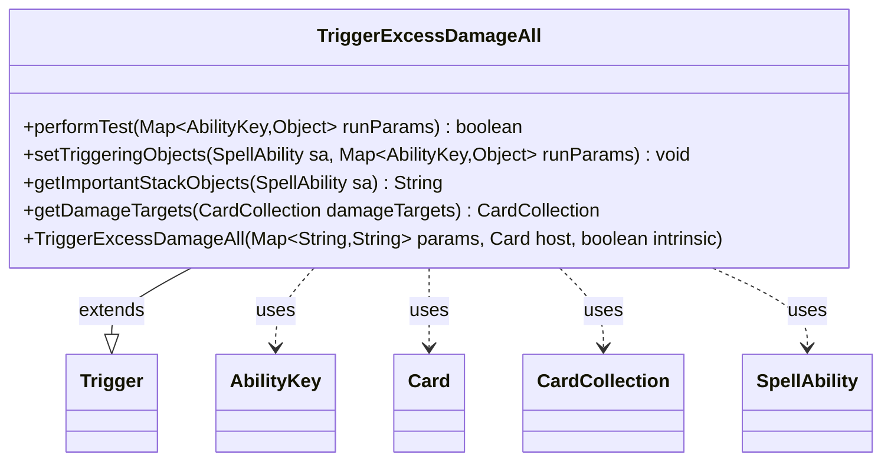

---
aliases:
  - TriggerExcessDamageAll
tags:
  - java/class
  - module/forge-game
  - pkg/forge/game/trigger
fqn: forge.game.trigger.TriggerExcessDamageAll
package: forge.game.trigger
module: forge-game
kind: Class
---

# TriggerExcessDamageAll

**Package:** `forge.game.trigger` &nbsp; **Module:** `forge-game` &nbsp; **Kind:** Class



## Relationships
**Extends:**
- [[forge.game.trigger.Trigger|Trigger]]
**Uses:**
- [[forge.game.ability.AbilityKey|AbilityKey]]
- [[forge.game.card.Card|Card]]
- [[forge.game.card.CardCollection|CardCollection]]
- [[forge.game.spellability.SpellAbility|SpellAbility]]

## Source
`forge-game/src/main/java/forge/game/trigger/TriggerExcessDamageAll.java`

```java
package forge.game.trigger;

import java.util.Map;

import forge.game.ability.AbilityKey;
import forge.game.card.Card;
import forge.game.card.CardCollection;
import forge.game.spellability.SpellAbility;
import forge.util.Localizer;

public class TriggerExcessDamageAll extends Trigger {

    public TriggerExcessDamageAll(Map<String, String> params, Card host, boolean intrinsic) {
        super(params, host, intrinsic);
    }

    @Override
    public boolean performTest(Map<AbilityKey, Object> runParams) {
        if (hasParam("CombatDamage")) {
            if (getParam("CombatDamage").equalsIgnoreCase("True") != (Boolean) runParams.get(AbilityKey.IsCombatDamage)) {
                return false;
            }
        }
        if (getDamageTargets((CardCollection) runParams.get(AbilityKey.DamageTargets)).isEmpty()) {
            return false;
        }

        return true;
    }

    @Override
    public void setTriggeringObjects(SpellAbility sa, Map<AbilityKey, Object> runParams) {
        sa.setTriggeringObject(AbilityKey.Targets, getDamageTargets((CardCollection) runParams.get(AbilityKey.DamageTargets)));
    }

    @Override
    public String getImportantStackObjects(SpellAbility sa) {
        StringBuilder sb = new StringBuilder();
        sb.append(Localizer.getInstance().getMessage("lblDamaged")).append(": ").append(sa.getTriggeringObject(AbilityKey.Targets));
        return sb.toString();
    }

    public CardCollection getDamageTargets(CardCollection damageTargets) {
        if (!hasParam("ValidTarget")) {
            return damageTargets;
        }
        CardCollection result = new CardCollection();
        for (Card c : damageTargets) {
            if (matchesValidParam("ValidTarget", c)) {
                result.add(c);
            }
        }
        return result;
    }
}
```
