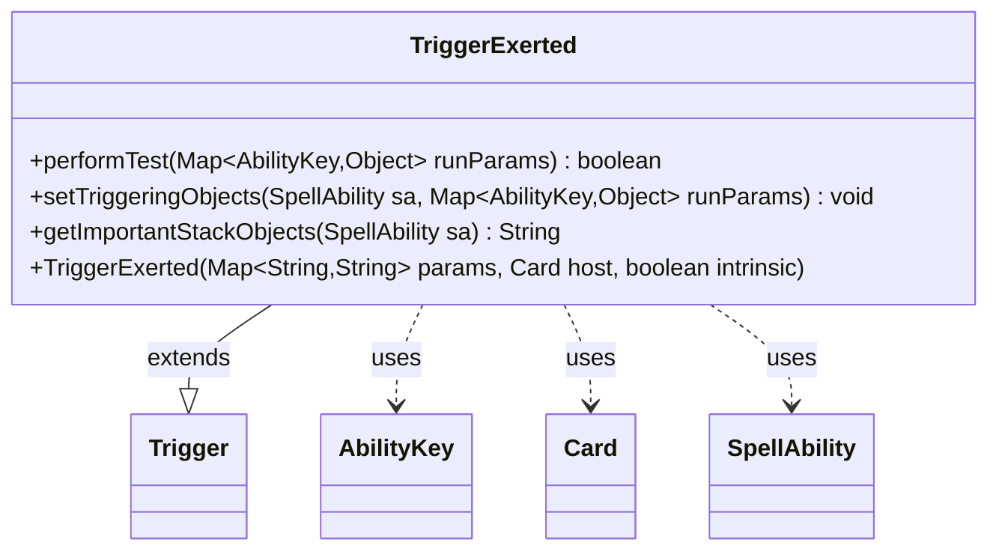

---
aliases:
  - TriggerExerted
tags:
  - java/class
  - module/forge-game
  - pkg/forge/game/trigger
fqn: forge.game.trigger.TriggerExerted
package: forge.game.trigger
module: forge-game
kind: Class
---

# TriggerExerted

**Package:** `forge.game.trigger`   **Module:** `forge-game`   **Kind:** Class



## Relationships
**Extends:**
- [[forge.game.trigger.Trigger|Trigger]]
**Uses:**
- [[forge.game.ability.AbilityKey|AbilityKey]]
- [[forge.game.card.Card|Card]]
- [[forge.game.spellability.SpellAbility|SpellAbility]]

## Design Description

TriggerExerted is a concrete trigger that fires when a creature is exerted, extending the abstract Trigger base class within Forge's event-driven triggered-ability framework. It specializes the three template hooks its supertype defines: performTest gates firing through the standard ValidCard matcher against the exerted card, setTriggeringObjects exposes the Card and Player to the resolving ability, and getImportantStackObjects produces a localized stack description.

Collaborating with AbilityKey-keyed run-parameter maps, it reads the exerted Card and binds triggering objects onto the SpellAbility that carries the trigger. The design keeps the subclass thin—delegating construction, validation plumbing, and matching to Trigger—so each trigger type only encodes its event-specific predicate and bindings, while Localizer keeps the player-facing text translatable.

## Source
`forge-game/src/main/java/forge/game/trigger/TriggerExerted.java`

```java
package forge.game.trigger;

import java.util.HashMap;
import java.util.Map;

import forge.game.ability.AbilityKey;
import forge.game.card.Card;
import forge.game.spellability.SpellAbility;
import forge.util.Localizer;

public class TriggerExerted extends Trigger {
    /**
     * <p>
     * Constructor for Trigger.
     * </p>
     *
     * @param params    a {@link HashMap} object.
     * @param host      a {@link Card} object.
     * @param intrinsic
     */
    public TriggerExerted(Map<String, String> params, Card host, boolean intrinsic) {
        super(params, host, intrinsic);
    }

    @Override
    public boolean performTest(Map<AbilityKey, Object> runParams) {
        if (!matchesValidParam("ValidCard", runParams.get(AbilityKey.Card))) {
            return false;
        }
        return true;
    }

    @Override
    public void setTriggeringObjects(SpellAbility sa, Map<AbilityKey, Object> runParams) {
        sa.setTriggeringObjectsFrom(runParams, AbilityKey.Card, AbilityKey.Player);
    }

    @Override
    public String getImportantStackObjects(SpellAbility sa) {
        StringBuilder sb = new StringBuilder();
        sb.append(Localizer.getInstance().getMessage("lblExerted")).append(": ").append(sa.getTriggeringObject(AbilityKey.Card));
        return sb.toString();
    }
}
```

## Python
`forge/game/trigger/TriggerExerted.py`

```python
from forge.game.trigger.Trigger import Trigger
from forge.game.ability.AbilityKey import AbilityKey
from forge.game.card.Card import Card
from forge.game.spellability.SpellAbility import SpellAbility
from forge.util.Localizer import Localizer


class TriggerExerted(Trigger):
    """
    Constructor for Trigger.

    :param params:    a HashMap object.
    :param host:      a Card object.
    :param intrinsic:
    """

    def __init__(self, params: dict[str, str], host: Card, intrinsic: bool):
        super().__init__(params, host, intrinsic)

    def performTest(self, runParams: dict[AbilityKey, object]) -> bool:
        if not self.matchesValidParam("ValidCard", runParams.get(AbilityKey.Card)):
            return False
        return True

    def setTriggeringObjects(self, sa: SpellAbility, runParams: dict[AbilityKey, object]) -> None:
        sa.setTriggeringObjectsFrom(runParams, AbilityKey.Card, AbilityKey.Player)

    def getImportantStackObjects(self, sa: SpellAbility) -> str:
        sb = []
        sb.append(Localizer.getInstance().getMessage("lblExerted"))
        sb.append(": ")
        sb.append(str(sa.getTriggeringObject(AbilityKey.Card)))
        return "".join(sb)
```
