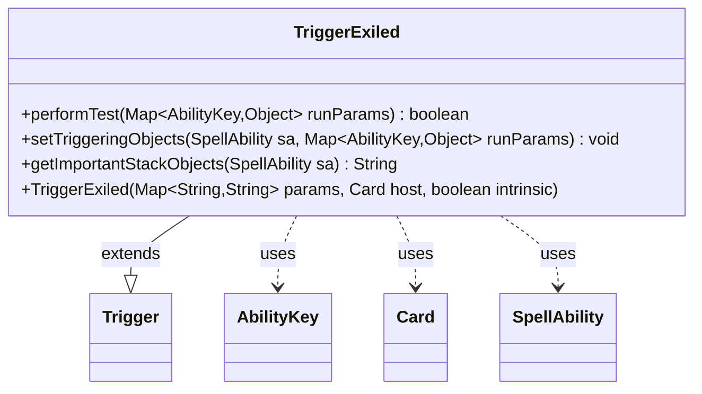

---
aliases:
  - TriggerExiled
tags:
  - java/class
  - module/forge-game
  - pkg/forge/game/trigger
fqn: forge.game.trigger.TriggerExiled
package: forge.game.trigger
module: forge-game
kind: Class
---

# TriggerExiled

**Package:** `forge.game.trigger`   **Module:** `forge-game`   **Kind:** Class



## Relationships
**Extends:**
- [[forge.game.trigger.Trigger|Trigger]]
**Uses:**
- [[forge.game.ability.AbilityKey|AbilityKey]]
- [[forge.game.card.Card|Card]]
- [[forge.game.spellability.SpellAbility|SpellAbility]]

## Design Description

TriggerExiled is a concrete trigger that fires when a card moves into the exile zone, specializing the abstract Trigger base class it extends. Its primary responsibility is `performTest`, which evaluates whether a given zone-change event satisfies the trigger's configured conditions—matching the originating zone against an `Origin` parameter list, validating the affected card and causing `SpellAbility` via `ValidCard`/`ValidCause` filters, optional keyword-state checks, and special handling for Madness so the trigger only fires when its static keyword matches the cause's. It collaborates with `AbilityKey` to read run parameters from the event map, with `Card` as its host, and with `SpellAbility` to record triggering objects and report the exiled card. The design keeps event-matching logic declarative and parameter-driven, deferring shared trigger plumbing to the supertype while localizing only the exile-specific test, binding, and stack-description behavior.

## Source
`forge-game/src/main/java/forge/game/trigger/TriggerExiled.java`

```java
/*
 * Forge: Play Magic: the Gathering.
 * Copyright (C) 2011  Forge Team
 *
 * This program is free software: you can redistribute it and/or modify
 * it under the terms of the GNU General Public License as published by
 * the Free Software Foundation, either version 3 of the License, or
 * (at your option) any later version.
 *
 * This program is distributed in the hope that it will be useful,
 * but WITHOUT ANY WARRANTY; without even the implied warranty of
 * MERCHANTABILITY or FITNESS FOR A PARTICULAR PURPOSE.  See the
 * GNU General Public License for more details.
 *
 * You should have received a copy of the GNU General Public License
 * along with this program.  If not, see <http://www.gnu.org/licenses/>.
 */
package forge.game.trigger;

import java.util.Map;
import java.util.Objects;

import org.apache.commons.lang3.ArrayUtils;

import forge.game.ability.AbilityKey;
import forge.game.card.Card;
import forge.game.keyword.Keyword;
import forge.game.spellability.SpellAbility;
import forge.util.Localizer;

/**
 * <p>
 * Trigger_ChangesZone class.
 * </p>
 *
 * @author Forge
 * @version $Id$
 */
public class TriggerExiled extends Trigger {

    /**
     * <p>
     * Constructor for TriggerExiled.
     * </p>
     *
     * @param params
     *            a {@link java.util.Map} object.
     * @param host
     *            a {@link forge.game.card.Card} object.
     * @param intrinsic
     *            the intrinsic
     */
    public TriggerExiled(final Map<String, String> params, final Card host, final boolean intrinsic) {
        super(params, host, intrinsic);
    }

    /** {@inheritDoc}
     * @param runParams*/
    @Override
    public final boolean performTest(final Map<AbilityKey, Object> runParams) {
        SpellAbility cause = (SpellAbility) runParams.get(AbilityKey.Cause);

        if (hasParam("Origin")) {
            if (!getParam("Origin").equals("Any")) {
                if (getParam("Origin") == null) {
                    return false;
                }
                if (!ArrayUtils.contains(
                    getParam("Origin").split(","), runParams.get(AbilityKey.Origin)
                )) {
                    return false;
                }
            }
        }

        if (!matchesValidParam("ValidCard", runParams.get(AbilityKey.Card))) {
            return false;
        }

        if (!matchesValidParam("ValidCause", cause)) {
            return false;
        }

        if (hasParam("WhileKeyword") && !whileKeywordCheck(getParam("WhileKeyword"), runParams)) {
            return false;
        }

        if (isKeyword(Keyword.MADNESS)) {
            if (cause == null || !cause.isKeyword(Keyword.MADNESS)) {
                return false;
            }
            if (!Objects.equals(getKeyword().getStatic(), cause.getKeyword().getStatic())) {
                return false;
            }
        }

        return true;
    }

    /** {@inheritDoc} */
    @Override
    public final void setTriggeringObjects(final SpellAbility sa, Map<AbilityKey, Object> runParams) {
        sa.setTriggeringObjectsFrom(runParams, AbilityKey.Card);
    }

    @Override
    public String getImportantStackObjects(SpellAbility sa) {
        return Localizer.getInstance().getMessage("lblExiled") + ": " + sa.getTriggeringObject(AbilityKey.Card);
    }

}
```

## Python
`forge/game/trigger/TriggerExiled.py`

```python
from forge.game.ability.AbilityKey import AbilityKey
from forge.game.card.Card import Card
from forge.game.keyword.Keyword import Keyword
from forge.game.spellability.SpellAbility import SpellAbility
from forge.util.Localizer import Localizer
from forge.game.trigger.Trigger import Trigger


class TriggerExiled(Trigger):
    """
    Trigger_ChangesZone class.

    @author Forge
    @version $Id$
    """

    def __init__(self, params: dict[str, str], host: Card, intrinsic: bool):
        super().__init__(params, host, intrinsic)

    def performTest(self, runParams: dict[AbilityKey, object]) -> bool:
        cause = runParams.get(AbilityKey.Cause)

        if self.hasParam("Origin"):
            if self.getParam("Origin") != "Any":
                if self.getParam("Origin") is None:
                    return False
                if runParams.get(AbilityKey.Origin) not in self.getParam("Origin").split(","):
                    return False

        if not self.matchesValidParam("ValidCard", runParams.get(AbilityKey.Card)):
            return False

        if not self.matchesValidParam("ValidCause", cause):
            return False

        if self.hasParam("WhileKeyword") and not self.whileKeywordCheck(self.getParam("WhileKeyword"), runParams):
            return False

        if self.isKeyword(Keyword.MADNESS):
            if cause is None or not cause.isKeyword(Keyword.MADNESS):
                return False
            if self.getKeyword().getStatic() != cause.getKeyword().getStatic():
                return False

        return True

    def setTriggeringObjects(self, sa: SpellAbility, runParams: dict[AbilityKey, object]) -> None:
        sa.setTriggeringObjectsFrom(runParams, AbilityKey.Card)

    def getImportantStackObjects(self, sa: SpellAbility) -> str:
        return Localizer.getInstance().getMessage("lblExiled") + ": " + str(sa.getTriggeringObject(AbilityKey.Card))
```
