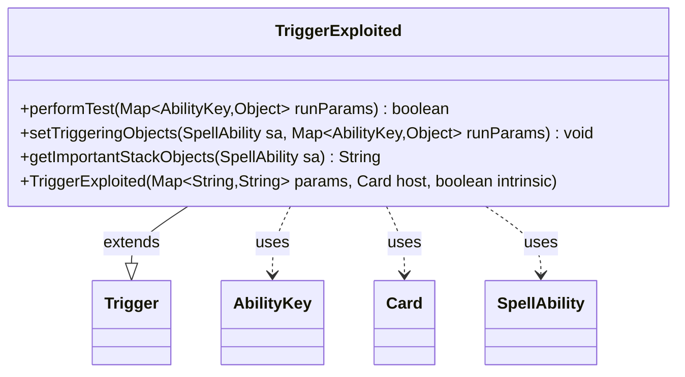

---
aliases:
  - TriggerExploited
tags:
  - java/class
  - module/forge-game
  - pkg/forge/game/trigger
fqn: forge.game.trigger.TriggerExploited
package: forge.game.trigger
module: forge-game
kind: Class
---

# TriggerExploited

**Package:** `forge.game.trigger` &nbsp; **Module:** `forge-game` &nbsp; **Kind:** Class



## Relationships
**Extends:**
- [[forge.game.trigger.Trigger|Trigger]]
**Uses:**
- [[forge.game.ability.AbilityKey|AbilityKey]]
- [[forge.game.card.Card|Card]]
- [[forge.game.spellability.SpellAbility|SpellAbility]]

## Design Description

Forge: Play Magic: the Gathering.

`TriggerExploited` is a concrete trigger that fires when a creature is "exploited" (sacrificed via the Exploit mechanic). It extends `Trigger`, the abstract base for all triggered abilities, supplying the three hook methods the framework requires: `performTest` validates the firing conditions against the run parameters, `setTriggeringObjects` records the relevant objects on the resolving `SpellAbility`, and `getImportantStackObjects` produces a localized stack description.

The class collaborates with `AbilityKey` to look up the exploited creature and its source from a parameter map, with `Card` as the trigger's host, and with `SpellAbility` to carry triggering objects forward. Its design intent is minimal and declarative: it pattern-matches the `Exploited` and `Card` keys via `matchesValidParam` against `ValidCard`/`ValidSource` constraints, delegating all scheduling and resolution logic to the inherited `Trigger` infrastructure while using `Localizer` to keep the displayed text translatable.

## Source
`forge-game/src/main/java/forge/game/trigger/TriggerExploited.java`

```java
/*
 * Forge: Play Magic: the Gathering.
 * Copyright (C) 2011  Forge Team
 *
 * This program is free software: you can redistribute it and/or modify
 * it under the terms of the GNU General Public License as published by
 * the Free Software Foundation, either version 3 of the License, or
 * (at your option) any later version.
 * 
 * This program is distributed in the hope that it will be useful,
 * but WITHOUT ANY WARRANTY; without even the implied warranty of
 * MERCHANTABILITY or FITNESS FOR A PARTICULAR PURPOSE.  See the
 * GNU General Public License for more details.
 * 
 * You should have received a copy of the GNU General Public License
 * along with this program.  If not, see <http://www.gnu.org/licenses/>.
 */
package forge.game.trigger;

import java.util.Map;

import forge.game.ability.AbilityKey;
import forge.game.card.Card;
import forge.game.spellability.SpellAbility;
import forge.util.Localizer;

/**
 * <p>
 * Trigger_Championed class.
 * </p>
 * 
 * @author Forge
 * @version $Id: TriggerChampioned.java 24762 2014-02-09 10:18:46Z swordshine $
 * @since 1.0.15
 */
public class TriggerExploited extends Trigger {

    /**
     * <p>
     * Constructor for Trigger_Exploited.
     * </p>
     * 
     * @param params
     *            a {@link java.util.HashMap} object.
     * @param host
     *            a {@link forge.game.card.Card} object.
     * @param intrinsic
     *            the intrinsic
     */
    public TriggerExploited(final Map<String, String> params, final Card host, final boolean intrinsic) {
        super(params, host, intrinsic);
    }

    /** {@inheritDoc}
     * @param runParams*/
    @Override
    public final boolean performTest(final Map<AbilityKey, Object> runParams) {
        if (!matchesValidParam("ValidCard", runParams.get(AbilityKey.Exploited))) {
            return false;
        }
        if (!matchesValidParam("ValidSource", runParams.get(AbilityKey.Card))) {
            return false;
        }

        return true;
    }

    /** {@inheritDoc} */
    @Override
    public final void setTriggeringObjects(final SpellAbility sa, Map<AbilityKey, Object> runParams) {
        sa.setTriggeringObjectsFrom(runParams, AbilityKey.Exploited, AbilityKey.Card);
    }

    @Override
    public String getImportantStackObjects(SpellAbility sa) {
        StringBuilder sb = new StringBuilder();
        sb.append(Localizer.getInstance().getMessage("lblExploited")).append(": ").append(sa.getTriggeringObject(AbilityKey.Exploited)).append(", ");
        sb.append(Localizer.getInstance().getMessage("lblExploiter")).append(": ").append(sa.getTriggeringObject(AbilityKey.Card));
        return sb.toString();
    }
}
```

## Python
`forge/game/trigger/TriggerExploited.py`

```python
from forge.game.ability.AbilityKey import AbilityKey
from forge.game.card.Card import Card
from forge.game.spellability.SpellAbility import SpellAbility
from forge.game.trigger.Trigger import Trigger
from forge.util.Localizer import Localizer


class TriggerExploited(Trigger):
    """
    Trigger_Championed class.

    @author Forge
    @version $Id: TriggerChampioned.java 24762 2014-02-09 10:18:46Z swordshine $
    @since 1.0.15
    """

    def __init__(self, params: dict[str, str], host: Card, intrinsic: bool):
        """
        Constructor for Trigger_Exploited.

        :param params: a dict object.
        :param host: a Card object.
        :param intrinsic: the intrinsic
        """
        super().__init__(params, host, intrinsic)

    def performTest(self, runParams: dict[AbilityKey, object]) -> bool:
        if not self.matchesValidParam("ValidCard", runParams.get(AbilityKey.Exploited)):
            return False
        if not self.matchesValidParam("ValidSource", runParams.get(AbilityKey.Card)):
            return False

        return True

    def setTriggeringObjects(self, sa: SpellAbility, runParams: dict[AbilityKey, object]) -> None:
        sa.setTriggeringObjectsFrom(runParams, AbilityKey.Exploited, AbilityKey.Card)

    def getImportantStackObjects(self, sa: SpellAbility) -> str:
        sb = []
        sb.append(Localizer.getInstance().getMessage("lblExploited"))
        sb.append(": ")
        sb.append(str(sa.getTriggeringObject(AbilityKey.Exploited)))
        sb.append(", ")
        sb.append(Localizer.getInstance().getMessage("lblExploiter"))
        sb.append(": ")
        sb.append(str(sa.getTriggeringObject(AbilityKey.Card)))
        return "".join(sb)
```
