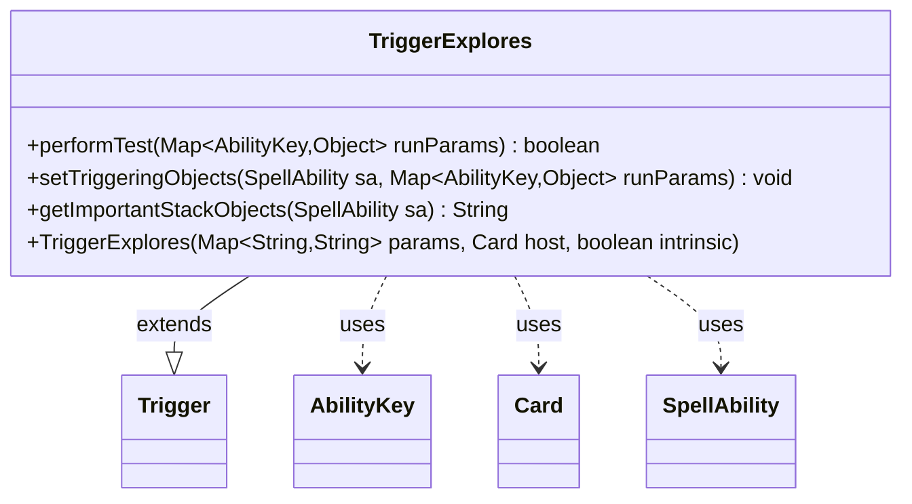

---
aliases:
  - TriggerExplores
tags:
  - java/class
  - module/forge-game
  - pkg/forge/game/trigger
fqn: forge.game.trigger.TriggerExplores
package: forge.game.trigger
module: forge-game
kind: Class
---

# TriggerExplores

**Package:** `forge.game.trigger` &nbsp; **Module:** `forge-game` &nbsp; **Kind:** Class



## Relationships
**Extends:**
- [[forge.game.trigger.Trigger|Trigger]]
**Uses:**
- [[forge.game.ability.AbilityKey|AbilityKey]]
- [[forge.game.card.Card|Card]]
- [[forge.game.spellability.SpellAbility|SpellAbility]]

## Design Description

TriggerExplores is a concrete trigger that fires when a creature explores, extending the abstract `Trigger` base class to model the "explores" event within Forge's data-driven triggered-ability framework. It implements `performTest` to filter qualifying events through the `ValidCard` and `ValidExplored` restrictions, `setTriggeringObjects` to bind the exploring creature (as `Explorer`) and any explored card into the firing `SpellAbility`, and `getImportantStackObjects` to produce a localized, human-readable summary of those objects.

Collaborating chiefly with `AbilityKey` for typed run-parameter lookups, `Card` as the trigger host, and `SpellAbility` as the resolving ability, the class keeps event-specific logic minimal and delegates shared mechanics to its supertype. Its reliance on parameter maps and `matchesValidParam` reflects Forge's design intent of declaring trigger behavior through card-script parameters rather than hard-coded rules, while `Localizer` keeps presentation text translatable.

## Source
`forge-game/src/main/java/forge/game/trigger/TriggerExplores.java`

```java
/*
 * Forge: Play Magic: the Gathering.
 * Copyright (C) 2011  Forge Team
 *
 * This program is free software: you can redistribute it and/or modify
 * it under the terms of the GNU General Public License as published by
 * the Free Software Foundation, either version 3 of the License, or
 * (at your option) any later version.
 *
 * This program is distributed in the hope that it will be useful,
 * but WITHOUT ANY WARRANTY; without even the implied warranty of
 * MERCHANTABILITY or FITNESS FOR A PARTICULAR PURPOSE.  See the
 * GNU General Public License for more details.
 *
 * You should have received a copy of the GNU General Public License
 * along with this program.  If not, see <http://www.gnu.org/licenses/>.
 */
package forge.game.trigger;

import java.util.Map;

import forge.game.ability.AbilityKey;
import forge.game.card.Card;
import forge.game.spellability.SpellAbility;
import forge.util.Localizer;

/**
 * <p>
 * Trigger_Explores class.
 * </p>
 *
 * @author Forge
 */
public class TriggerExplores extends Trigger {

    /**
     * <p>
     * Constructor for Trigger_Explores.
     * </p>
     *
     * @param params
     *            a {@link java.util.HashMap} object.
     * @param host
     *            a {@link forge.game.card.Card} object.
     * @param intrinsic
     *            the intrinsic
     */
    public TriggerExplores(final Map<String, String> params, final Card host, final boolean intrinsic) {
        super(params, host, intrinsic);
    }

    /** {@inheritDoc} */
    @Override
    public final boolean performTest(final Map<AbilityKey, Object> runParams) {
        if (!matchesValidParam("ValidCard", runParams.get(AbilityKey.Card))) {
            return false;
        }

        if (!matchesValidParam("ValidExplored", runParams.get(AbilityKey.Explored))) {
            return false;
        }

        return true;
    }

    /** {@inheritDoc} */
    @Override
    public final void setTriggeringObjects(final SpellAbility sa, Map<AbilityKey, Object> runParams) {
        sa.setTriggeringObject(AbilityKey.Explorer, runParams.get(AbilityKey.Card));
        if (runParams.containsKey(AbilityKey.Explored)) sa.setTriggeringObjectsFrom(runParams, AbilityKey.Explored);
    }

    @Override
    public String getImportantStackObjects(SpellAbility sa) {
        StringBuilder sb = new StringBuilder();
        sb.append(Localizer.getInstance().getMessage("lblExplorer")).append(": ");
        sb.append(sa.getTriggeringObject(AbilityKey.Explorer));
        if (sa.hasTriggeringObject(AbilityKey.Explored)) {
            sb.append(", ").append(Localizer.getInstance().getMessage("lblExplored")).append(": ");
            sb.append(sa.getTriggeringObject(AbilityKey.Explored));
        }
        return sb.toString();
    }
}
```

## Python
`forge/game/trigger/TriggerExplores.py`

```python
package forge.game.trigger;

from typing import Any

from forge.game.trigger.Trigger import Trigger
from forge.game.ability.AbilityKey import AbilityKey
from forge.game.card.Card import Card
from forge.game.spellability.SpellAbility import SpellAbility
from forge.util.Localizer import Localizer


class TriggerExplores(Trigger):

    def __init__(self, params: dict[str, str], host: Card, intrinsic: bool):
        super().__init__(params, host, intrinsic)

    def performTest(self, runParams: dict[AbilityKey, Any]) -> bool:
        if not self.matchesValidParam("ValidCard", runParams.get(AbilityKey.Card)):
            return False

        if not self.matchesValidParam("ValidExplored", runParams.get(AbilityKey.Explored)):
            return False

        return True

    def setTriggeringObjects(self, sa: SpellAbility, runParams: dict[AbilityKey, Any]) -> None:
        sa.setTriggeringObject(AbilityKey.Explorer, runParams.get(AbilityKey.Card))
        if AbilityKey.Explored in runParams:
            sa.setTriggeringObjectsFrom(runParams, AbilityKey.Explored)

    def getImportantStackObjects(self, sa: SpellAbility) -> str:
        sb = []
        sb.append(Localizer.getInstance().getMessage("lblExplorer"))
        sb.append(": ")
        sb.append(str(sa.getTriggeringObject(AbilityKey.Explorer)))
        if sa.hasTriggeringObject(AbilityKey.Explored):
            sb.append(", ")
            sb.append(Localizer.getInstance().getMessage("lblExplored"))
            sb.append(": ")
            sb.append(str(sa.getTriggeringObject(AbilityKey.Explored)))
        return "".join(sb)
```
