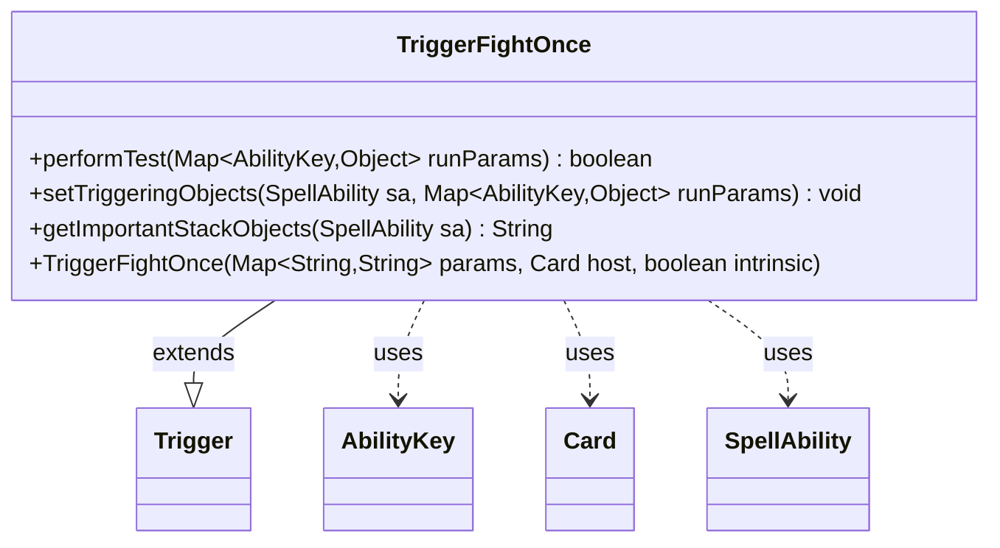

---
aliases:
  - TriggerFightOnce
tags:
  - java/class
  - module/forge-game
  - pkg/forge/game/trigger
fqn: forge.game.trigger.TriggerFightOnce
package: forge.game.trigger
module: forge-game
kind: Class
---

# TriggerFightOnce

**Package:** `forge.game.trigger` &nbsp; **Module:** `forge-game` &nbsp; **Kind:** Class



## Relationships
**Extends:**
- [[forge.game.trigger.Trigger|Trigger]]
**Uses:**
- [[forge.game.ability.AbilityKey|AbilityKey]]
- [[forge.game.card.Card|Card]]
- [[forge.game.spellability.SpellAbility|SpellAbility]]

## Design Description

TriggerFightOnce is a concrete trigger that fires when a fight between two creatures occurs, specializing the abstract Trigger base class for the "fight once" event. It overrides performTest to validate the participating Fighters against the ValidCard parameter, setTriggeringObjects to bind those fighters into the spell ability's triggering context via AbilityKey.Fighters, and getImportantStackObjects to produce a localized, human-readable summary of the two combatants.

Collaborating with Card, SpellAbility, and the AbilityKey enum, it follows the engine's standard trigger contract: the base class drives the matching and firing lifecycle while this subclass supplies only event-specific testing and data extraction. Its reliance on Localizer for fighter labels reflects an intent to keep player-facing stack descriptions translatable, and the focused single-event responsibility keeps each trigger type small and uniform.

## Source
`forge-game/src/main/java/forge/game/trigger/TriggerFightOnce.java`

```java
/*
 * Forge: Play Magic: the Gathering.
 * Copyright (C) 2011  Forge Team
 *
 * This program is free software: you can redistribute it and/or modify
 * it under the terms of the GNU General Public License as published by
 * the Free Software Foundation, either version 3 of the License, or
 * (at your option) any later version.
 *
 * This program is distributed in the hope that it will be useful,
 * but WITHOUT ANY WARRANTY; without even the implied warranty of
 * MERCHANTABILITY or FITNESS FOR A PARTICULAR PURPOSE.  See the
 * GNU General Public License for more details.
 *
 * You should have received a copy of the GNU General Public License
 * along with this program.  If not, see <http://www.gnu.org/licenses/>.
 */
package forge.game.trigger;

import java.util.List;
import java.util.Map;

import forge.game.ability.AbilityKey;
import forge.game.card.Card;
import forge.game.spellability.SpellAbility;
import forge.util.Localizer;

public class TriggerFightOnce extends Trigger {

    /**
     * <p>
     * Constructor for Trigger_Fight.
     * </p>
     *
     * @param params
     *            a {@link java.util.HashMap} object.
     * @param host
     *            a {@link forge.game.card.Card} object.
     * @param intrinsic
     *            the intrinsic
     */
    public TriggerFightOnce(final Map<String, String> params, final Card host, final boolean intrinsic) {
        super(params, host, intrinsic);
    }

    /** {@inheritDoc}
     * @param runParams*/
    @Override
    public final boolean performTest(final Map<AbilityKey, Object> runParams) {
        if (!matchesValidParam("ValidCard", runParams.get(AbilityKey.Fighters))) {
            return false;
        }

        return true;
    }

    /** {@inheritDoc} */
    @Override
    public final void setTriggeringObjects(final SpellAbility sa, Map<AbilityKey, Object> runParams) {
        sa.setTriggeringObjectsFrom(runParams, AbilityKey.Fighters);
    }

    @Override
    public String getImportantStackObjects(SpellAbility sa) {
        StringBuilder sb = new StringBuilder();
        @SuppressWarnings("unchecked")
        List<Card> fighters = (List<Card>)sa.getTriggeringObject(AbilityKey.Fighters);
        sb.append(Localizer.getInstance().getMessage("lblFighter")).append(" 1: ").append(fighters.get(0)).append(", ");
        sb.append(Localizer.getInstance().getMessage("lblFighter")).append(" 2: ").append(fighters.get(1));
        return sb.toString();
    }
}
```

## Python
`forge/game/trigger/TriggerFightOnce.py`

```python
from forge.game.ability.AbilityKey import AbilityKey
from forge.game.card.Card import Card
from forge.game.spellability.SpellAbility import SpellAbility
from forge.util.Localizer import Localizer

from forge.game.trigger.Trigger import Trigger


class TriggerFightOnce(Trigger):
    """
    Constructor for Trigger_Fight.

    :param params: a HashMap object.
    :param host: a Card object.
    :param intrinsic: the intrinsic
    """

    def __init__(self, params: dict[str, str], host: Card, intrinsic: bool):
        super().__init__(params, host, intrinsic)

    def performTest(self, runParams: dict[AbilityKey, object]) -> bool:
        if not self.matchesValidParam("ValidCard", runParams.get(AbilityKey.Fighters)):
            return False

        return True

    def setTriggeringObjects(self, sa: SpellAbility, runParams: dict[AbilityKey, object]) -> None:
        sa.setTriggeringObjectsFrom(runParams, AbilityKey.Fighters)

    def getImportantStackObjects(self, sa: SpellAbility) -> str:
        sb = []
        fighters: list[Card] = sa.getTriggeringObject(AbilityKey.Fighters)
        sb.append(Localizer.getInstance().getMessage("lblFighter"))
        sb.append(" 1: ")
        sb.append(str(fighters[0]))
        sb.append(", ")
        sb.append(Localizer.getInstance().getMessage("lblFighter"))
        sb.append(" 2: ")
        sb.append(str(fighters[1]))
        return "".join(sb)
```
