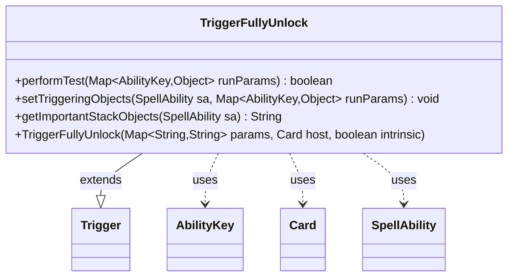

---
aliases:
  - TriggerFullyUnlock
tags:
  - java/class
  - module/forge-game
  - pkg/forge/game/trigger
fqn: forge.game.trigger.TriggerFullyUnlock
package: forge.game.trigger
module: forge-game
kind: Class
---

# TriggerFullyUnlock

**Package:** `forge.game.trigger`   **Module:** `forge-game`   **Kind:** Class



## Relationships
**Extends:**
- [[forge.game.trigger.Trigger|Trigger]]
**Uses:**
- [[forge.game.ability.AbilityKey|AbilityKey]]
- [[forge.game.card.Card|Card]]
- [[forge.game.spellability.SpellAbility|SpellAbility]]

## Design Description

TriggerFullyUnlock is a concrete trigger type that fires when a card becomes fully unlocked, modeling that game event within Forge's data-driven triggered-ability system. Extending the abstract Trigger base class, it supplies the three behaviors the framework expects: performTest gates firing by matching the optional ValidCard and ValidPlayer restrictions against the run parameters, setTriggeringObjects binds the relevant Card and Player onto the resolving SpellAbility, and getImportantStackObjects produces a localized summary for stack display. It collaborates with AbilityKey to look up event participants in the runParams map, Card as its host, and SpellAbility as the ability being configured. Its design intent is minimalism—parameters drive matching declaratively and Localizer keeps user-facing text translatable—so the class adds only the event-specific keys (Card, Player) while delegating all shared trigger machinery to its supertype.

## Source
`forge-game/src/main/java/forge/game/trigger/TriggerFullyUnlock.java`

```java
package forge.game.trigger;

import java.util.Map;

import forge.game.ability.AbilityKey;
import forge.game.card.Card;
import forge.game.spellability.SpellAbility;
import forge.util.Localizer;

public class TriggerFullyUnlock extends Trigger {

    public TriggerFullyUnlock(final Map<String, String> params, final Card host, final boolean intrinsic) {
        super(params, host, intrinsic);
    }

    @Override
    public boolean performTest(Map<AbilityKey, Object> runParams) {
        if (!matchesValidParam("ValidCard", runParams.get(AbilityKey.Card))) {
            return false;
        }

        if (!matchesValidParam("ValidPlayer", runParams.get(AbilityKey.Player))) {
            return false;
        }
        return true;
    }

    @Override
    public void setTriggeringObjects(SpellAbility sa, Map<AbilityKey, Object> runParams) {
        sa.setTriggeringObjectsFrom(runParams, AbilityKey.Card, AbilityKey.Player);
    }

    @Override
    public String getImportantStackObjects(SpellAbility sa) {
        StringBuilder sb = new StringBuilder();
        sb.append(Localizer.getInstance().getMessage("lblPlayer")).append(": ").append(sa.getTriggeringObject(AbilityKey.Player));
        sb.append(", ").append(Localizer.getInstance().getMessage("lblCard")).append(": ").append(sa.getTriggeringObject(AbilityKey.Card));
        return sb.toString();
    }

}
```

## Python
`forge/game/trigger/TriggerFullyUnlock.py`

```python
from forge.game.ability.AbilityKey import AbilityKey
from forge.game.card.Card import Card
from forge.game.spellability.SpellAbility import SpellAbility
from forge.util.Localizer import Localizer
from forge.game.trigger.Trigger import Trigger


class TriggerFullyUnlock(Trigger):

    def __init__(self, params: dict[str, str], host: Card, intrinsic: bool):
        super().__init__(params, host, intrinsic)

    def performTest(self, runParams: dict[AbilityKey, object]) -> bool:
        if not self.matchesValidParam("ValidCard", runParams.get(AbilityKey.Card)):
            return False

        if not self.matchesValidParam("ValidPlayer", runParams.get(AbilityKey.Player)):
            return False
        return True

    def setTriggeringObjects(self, sa: SpellAbility, runParams: dict[AbilityKey, object]) -> None:
        sa.setTriggeringObjectsFrom(runParams, AbilityKey.Card, AbilityKey.Player)

    def getImportantStackObjects(self, sa: SpellAbility) -> str:
        sb = []
        sb.append(Localizer.getInstance().getMessage("lblPlayer"))
        sb.append(": ")
        sb.append(str(sa.getTriggeringObject(AbilityKey.Player)))
        sb.append(", ")
        sb.append(Localizer.getInstance().getMessage("lblCard"))
        sb.append(": ")
        sb.append(str(sa.getTriggeringObject(AbilityKey.Card)))
        return "".join(sb)
```
