---
aliases:
  - TriggerHandler
tags:
  - java/class
  - module/forge-game
  - pkg/forge/game/trigger
fqn: forge.game.trigger.TriggerHandler
package: forge.game.trigger
module: forge-game
kind: Class
---

# TriggerHandler

**Package:** `forge.game.trigger` &nbsp; **Module:** `forge-game` &nbsp; **Kind:** Class

```mermaid
classDiagram
    class TriggerHandler {
        -Set~TriggerType~ suppressedModes
        -boolean allSuppressed
        -List~Trigger~ activeTriggers
        -List~Trigger~ delayedTriggers
        -List~Trigger~ thisTurnDelayedTriggers
        -ListMultimap~Player,Trigger~ playerDefinedDelayedTriggers
        -List~TriggerWaiting~ waitingTriggers
        -Game game
        +registerDelayedTrigger(Trigger trig) void
        +clearDelayedTrigger() void
        +registerThisTurnDelayedTrigger(Trigger trig) void
        +clearThisTurnDelayedTrigger() void
        +clearDelayedTrigger(Card card) void
        +registerPlayerDefinedDelayedTrigger(Player player, Trigger trig) void
        +clearPlayerDefinedDelayedTrigger() void
        +handlePlayerDefinedDelTriggers(Player player) void
        +suppressMode(TriggerType mode) void
        +setSuppressAllTriggers(boolean suppress) void
        +clearSuppression(TriggerType mode) void
        +isTriggerSuppressed(TriggerType mode) boolean
        +parseTrigger(String trigParse, Card host, boolean intrinsic) Trigger
        +parseTrigger(String trigParse, Card host, boolean intrinsic, IHasSVars sVarHolder) Trigger
        +parseTrigger(Map~String,String~ mapParams, Card host, boolean intrinsic, IHasSVars sVarHolder) Trigger
        -parseParams(String trigParse) Map~String,String~
        +collectTriggerForWaiting() void
        +resetActiveTriggers() void
        +resetActiveTriggers(boolean collect, CardCollectionView lastStateBattlefield) void
        +clearActiveTriggers(Card c, Zone zoneFrom) void
        +registerActiveTrigger(Card c, boolean onlyExtrinsic) void
        +registerActiveLTBTrigger(Card c) void
        +registerOneTrigger(Trigger t) boolean
        +runTrigger(TriggerType mode, Map~AbilityKey,Object~ runParams, boolean holdTrigger) void
        -runStateTrigger(Map~AbilityKey,Object~ runParams) void
        +runWaitingTriggers() boolean
        -runWaitingTrigger(TriggerWaiting wt) boolean
        +clearWaitingTriggers() void
        -isTriggerActive(Trigger regtrig) boolean
        -canRunTrigger(Trigger regtrig, TriggerType mode, Map~AbilityKey,Object~ runParams) boolean
        -runSingleTrigger(Trigger regtrig, Map~AbilityKey,Object~ runParams) void
        -runSingleTrigger(Trigger regtrig, Map~AbilityKey,Object~ runParams, Player controller) void
        -runSingleTriggerInternal(Trigger regtrig, Map~AbilityKey,Object~ runParams, Player controller) void
        -adjustUndoStack(Trigger regtrig, Map~AbilityKey,Object~ runParams) void
        +getActiveTrigger(TriggerType mode, Map~AbilityKey,Object~ runParams) List~Trigger~
        +onPlayerLost(Player p) void
        +TriggerHandler(Game gameState)
    }
    TriggerHandler ..> AbilityKey : uses
    TriggerHandler ..> AbilitySub : uses
    TriggerHandler ..> Card : uses
    TriggerHandler ..> CardCollection : uses
    TriggerHandler ..> CardCollectionView : uses
    TriggerHandler ..> CardState : uses
    TriggerHandler ..> CardTraitBase : uses
    TriggerHandler ..> EmptySa : uses
    TriggerHandler ..> Game : uses
    TriggerHandler ..> IHasSVars : uses
    TriggerHandler ..> Player : uses
    TriggerHandler ..> SpellAbility : uses
    TriggerHandler ..> Trigger : uses
    TriggerHandler ..> TriggerAbilityResolves : uses
    TriggerHandler ..> TriggerManaAdded : uses
    TriggerHandler ..> TriggerSpellAbilityCastOrCopy : uses
    TriggerHandler ..> TriggerTapAll : uses
    TriggerHandler ..> TriggerTaps : uses
    TriggerHandler ..> TriggerTapsForMana : uses
    TriggerHandler ..> TriggerType : uses
    TriggerHandler ..> TriggerUntapAll : uses
    TriggerHandler ..> TriggerUntaps : uses
    TriggerHandler ..> TriggerWaiting : uses
    TriggerHandler ..> WrappedAbility : uses
    TriggerHandler ..> Zone : uses
    TriggerHandler ..> ZoneType : uses
```



## Relationships
**Uses:**
- [[forge.game.CardTraitBase|CardTraitBase]]
- [[forge.game.Game|Game]]
- [[forge.game.IHasSVars|IHasSVars]]
- [[forge.game.ability.AbilityKey|AbilityKey]]
- [[forge.game.card.Card|Card]]
- [[forge.game.card.CardCollection|CardCollection]]
- [[forge.game.card.CardCollectionView|CardCollectionView]]
- [[forge.game.card.CardState|CardState]]
- [[forge.game.player.Player|Player]]
- [[forge.game.spellability.AbilitySub|AbilitySub]]
- [[forge.game.spellability.SpellAbility|SpellAbility]]
- [[forge.game.spellability.SpellAbility.EmptySa|EmptySa]]
- [[forge.game.trigger.Trigger|Trigger]]
- [[forge.game.trigger.TriggerAbilityResolves|TriggerAbilityResolves]]
- [[forge.game.trigger.TriggerManaAdded|TriggerManaAdded]]
- [[forge.game.trigger.TriggerSpellAbilityCastOrCopy|TriggerSpellAbilityCastOrCopy]]
- [[forge.game.trigger.TriggerTapAll|TriggerTapAll]]
- [[forge.game.trigger.TriggerTaps|TriggerTaps]]
- [[forge.game.trigger.TriggerTapsForMana|TriggerTapsForMana]]
- [[forge.game.trigger.TriggerType|TriggerType]]
- [[forge.game.trigger.TriggerUntapAll|TriggerUntapAll]]
- [[forge.game.trigger.TriggerUntaps|TriggerUntaps]]
- [[forge.game.trigger.TriggerWaiting|TriggerWaiting]]
- [[forge.game.trigger.WrappedAbility|WrappedAbility]]
- [[forge.game.zone.Zone|Zone]]
- [[forge.game.zone.ZoneType|ZoneType]]

## Design Description

TriggerHandler is the per-`Game` orchestrator for Magic's triggered-ability system, owning the lifecycle of every trigger from registration through resolution. It maintains the set of active triggers (rebuilt from all cards via `resetActiveTriggers`), several categories of delayed triggers (general, this-turn, and player-defined), and a queue of waiting triggers that defers firing while the stack is frozen. Its core duty is `runTrigger`, which screens each `Trigger` against suppression modes, mode/zone/phase requirements, and disabling static abilities (`canRunTrigger`/`isTriggerActive`) before wrapping the eligible ability in a `WrappedAbility` and pushing it onto the stack.

As a plain collaborator class (no supertype), it is held by `Game` and coordinates broadly with the trigger hierarchy, `Card`/`CardState`, `Player`, and `SpellAbility`. Notable design intent: thread-safe synchronized collections guard concurrent access; a static `parseTrigger` family builds `Trigger` instances from card script params with Sentry breadcrumbs for diagnostics; `StaticAbilityPanharmonicon` enables trigger doubling; and `adjustUndoStack` selectively invalidates mana undo for specific trigger subtypes, reflecting careful integration with the rules engine's edge cases.

## Source
`forge-game/src/main/java/forge/game/trigger/TriggerHandler.java`

```java
/*
 * Forge: Play Magic: the Gathering.
 * Copyright (C) 2011  Forge Team
 *
 * This program is free software: you can redistribute it and/or modify
 * it under the terms of the GNU General Public License as published by
 * the Free Software Foundation, either version 3 of the License, or
 * (at your option) any later version.
 *
 * This program is distributed in the hope that it will be useful,
 * but WITHOUT ANY WARRANTY; without even the implied warranty of
 * MERCHANTABILITY or FITNESS FOR A PARTICULAR PURPOSE.  See the
 * GNU General Public License for more details.
 *
 * You should have received a copy of the GNU General Public License
 * along with this program.  If not, see <http://www.gnu.org/licenses/>.
 */
package forge.game.trigger;

import java.util.*;

import com.google.common.collect.*;

import forge.game.CardTraitBase;
import forge.game.CardTraitPredicates;
import forge.game.Game;
import forge.game.IHasSVars;
import forge.game.ability.AbilityFactory;
import forge.game.ability.AbilityKey;
import forge.game.ability.AbilityUtils;
import forge.game.card.*;
import forge.game.player.Player;
import forge.game.spellability.AbilitySub;
import forge.game.spellability.SpellAbility;
import forge.game.staticability.StaticAbilityDisableTriggers;
import forge.game.staticability.StaticAbilityPanharmonicon;
import forge.game.zone.Zone;
import forge.game.zone.ZoneType;
import forge.util.FileSection;
import io.sentry.Breadcrumb;
import io.sentry.Sentry;

public class TriggerHandler {
    private final Set<TriggerType> suppressedModes = Collections.synchronizedSet(EnumSet.noneOf(TriggerType.class));
    private boolean allSuppressed = false;
    private final List<Trigger> activeTriggers = Collections.synchronizedList(new ArrayList<>());

    private final List<Trigger> delayedTriggers = Collections.synchronizedList(new ArrayList<>());
    private final List<Trigger> thisTurnDelayedTriggers = Collections.synchronizedList(new ArrayList<>());
    private final ListMultimap<Player, Trigger> playerDefinedDelayedTriggers = Multimaps.synchronizedListMultimap(ArrayListMultimap.create());
    private final List<TriggerWaiting> waitingTriggers = Collections.synchronizedList(new ArrayList<>());
    private final Game game;

    public TriggerHandler(final Game gameState) {
        game = gameState;
    }

    public final void registerDelayedTrigger(final Trigger trig) {
        delayedTriggers.add(trig);
    }

    public final void clearDelayedTrigger() {
        delayedTriggers.clear();
    }

    public final void registerThisTurnDelayedTrigger(final Trigger trig) {
        thisTurnDelayedTriggers.add(trig);
        delayedTriggers.add(trig);
    }

    public final void clearThisTurnDelayedTrigger() {
        delayedTriggers.removeAll(thisTurnDelayedTriggers);
        thisTurnDelayedTriggers.clear();
    }

    public final void clearDelayedTrigger(final Card card) {
        final List<Trigger> deltrigs = new ArrayList<>(delayedTriggers);

        for (final Trigger trigger : deltrigs) {
            if (trigger.getHostCard().equals(card)) {
                delayedTriggers.remove(trigger);
            }
        }
    }

    public final void registerPlayerDefinedDelayedTrigger(final Player player, final Trigger trig) {
        playerDefinedDelayedTriggers.put(player, trig);
    }

    public final void clearPlayerDefinedDelayedTrigger() {
        playerDefinedDelayedTriggers.clear();
    }

    public final void handlePlayerDefinedDelTriggers(final Player player) {
        final List<Trigger> playerTriggers = playerDefinedDelayedTriggers.removeAll(player);
        playerTriggers.stream().filter(CardTraitPredicates.hasParam("ThisTurn")).forEach(thisTurnDelayedTriggers::add);
        delayedTriggers.addAll(playerTriggers);
    }

    public final void suppressMode(final TriggerType mode) {
        suppressedModes.add(mode);
    }

    public final void setSuppressAllTriggers(final boolean suppress) {
        allSuppressed = suppress;
    }

    public final void clearSuppression(final TriggerType mode) {
        suppressedModes.remove(mode);
    }
    public boolean isTriggerSuppressed(final TriggerType mode) {
        return allSuppressed || suppressedModes.contains(mode);
    }

    public static Trigger parseTrigger(final String trigParse, final Card host, final boolean intrinsic) {
        return parseTrigger(trigParse, host, intrinsic, host.getCurrentState());
    }

    public static Trigger parseTrigger(final String trigParse, final Card host, final boolean intrinsic, final IHasSVars sVarHolder) {
        try {
            final Map<String, String> mapParams = TriggerHandler.parseParams(trigParse);
            return TriggerHandler.parseTrigger(mapParams, host, intrinsic, sVarHolder);
        } catch (Exception e) {
            String msg = "TriggerHandler:parseTrigger failed to parse";

            Breadcrumb bread = new Breadcrumb(msg);
            bread.setData("Card", host.getName());
            bread.setData("Trigger", trigParse);
            Sentry.addBreadcrumb(bread);

            //rethrow
            throw new RuntimeException("Error in Trigger for Card: " + host.getName(), e);
        }
    }

    public static Trigger parseTrigger(final Map<String, String> mapParams, final Card host, final boolean intrinsic, final IHasSVars sVarHolder) {
        Trigger result;

        try {
            final TriggerType type = TriggerType.smartValueOf(mapParams.get("Mode"));
            result = type.createTrigger(mapParams, host, intrinsic);
            if (sVarHolder != null) {
                result.ensureAbility(sVarHolder);

                if (sVarHolder instanceof CardState) {
                    result.setCardState((CardState)sVarHolder);
                } else if (sVarHolder instanceof CardTraitBase) {
                    result.setCardState(((CardTraitBase)sVarHolder).getCardState());
                }
            }
        } catch (Exception e) {
            String msg = "TriggerHandler:parseTrigger failed to parse";

            Breadcrumb bread = new Breadcrumb(msg);
            bread.setData("Card", host.getName());
            bread.setData("Params", mapParams.toString());
            Sentry.addBreadcrumb(bread);

            //rethrow
            throw new RuntimeException("Error in Trigger for Card: " + host.getName(), e);
        }

        return result;
    }

    private static Map<String, String> parseParams(final String trigParse) {
        if (trigParse.length() == 0) {
            throw new RuntimeException("TriggerFactory : registerTrigger -- trigParse too short");
        }

        return FileSection.parseToMap(trigParse, FileSection.DOLLAR_SIGN_KV_SEPARATOR);
    }

    public void collectTriggerForWaiting() {
        for (final TriggerWaiting wt : waitingTriggers) {
            if (wt.getTriggers() != null)
                continue;

            // TODO we don't seem to handle Static ones from this,
            // so they shouldn't be checked for performance in the first place
            wt.setTriggers(getActiveTrigger(wt.getMode(), wt.getParams()));
        }
    }

    public final void resetActiveTriggers() {
        resetActiveTriggers(true, null);
    }
    public final void resetActiveTriggers(boolean collect, CardCollectionView lastStateBattlefield) {
        if (collect) {
            collectTriggerForWaiting();
        }
        activeTriggers.clear();
        game.forEachCardInGame(c -> {
            for (final Trigger t : c.getTriggers()) {
                if (c.isInPlay() && lastStateBattlefield != null && !lastStateBattlefield.contains(c) && t.looksBackInTime()) {
                    continue;
                }
                if (isTriggerActive(t)) {
                    activeTriggers.add(t);
                }
            }
            return true;
        });
    }

    public final void clearActiveTriggers(final Card c, Zone zoneFrom) {
        final List<Trigger> toBeRemoved = Lists.newArrayList();

        for (Trigger t : activeTriggers) {
            // Clear if no ZoneFrom, or not coming from the TriggerZone
            if (c.getId() == t.getHostCard().getId() && (!c.getTriggers().contains(t) || !t.zonesCheck(zoneFrom))) {
                toBeRemoved.add(t);
            }
        }

        activeTriggers.removeAll(toBeRemoved);
    }

    public final void registerActiveTrigger(final Card c, final boolean onlyExtrinsic) {
        for (final Trigger t : c.getTriggers()) {
            if (!onlyExtrinsic || c.isCloned() || !t.isIntrinsic() || TriggerType.Always.equals(t.getMode())) {
                registerOneTrigger(t);
            }
        }
    }

    public final void registerActiveLTBTrigger(final Card c) {
        for (final Trigger t : c.getTriggers()) {
            if (t.looksBackInTime()) {
                registerOneTrigger(t);
            }
        }
    }

    public final boolean registerOneTrigger(final Trigger t) {
        if (isTriggerActive(t)) {
            activeTriggers.add(t);
            return true;
        }
        return false;
    }

    public final void runTrigger(final TriggerType mode, final Map<AbilityKey, Object> runParams, boolean holdTrigger) {
        if (isTriggerSuppressed(mode)) {
            return;
        }

        // too many waiting triggers might cause OutOfMemory exception
        // such high amount usually happens from looping on one type:
        // e.g. Heroes' Bane counters ability
        // we can just run further triggers directly, side effects are highly unlikely
        // (could also make this depend on Runtime.getRuntime().freeMemory()
        // - but probably overkill)
        boolean canWait = waitingTriggers.size() < 9999;
        if (mode == TriggerType.Always) {
            runStateTrigger(runParams);
        } else if (canWait && (game.getStack().isFrozen() || holdTrigger) && mode != TriggerType.TapsForMana && mode != TriggerType.ManaAdded) {
            waitingTriggers.add(new TriggerWaiting(mode, runParams));
        } else {
            runWaitingTrigger(new TriggerWaiting(mode, runParams));
        }
    }

    private void runStateTrigger(final Map<AbilityKey, Object> runParams) {
        for (final Trigger t: Lists.newArrayList(activeTriggers)) {
            if (canRunTrigger(t, TriggerType.Always, runParams)) {
                runSingleTrigger(t, runParams);
            }
        }
    }

    public final boolean runWaitingTriggers() {
        if (waitingTriggers.isEmpty()) {
            return false;
        }
        final List<TriggerWaiting> waiting = new ArrayList<>(waitingTriggers);
        waitingTriggers.clear();

        boolean haveWaiting = false;
        for (final TriggerWaiting wt : waiting) {
            haveWaiting |= runWaitingTrigger(wt);
        }

        return haveWaiting;
    }

    private boolean runWaitingTrigger(final TriggerWaiting wt) {
        final Player playerAP = game.getPhaseHandler().getPlayerTurn();
        if (playerAP == null) {
            // This should only happen outside of games, so it's safe to abort.
            return false;
        }

        final TriggerType mode = wt.getMode();
        final Map<AbilityKey, Object> runParams = wt.getParams();
        // Copy triggers here, so things can be modified just in case
        final List<Trigger> delayedTriggersWorkingCopy = new ArrayList<>(delayedTriggers);
        boolean checkStatics = false;

        // Static ones should happen first
        for (final Trigger t : Lists.newArrayList(activeTriggers)) {
            if (t.isStatic() && canRunTrigger(t, mode, runParams)) {
                int trigAmt = 1 + StaticAbilityPanharmonicon.handlePanharmonicon(game, t, runParams);
                for (int i = 0; i < trigAmt; ++i) {
                    runSingleTrigger(t, runParams);
                }
                checkStatics = true;
            }
        }

        if (runParams.containsKey(AbilityKey.Destination)) {
            // Check static abilities when a card enters the battlefield
            if (runParams.get(AbilityKey.Destination) instanceof String) {
                final String type = (String) runParams.get(AbilityKey.Destination);
                checkStatics |= type.equals("Battlefield");
            } else {
                final ZoneType zone = (ZoneType) runParams.get(AbilityKey.Destination);
                if (zone != null) {
                    checkStatics |= zone.equals(ZoneType.Battlefield);
                }
            }
        }

        final boolean wasCollected = wt.getTriggers() != null;
        final Iterable<Trigger> triggers = wasCollected ? wt.getTriggers() : activeTriggers;

        // the trigger will be ordered later in MagicStack
        for (final Trigger t : triggers) {
            if (!t.isStatic() && (wasCollected || canRunTrigger(t, mode, runParams))) {
                if (wasCollected && !t.checkActivationLimit()) {
                    continue;
                }
                int trigAmt = 1 + StaticAbilityPanharmonicon.handlePanharmonicon(game, t, runParams);
                for (int i = 0; i < trigAmt; ++i) {
                    runSingleTrigger(t, runParams, wt.getController(t));
                }
                checkStatics = true;
            }
        }

        for (final Trigger deltrig : delayedTriggersWorkingCopy) {
            if (isTriggerActive(deltrig) && canRunTrigger(deltrig, mode, runParams)) {
                delayedTriggers.remove(deltrig);
                runSingleTrigger(deltrig, runParams);
            }
        }

        return checkStatics;
    }

    public void clearWaitingTriggers() {
        waitingTriggers.clear();
    }

    private boolean isTriggerActive(final Trigger regtrig) {
        if (!regtrig.phasesCheck(game)) {
            return false; // It's not the right phase to go off.
        }

        if (regtrig.isSuppressed()) {
            return false; // Trigger removed by effect
        }

        if (TriggerType.Always.equals(regtrig.getMode()) && game.getStack().hasStateTrigger(regtrig.getId())) {
            return false; // State triggers that are already on the stack
            // don't trigger again.
        }

        // do not check delayed
        if (regtrig.getSpawningAbility() == null && !regtrig.zonesCheck(game.getZoneOf(regtrig.getHostCard()))) {
            return false; // Host card isn't where it needs to be.
        }

        for (Trigger t : this.activeTriggers) {
            // If an ID that matches this ID is already active, don't add it
            if (regtrig.getId() == t.getId()) {
                return false;
            }
        }

        return true;
    }

    private boolean canRunTrigger(final Trigger regtrig, final TriggerType mode, final Map<AbilityKey, Object> runParams) {
        if (regtrig.getMode() != mode) {
            return false; // Not the right mode.
        }

        if (regtrig.isSuppressed()) {
            return false; // Trigger removed by effect
        }

        /* this trigger can only be activated once per turn, verify it hasn't already run */
        if (!regtrig.checkActivationLimit()) {
            return false;
        }

        if (!regtrig.requirementsCheck(game)) {
            return false; // Conditions aren't right.
        }

        if (!regtrig.meetsRequirementsOnTriggeredObjects(game, runParams)) {
            return false; // Conditions aren't right.
        }

        if (!regtrig.performTest(runParams)) {
            return false; // Test failed.
        }

        if (TriggerType.Always.equals(regtrig.getMode()) && game.getStack().hasStateTrigger(regtrig.getId())) {
            return false; // State triggers that are already on the stack
            // don't trigger again.
        }

        // check if any static abilities are disabling the trigger (Torpor Orb and the like)
        if (!regtrig.isStatic() && StaticAbilityDisableTriggers.disabled(game, regtrig, runParams)) {
            return false;
        }

        return true;
    }

    private void runSingleTrigger(final Trigger regtrig, final Map<AbilityKey, Object> runParams) {
        runSingleTrigger(regtrig, runParams, null);
    }
    private void runSingleTrigger(final Trigger regtrig, final Map<AbilityKey, Object> runParams, Player controller) {
        if (controller == null) {
            controller = regtrig.getHostCard().getController();
        }
        // If the runParams contains MergedCards, it is called from GameAction.changeZone()
        if (runParams.get(AbilityKey.MergedCards) != null) {
            // Check if the trigger cares the origin is from battlefield
            Card original = (Card) runParams.get(AbilityKey.Card);
            CardCollection mergedCards = (CardCollection) runParams.get(AbilityKey.MergedCards);
            mergedCards.set(mergedCards.indexOf(original), original);
            Map<AbilityKey, Object> newParams = AbilityKey.newMap(runParams);
            if ("Battlefield".equals(regtrig.getParam("Origin"))) {
                // If yes, only trigger once
                newParams.put(AbilityKey.Card, mergedCards);
                runSingleTriggerInternal(regtrig, newParams, controller);
            } else {
                // Else, trigger for each merged components
                for (final Card c : mergedCards) {
                    newParams.put(AbilityKey.Card, c);
                    runSingleTriggerInternal(regtrig, newParams, controller);
                }
            }
        } else {
            runSingleTriggerInternal(regtrig, runParams, controller);
        }
    }

    // Checks if the conditions are right for a single trigger to go off, and
    // runs it if so.
    // Return true if the trigger went off, false otherwise.
    private void runSingleTriggerInternal(final Trigger regtrig, final Map<AbilityKey, Object> runParams, Player controller) {
        // All tests passed, execute ability.

        adjustUndoStack(regtrig, runParams);

        Card host = regtrig.getHostCard();
        SpellAbility sa = regtrig.getOverridingAbility();
        if (sa == null) {
            if (!regtrig.hasParam("Execute")) {
                sa = new SpellAbility.EmptySa(host);
            } else {
                String name = regtrig.getParam("Execute");
                if (!host.getCurrentState().hasSVar(name)) {
                    System.err.println("Warning: tried to run a trigger for card " + host + " referencing a SVar " + name + " not present on the current state " + host.getCurrentState() + ". Aborting trigger execution to prevent a crash.");
                    return;
                }

                sa = AbilityFactory.getAbility(host, name);
                // need to set as Overriding Ability so it can be copied better
                regtrig.setOverridingAbility(sa);
            }
            sa.setActivatingPlayer(controller);

            if (regtrig.isIntrinsic()) {
                sa.setIntrinsic(true);
                sa.changeText();
            }
        } else {
            if (regtrig.getSpawningAbility() != null) {
                controller = regtrig.getSpawningAbility().getActivatingPlayer();
            }
            // need to copy the SA because of TriggeringObjects
            sa = sa.copy(host, controller, false, true);
        }

        sa.setTrigger(regtrig);
        regtrig.setTriggeringObjects(sa, runParams);

        if (regtrig.hasParam("TriggerController")) {
            Player p = AbilityUtils.getDefinedPlayers(host, regtrig.getParam("TriggerController"), sa).get(0);
            sa.setActivatingPlayer(p);
        }

        if (!sa.getActivatingPlayer().isInGame()) {
            return;
        }

        sa.setStackDescription(sa.toString());

        Player decider = null;
        boolean isMandatory = false;
        if (regtrig.hasParam("OptionalDecider")) {
            sa.setOptionalTrigger(true);
            decider = AbilityUtils.getDefinedPlayers(host, regtrig.getParam("OptionalDecider"), sa).get(0);
        }
        else if (sa instanceof AbilitySub || !sa.hasParam("Cost") || (sa.getPayCosts() != null && sa.getPayCosts().isMandatory()) || sa.getParam("Cost").equals("0")) {
            isMandatory = true;
        } else { // triggers with a cost can't be mandatory
            sa.setOptionalTrigger(true);
            decider = sa.getActivatingPlayer();
        }

        final WrappedAbility wrapperAbility = new WrappedAbility(regtrig, sa, decider);
        //wrapperAbility.setDescription(wrapperAbility.getStackDescription());
        //wrapperAbility.setDescription(wrapperAbility.toUnsuppressedString());

        if (regtrig.isStatic()) {
            if (wrapperAbility.getActivatingPlayer().getController().playTrigger(host, wrapperAbility, isMandatory)) {
                final Map<AbilityKey, Object> staticParams = AbilityKey.mapFromCard(host);
                staticParams.put(AbilityKey.SpellAbility, sa);
                game.getTriggerHandler().runTrigger(TriggerType.AbilityResolves, staticParams, false);
            }
        } else {
            game.getStack().addSimultaneousStackEntry(wrapperAbility);
            game.getTriggerHandler().runTrigger(TriggerType.AbilityTriggered, TriggerAbilityTriggered.getRunParams(regtrig, wrapperAbility, runParams), false);
        }

        regtrig.triggerRun();

        boolean removeBoon = host.isBoon();
        if (regtrig.hasParam("BoonAmount")) {
            int x = AbilityUtils.calculateAmount(host, regtrig.getParam("BoonAmount"), wrapperAbility);
            int y = host.getAbilityActivatedThisGame(regtrig.getOverridingAbility());
            if (y < x) removeBoon = false;
        }
        if (regtrig.hasParam("OneOff") && host.isImmutable() || removeBoon) {
            host.getController().getZone(ZoneType.Command).remove(host);
        }
    }

    private void adjustUndoStack(Trigger regtrig, Map<AbilityKey, Object> runParams) {
        if (regtrig instanceof TriggerTapsForMana || regtrig instanceof TriggerManaAdded) {
            final SpellAbility abMana = (SpellAbility) runParams.get(AbilityKey.AbilityMana);
            if (null != abMana && null != abMana.getManaPart()) {
                abMana.setUndoable(false);
            }
        }
        else if (regtrig instanceof TriggerSpellAbilityCastOrCopy || regtrig instanceof TriggerAbilityResolves) {
            final SpellAbility abMana = (SpellAbility) runParams.get(AbilityKey.SpellAbility);
            if (null != abMana && null != abMana.getManaPart()) {
                abMana.setUndoable(false);
            }
        }
        else if (regtrig instanceof TriggerTaps || regtrig instanceof TriggerUntaps) {
            final Card c = (Card) runParams.get(AbilityKey.Card);
            for (SpellAbility sa : game.getStack().filterUndoStackByHost(c)) {
                sa.setUndoable(false);
            }
        }  
        else if (regtrig instanceof TriggerTapAll) {
            final Iterable<Card> cards = (Iterable<Card>) runParams.get(AbilityKey.Cards);
            for (Card c : cards) {
                for (SpellAbility sa : game.getStack().filterUndoStackByHost(c)) {
                    sa.setUndoable(false);
                }
            }
        }
        else if (regtrig instanceof TriggerUntapAll) {
            final Map<Player, CardCollection> map = (Map<Player, CardCollection>) runParams.get(AbilityKey.Map);
            for (Card c : Iterables.concat(map.values())) {
                for (SpellAbility sa : game.getStack().filterUndoStackByHost(c)) {
                    sa.setUndoable(false);
                }
            }
        } 
    }

    public List<Trigger> getActiveTrigger(final TriggerType mode, final Map<AbilityKey, Object> runParams) {
        List<Trigger> trigger = Lists.newArrayList();
        for (final Trigger t : activeTriggers) {
            if (canRunTrigger(t, mode, runParams)) {
                trigger.add(t);
            }
        }
        return trigger;
    }

    public void onPlayerLost(Player p) {
        List<Trigger> lost = new ArrayList<>(delayedTriggers);
        for (Trigger t : lost) {
            // CR 800.4d trigger controller lost game
            if (p.equals(t.getSpawningAbility().getActivatingPlayer())) {
                delayedTriggers.remove(t);
            }
        }
        // run all ChangesZone
        runWaitingTriggers();
    }
}
```

## Python
`forge/game/trigger/TriggerHandler.py`

```python
from forge.game.CardTraitBase import CardTraitBase
from forge.game.CardTraitPredicates import CardTraitPredicates
from forge.game.Game import Game
from forge.game.IHasSVars import IHasSVars
from forge.game.ability.AbilityFactory import AbilityFactory
from forge.game.ability.AbilityKey import AbilityKey
from forge.game.ability.AbilityUtils import AbilityUtils
from forge.game.card.Card import Card
from forge.game.card.CardCollection import CardCollection
from forge.game.card.CardCollectionView import CardCollectionView
from forge.game.card.CardState import CardState
from forge.game.player.Player import Player
from forge.game.spellability.AbilitySub import AbilitySub
from forge.game.spellability.SpellAbility import SpellAbility
from forge.game.spellability.SpellAbility.EmptySa import EmptySa
from forge.game.staticability.StaticAbilityDisableTriggers import StaticAbilityDisableTriggers
from forge.game.staticability.StaticAbilityPanharmonicon import StaticAbilityPanharmonicon
from forge.game.trigger.Trigger import Trigger
from forge.game.trigger.TriggerAbilityResolves import TriggerAbilityResolves
from forge.game.trigger.TriggerAbilityTriggered import TriggerAbilityTriggered
from forge.game.trigger.TriggerManaAdded import TriggerManaAdded
from forge.game.trigger.TriggerSpellAbilityCastOrCopy import TriggerSpellAbilityCastOrCopy
from forge.game.trigger.TriggerTapAll import TriggerTapAll
from forge.game.trigger.TriggerTaps import TriggerTaps
from forge.game.trigger.TriggerTapsForMana import TriggerTapsForMana
from forge.game.trigger.TriggerType import TriggerType
from forge.game.trigger.TriggerUntapAll import TriggerUntapAll
from forge.game.trigger.TriggerUntaps import TriggerUntaps
from forge.game.trigger.TriggerWaiting import TriggerWaiting
from forge.game.trigger.WrappedAbility import WrappedAbility
from forge.game.zone.Zone import Zone
from forge.game.zone.ZoneType import ZoneType
from forge.util.FileSection import FileSection
from io.sentry.Breadcrumb import Breadcrumb
from io.sentry.Sentry import Sentry

import sys
import itertools


class TriggerHandler:
    def __init__(self, gameState: Game):
        self.suppressedModes: set[TriggerType] = set()
        self.allSuppressed: bool = False
        self.activeTriggers: list[Trigger] = []

        self.delayedTriggers: list[Trigger] = []
        self.thisTurnDelayedTriggers: list[Trigger] = []
        self.playerDefinedDelayedTriggers: dict[Player, list[Trigger]] = {}
        self.waitingTriggers: list[TriggerWaiting] = []
        self.game: Game = gameState

    def registerDelayedTrigger(self, trig: Trigger) -> None:
        self.delayedTriggers.append(trig)

    def clearDelayedTrigger(self) -> None:
        self.delayedTriggers.clear()

    def registerThisTurnDelayedTrigger(self, trig: Trigger) -> None:
        self.thisTurnDelayedTriggers.append(trig)
        self.delayedTriggers.append(trig)

    def clearThisTurnDelayedTrigger(self) -> None:
        self.delayedTriggers[:] = [t for t in self.delayedTriggers if t not in self.thisTurnDelayedTriggers]
        self.thisTurnDelayedTriggers.clear()

    def clearDelayedTrigger(self, card: Card) -> None:
        deltrigs = list(self.delayedTriggers)

        for trigger in deltrigs:
            if trigger.getHostCard() == card:
                self.delayedTriggers.remove(trigger)

    def registerPlayerDefinedDelayedTrigger(self, player: Player, trig: Trigger) -> None:
        self.playerDefinedDelayedTriggers.setdefault(player, []).append(trig)

    def clearPlayerDefinedDelayedTrigger(self) -> None:
        self.playerDefinedDelayedTriggers.clear()

    def handlePlayerDefinedDelTriggers(self, player: Player) -> None:
        playerTriggers = self.playerDefinedDelayedTriggers.pop(player, [])
        pred = CardTraitPredicates.hasParam("ThisTurn")
        for t in playerTriggers:
            if pred.apply(t):
                self.thisTurnDelayedTriggers.append(t)
        self.delayedTriggers.extend(playerTriggers)

    def suppressMode(self, mode: TriggerType) -> None:
        self.suppressedModes.add(mode)

    def setSuppressAllTriggers(self, suppress: bool) -> None:
        self.allSuppressed = suppress

    def clearSuppression(self, mode: TriggerType) -> None:
        self.suppressedModes.discard(mode)

    def isTriggerSuppressed(self, mode: TriggerType) -> bool:
        return self.allSuppressed or mode in self.suppressedModes

    @staticmethod
    def parseTrigger(trigParse: str, host: Card, intrinsic: bool) -> Trigger:
        return TriggerHandler.parseTrigger(trigParse, host, intrinsic, host.getCurrentState())

    @staticmethod
    def parseTrigger(trigParse: str, host: Card, intrinsic: bool, sVarHolder: IHasSVars) -> Trigger:
        try:
            mapParams = TriggerHandler.parseParams(trigParse)
            return TriggerHandler.parseTrigger(mapParams, host, intrinsic, sVarHolder)
        except Exception as e:
            msg = "TriggerHandler:parseTrigger failed to parse"

            bread = Breadcrumb(msg)
            bread.setData("Card", host.getName())
            bread.setData("Trigger", trigParse)
            Sentry.addBreadcrumb(bread)

            # rethrow
            raise RuntimeError("Error in Trigger for Card: " + host.getName(), e)

    @staticmethod
    def parseTrigger(mapParams: dict[str, str], host: Card, intrinsic: bool, sVarHolder: IHasSVars) -> Trigger:
        try:
            type = TriggerType.smartValueOf(mapParams.get("Mode"))
            result = type.createTrigger(mapParams, host, intrinsic)
            if sVarHolder is not None:
                result.ensureAbility(sVarHolder)

                if isinstance(sVarHolder, CardState):
                    result.setCardState(sVarHolder)
                elif isinstance(sVarHolder, CardTraitBase):
                    result.setCardState(sVarHolder.getCardState())
        except Exception as e:
            msg = "TriggerHandler:parseTrigger failed to parse"

            bread = Breadcrumb(msg)
            bread.setData("Card", host.getName())
            bread.setData("Params", str(mapParams))
            Sentry.addBreadcrumb(bread)

            # rethrow
            raise RuntimeError("Error in Trigger for Card: " + host.getName(), e)

        return result

    @staticmethod
    def parseParams(trigParse: str) -> dict[str, str]:
        if len(trigParse) == 0:
            raise RuntimeError("TriggerFactory : registerTrigger -- trigParse too short")

        return FileSection.parseToMap(trigParse, FileSection.DOLLAR_SIGN_KV_SEPARATOR)

    def collectTriggerForWaiting(self) -> None:
        for wt in self.waitingTriggers:
            if wt.getTriggers() is not None:
                continue

            # TODO we don't seem to handle Static ones from this,
            # so they shouldn't be checked for performance in the first place
            wt.setTriggers(self.getActiveTrigger(wt.getMode(), wt.getParams()))

    def resetActiveTriggers(self) -> None:
        self.resetActiveTriggers(True, None)

    def resetActiveTriggers(self, collect: bool, lastStateBattlefield: CardCollectionView) -> None:
        if collect:
            self.collectTriggerForWaiting()
        self.activeTriggers.clear()

        def _process(c):
            for t in c.getTriggers():
                if c.isInPlay() and lastStateBattlefield is not None and not lastStateBattlefield.contains(c) and t.looksBackInTime():
                    continue
                if self.isTriggerActive(t):
                    self.activeTriggers.append(t)
            return True

        self.game.forEachCardInGame(_process)

    def clearActiveTriggers(self, c: Card, zoneFrom: Zone) -> None:
        toBeRemoved = []

        for t in self.activeTriggers:
            # Clear if no ZoneFrom, or not coming from the TriggerZone
            if c.getId() == t.getHostCard().getId() and (t not in c.getTriggers() or not t.zonesCheck(zoneFrom)):
                toBeRemoved.append(t)

        self.activeTriggers[:] = [t for t in self.activeTriggers if t not in toBeRemoved]

    def registerActiveTrigger(self, c: Card, onlyExtrinsic: bool) -> None:
        for t in c.getTriggers():
            if not onlyExtrinsic or c.isCloned() or not t.isIntrinsic() or TriggerType.Always == t.getMode():
                self.registerOneTrigger(t)

    def registerActiveLTBTrigger(self, c: Card) -> None:
        for t in c.getTriggers():
            if t.looksBackInTime():
                self.registerOneTrigger(t)

    def registerOneTrigger(self, t: Trigger) -> bool:
        if self.isTriggerActive(t):
            self.activeTriggers.append(t)
            return True
        return False

    def runTrigger(self, mode: TriggerType, runParams: dict[AbilityKey, object], holdTrigger: bool) -> None:
        if self.isTriggerSuppressed(mode):
            return

        # too many waiting triggers might cause OutOfMemory exception
        # such high amount usually happens from looping on one type:
        # e.g. Heroes' Bane counters ability
        # we can just run further triggers directly, side effects are highly unlikely
        # (could also make this depend on Runtime.getRuntime().freeMemory()
        # - but probably overkill)
        canWait = len(self.waitingTriggers) < 9999
        if mode == TriggerType.Always:
            self.runStateTrigger(runParams)
        elif canWait and (self.game.getStack().isFrozen() or holdTrigger) and mode != TriggerType.TapsForMana and mode != TriggerType.ManaAdded:
            self.waitingTriggers.append(TriggerWaiting(mode, runParams))
        else:
            self.runWaitingTrigger(TriggerWaiting(mode, runParams))

    def runStateTrigger(self, runParams: dict[AbilityKey, object]) -> None:
        for t in list(self.activeTriggers):
            if self.canRunTrigger(t, TriggerType.Always, runParams):
                self.runSingleTrigger(t, runParams)

    def runWaitingTriggers(self) -> bool:
        if len(self.waitingTriggers) == 0:
            return False
        waiting = list(self.waitingTriggers)
        self.waitingTriggers.clear()

        haveWaiting = False
        for wt in waiting:
            haveWaiting |= self.runWaitingTrigger(wt)

        return haveWaiting

    def runWaitingTrigger(self, wt: TriggerWaiting) -> bool:
        playerAP = self.game.getPhaseHandler().getPlayerTurn()
        if playerAP is None:
            # This should only happen outside of games, so it's safe to abort.
            return False

        mode = wt.getMode()
        runParams = wt.getParams()
        # Copy triggers here, so things can be modified just in case
        delayedTriggersWorkingCopy = list(self.delayedTriggers)
        checkStatics = False

        # Static ones should happen first
        for t in list(self.activeTriggers):
            if t.isStatic() and self.canRunTrigger(t, mode, runParams):
                trigAmt = 1 + StaticAbilityPanharmonicon.handlePanharmonicon(self.game, t, runParams)
                for i in range(trigAmt):
                    self.runSingleTrigger(t, runParams)
                checkStatics = True

        if AbilityKey.Destination in runParams:
            # Check static abilities when a card enters the battlefield
            if isinstance(runParams.get(AbilityKey.Destination), str):
                type = runParams.get(AbilityKey.Destination)
                checkStatics |= (type == "Battlefield")
            else:
                zone = runParams.get(AbilityKey.Destination)
                if zone is not None:
                    checkStatics |= (zone == ZoneType.Battlefield)

        wasCollected = wt.getTriggers() is not None
        triggers = wt.getTriggers() if wasCollected else self.activeTriggers

        # the trigger will be ordered later in MagicStack
        for t in triggers:
            if not t.isStatic() and (wasCollected or self.canRunTrigger(t, mode, runParams)):
                if wasCollected and not t.checkActivationLimit():
                    continue
                trigAmt = 1 + StaticAbilityPanharmonicon.handlePanharmonicon(self.game, t, runParams)
                for i in range(trigAmt):
                    self.runSingleTrigger(t, runParams, wt.getController(t))
                checkStatics = True

        for deltrig in delayedTriggersWorkingCopy:
            if self.isTriggerActive(deltrig) and self.canRunTrigger(deltrig, mode, runParams):
                self.delayedTriggers.remove(deltrig)
                self.runSingleTrigger(deltrig, runParams)

        return checkStatics

    def clearWaitingTriggers(self) -> None:
        self.waitingTriggers.clear()

    def isTriggerActive(self, regtrig: Trigger) -> bool:
        if not regtrig.phasesCheck(self.game):
            return False  # It's not the right phase to go off.

        if regtrig.isSuppressed():
            return False  # Trigger removed by effect

        if TriggerType.Always == regtrig.getMode() and self.game.getStack().hasStateTrigger(regtrig.getId()):
            return False  # State triggers that are already on the stack
            # don't trigger again.

        # do not check delayed
        if regtrig.getSpawningAbility() is None and not regtrig.zonesCheck(self.game.getZoneOf(regtrig.getHostCard())):
            return False  # Host card isn't where it needs to be.

        for t in self.activeTriggers:
            # If an ID that matches this ID is already active, don't add it
            if regtrig.getId() == t.getId():
                return False

        return True

    def canRunTrigger(self, regtrig: Trigger, mode: TriggerType, runParams: dict[AbilityKey, object]) -> bool:
        if regtrig.getMode() != mode:
            return False  # Not the right mode.

        if regtrig.isSuppressed():
            return False  # Trigger removed by effect

        # this trigger can only be activated once per turn, verify it hasn't already run
        if not regtrig.checkActivationLimit():
            return False

        if not regtrig.requirementsCheck(self.game):
            return False  # Conditions aren't right.

        if not regtrig.meetsRequirementsOnTriggeredObjects(self.game, runParams):
            return False  # Conditions aren't right.

        if not regtrig.performTest(runParams):
            return False  # Test failed.

        if TriggerType.Always == regtrig.getMode() and self.game.getStack().hasStateTrigger(regtrig.getId()):
            return False  # State triggers that are already on the stack
            # don't trigger again.

        # check if any static abilities are disabling the trigger (Torpor Orb and the like)
        if not regtrig.isStatic() and StaticAbilityDisableTriggers.disabled(self.game, regtrig, runParams):
            return False

        return True

    def runSingleTrigger(self, regtrig: Trigger, runParams: dict[AbilityKey, object]) -> None:
        self.runSingleTrigger(regtrig, runParams, None)

    def runSingleTrigger(self, regtrig: Trigger, runParams: dict[AbilityKey, object], controller: Player) -> None:
        if controller is None:
            controller = regtrig.getHostCard().getController()
        # If the runParams contains MergedCards, it is called from GameAction.changeZone()
        if runParams.get(AbilityKey.MergedCards) is not None:
            # Check if the trigger cares the origin is from battlefield
            original = runParams.get(AbilityKey.Card)
            mergedCards = runParams.get(AbilityKey.MergedCards)
            mergedCards.set(mergedCards.indexOf(original), original)
            newParams = AbilityKey.newMap(runParams)
            if "Battlefield" == regtrig.getParam("Origin"):
                # If yes, only trigger once
                newParams.put(AbilityKey.Card, mergedCards)
                self.runSingleTriggerInternal(regtrig, newParams, controller)
            else:
                # Else, trigger for each merged components
                for c in mergedCards:
                    newParams.put(AbilityKey.Card, c)
                    self.runSingleTriggerInternal(regtrig, newParams, controller)
        else:
            self.runSingleTriggerInternal(regtrig, runParams, controller)

    # Checks if the conditions are right for a single trigger to go off, and
    # runs it if so.
    # Return true if the trigger went off, false otherwise.
    def runSingleTriggerInternal(self, regtrig: Trigger, runParams: dict[AbilityKey, object], controller: Player) -> None:
        # All tests passed, execute ability.

        self.adjustUndoStack(regtrig, runParams)

        host = regtrig.getHostCard()
        sa = regtrig.getOverridingAbility()
        if sa is None:
            if not regtrig.hasParam("Execute"):
                sa = EmptySa(host)
            else:
                name = regtrig.getParam("Execute")
                if not host.getCurrentState().hasSVar(name):
                    print("Warning: tried to run a trigger for card " + str(host) + " referencing a SVar " + name + " not present on the current state " + str(host.getCurrentState()) + ". Aborting trigger execution to prevent a crash.", file=sys.stderr)
                    return

                sa = AbilityFactory.getAbility(host, name)
                # need to set as Overriding Ability so it can be copied better
                regtrig.setOverridingAbility(sa)
            sa.setActivatingPlayer(controller)

            if regtrig.isIntrinsic():
                sa.setIntrinsic(True)
                sa.changeText()
        else:
            if regtrig.getSpawningAbility() is not None:
                controller = regtrig.getSpawningAbility().getActivatingPlayer()
            # need to copy the SA because of TriggeringObjects
            sa = sa.copy(host, controller, False, True)

        sa.setTrigger(regtrig)
        regtrig.setTriggeringObjects(sa, runParams)

        if regtrig.hasParam("TriggerController"):
            p = AbilityUtils.getDefinedPlayers(host, regtrig.getParam("TriggerController"), sa).get(0)
            sa.setActivatingPlayer(p)

        if not sa.getActivatingPlayer().isInGame():
            return

        sa.setStackDescription(sa.toString())

        decider = None
        isMandatory = False
        if regtrig.hasParam("OptionalDecider"):
            sa.setOptionalTrigger(True)
            decider = AbilityUtils.getDefinedPlayers(host, regtrig.getParam("OptionalDecider"), sa).get(0)
        elif isinstance(sa, AbilitySub) or not sa.hasParam("Cost") or (sa.getPayCosts() is not None and sa.getPayCosts().isMandatory()) or sa.getParam("Cost") == "0":
            isMandatory = True
        else:  # triggers with a cost can't be mandatory
            sa.setOptionalTrigger(True)
            decider = sa.getActivatingPlayer()

        wrapperAbility = WrappedAbility(regtrig, sa, decider)
        # wrapperAbility.setDescription(wrapperAbility.getStackDescription());
        # wrapperAbility.setDescription(wrapperAbility.toUnsuppressedString());

        if regtrig.isStatic():
            if wrapperAbility.getActivatingPlayer().getController().playTrigger(host, wrapperAbility, isMandatory):
                staticParams = AbilityKey.mapFromCard(host)
                staticParams.put(AbilityKey.SpellAbility, sa)
                self.game.getTriggerHandler().runTrigger(TriggerType.AbilityResolves, staticParams, False)
        else:
            self.game.getStack().addSimultaneousStackEntry(wrapperAbility)
            self.game.getTriggerHandler().runTrigger(TriggerType.AbilityTriggered, TriggerAbilityTriggered.getRunParams(regtrig, wrapperAbility, runParams), False)

        regtrig.triggerRun()

        removeBoon = host.isBoon()
        if regtrig.hasParam("BoonAmount"):
            x = AbilityUtils.calculateAmount(host, regtrig.getParam("BoonAmount"), wrapperAbility)
            y = host.getAbilityActivatedThisGame(regtrig.getOverridingAbility())
            if y < x:
                removeBoon = False
        if regtrig.hasParam("OneOff") and host.isImmutable() or removeBoon:
            host.getController().getZone(ZoneType.Command).remove(host)

    def adjustUndoStack(self, regtrig: Trigger, runParams: dict[AbilityKey, object]) -> None:
        if isinstance(regtrig, TriggerTapsForMana) or isinstance(regtrig, TriggerManaAdded):
            abMana = runParams.get(AbilityKey.AbilityMana)
            if abMana is not None and abMana.getManaPart() is not None:
                abMana.setUndoable(False)
        elif isinstance(regtrig, TriggerSpellAbilityCastOrCopy) or isinstance(regtrig, TriggerAbilityResolves):
            abMana = runParams.get(AbilityKey.SpellAbility)
            if abMana is not None and abMana.getManaPart() is not None:
                abMana.setUndoable(False)
        elif isinstance(regtrig, TriggerTaps) or isinstance(regtrig, TriggerUntaps):
            c = runParams.get(AbilityKey.Card)
            for sa in self.game.getStack().filterUndoStackByHost(c):
                sa.setUndoable(False)
        elif isinstance(regtrig, TriggerTapAll):
            cards = runParams.get(AbilityKey.Cards)
            for c in cards:
                for sa in self.game.getStack().filterUndoStackByHost(c):
                    sa.setUndoable(False)
        elif isinstance(regtrig, TriggerUntapAll):
            map = runParams.get(AbilityKey.Map)
            for c in itertools.chain(*map.values()):
                for sa in self.game.getStack().filterUndoStackByHost(c):
                    sa.setUndoable(False)

    def getActiveTrigger(self, mode: TriggerType, runParams: dict[AbilityKey, object]) -> list[Trigger]:
        trigger = []
        for t in self.activeTriggers:
            if self.canRunTrigger(t, mode, runParams):
                trigger.append(t)
        return trigger

    def onPlayerLost(self, p: Player) -> None:
        lost = list(self.delayedTriggers)
        for t in lost:
            # CR 800.4d trigger controller lost game
            if p == t.getSpawningAbility().getActivatingPlayer():
                self.delayedTriggers.remove(t)
        # run all ChangesZone
        self.runWaitingTriggers()
```
