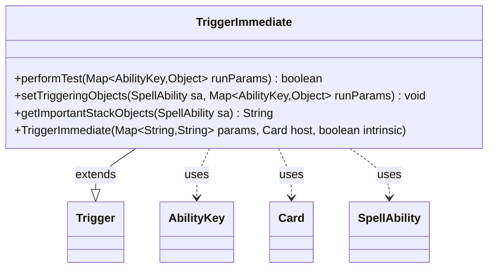

---
aliases:
  - TriggerImmediate
tags:
  - java/class
  - module/forge-game
  - pkg/forge/game/trigger
fqn: forge.game.trigger.TriggerImmediate
package: forge.game.trigger
module: forge-game
kind: Class
---

# TriggerImmediate

**Package:** `forge.game.trigger` &nbsp; **Module:** `forge-game` &nbsp; **Kind:** Class



## Relationships
**Extends:**
- [[forge.game.trigger.Trigger|Trigger]]
**Uses:**
- [[forge.game.ability.AbilityKey|AbilityKey]]
- [[forge.game.card.Card|Card]]
- [[forge.game.spellability.SpellAbility|SpellAbility]]

## Design Description

TriggerImmediate is a concrete trigger type in Forge's triggered-ability subsystem, extending the abstract Trigger base class to model an event that fires immediately as part of resolving a spell or ability. It overrides the three abstract hooks Trigger requires: performTest gates whether the trigger should fire, setTriggeringObjects supplies contextual data for the resolving SpellAbility (here a no-op, since this trigger carries no triggering objects), and getImportantStackObjects returns an empty descriptor.

Its only conditional logic lives in performTest, which suppresses the trigger when the optional "AfterReplacement" parameter is set and the game's ReplacementHandler is currently mid-replacement, preventing the immediate trigger from firing during replacement-effect processing. The class collaborates with AbilityKey-keyed run-parameter maps, the host Card, and SpellAbility, reflecting the standard data-passing contract shared across all Trigger subclasses.

## Source
`forge-game/src/main/java/forge/game/trigger/TriggerImmediate.java`

```java
/*
 * Forge: Play Magic: the Gathering.
 * Copyright (C) 2011  Forge Team
 *
 * This program is free software: you can redistribute it and/or modify
 * it under the terms of the GNU General Public License as published by
 * the Free Software Foundation, either version 3 of the License, or
 * (at your option) any later version.
 *
 * This program is distributed in the hope that it will be useful,
 * but WITHOUT ANY WARRANTY; without even the implied warranty of
 * MERCHANTABILITY or FITNESS FOR A PARTICULAR PURPOSE.  See the
 * GNU General Public License for more details.
 *
 * You should have received a copy of the GNU General Public License
 * along with this program.  If not, see <http://www.gnu.org/licenses/>.
 */
package forge.game.trigger;

import java.util.Map;

import forge.game.ability.AbilityKey;
import forge.game.card.Card;
import forge.game.spellability.SpellAbility;


public class TriggerImmediate extends Trigger {

    public TriggerImmediate(final Map<String, String> params, final Card host, final boolean intrinsic) {
        super(params, host, intrinsic);
    }

    /** {@inheritDoc}
     * @param runParams*/
    @Override
    public final boolean performTest(final Map<AbilityKey, Object> runParams) {
        if (hasParam("AfterReplacement") && hostCard.getGame().getReplacementHandler().isReplacing()) {
            return false;
        }

        return true;
    }

    /** {@inheritDoc} */
    @Override
    public void setTriggeringObjects(final SpellAbility sa, Map<AbilityKey, Object> runParams) {
    }

    @Override
    public String getImportantStackObjects(SpellAbility sa) {
        return "";
    }
}
```

## Python
`forge/game/trigger/TriggerImmediate.py`

```python
from typing import Map

from forge.game.ability.AbilityKey import AbilityKey
from forge.game.card.Card import Card
from forge.game.spellability.SpellAbility import SpellAbility
from forge.game.trigger.Trigger import Trigger


class TriggerImmediate(Trigger):

    def __init__(self, params: dict[str, str], host: Card, intrinsic: bool):
        super().__init__(params, host, intrinsic)

    # {@inheritDoc}
    # @param runParams
    def performTest(self, runParams: dict[AbilityKey, object]) -> bool:
        if self.hasParam("AfterReplacement") and self.hostCard.getGame().getReplacementHandler().isReplacing():
            return False

        return True

    # {@inheritDoc}
    def setTriggeringObjects(self, sa: SpellAbility, runParams: dict[AbilityKey, object]) -> None:
        pass

    def getImportantStackObjects(self, sa: SpellAbility) -> str:
        return ""
```
