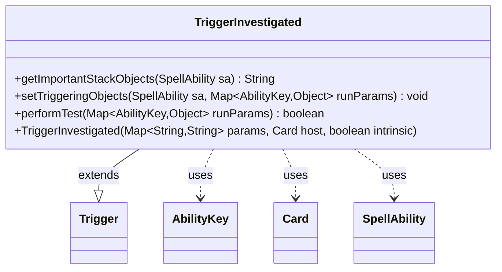

---
aliases:
  - TriggerInvestigated
tags:
  - java/class
  - module/forge-game
  - pkg/forge/game/trigger
fqn: forge.game.trigger.TriggerInvestigated
package: forge.game.trigger
module: forge-game
kind: Class
---

# TriggerInvestigated

**Package:** `forge.game.trigger`   **Module:** `forge-game`   **Kind:** Class



## Relationships
**Extends:**
- [[forge.game.trigger.Trigger|Trigger]]
**Uses:**
- [[forge.game.ability.AbilityKey|AbilityKey]]
- [[forge.game.card.Card|Card]]
- [[forge.game.spellability.SpellAbility|SpellAbility]]

## Design Description

Investigates trigger that fires when a permanent's Investigate ability creates a Clue, firing in response to investigation events during gameplay. As a concrete subclass of `Trigger`, it specializes the engine's event-driven trigger framework for this specific game event.

`performTest` gates firing through optional `ValidPlayer` matching and a `FirstTime` constraint, reading event context from the `runParams` map keyed by `AbilityKey` enum values. `setTriggeringObjects` exposes the investigating `Player` to the resolving `SpellAbility`, while `getImportantStackObjects` builds a localized stack description via `Localizer`. The design follows the established Trigger pattern—lightweight per-trigger subclasses overriding test and binding hooks—keeping per-event logic uniform and decoupled from the central trigger-dispatch machinery, with `Card host` and `intrinsic` flag passed straight to the superclass constructor.

## Source
`forge-game/src/main/java/forge/game/trigger/TriggerInvestigated.java`

```java
/*
 * Forge: Play Magic: the Gathering.
 * Copyright (C) 2011  Forge Team
 *
 * This program is free software: you can redistribute it and/or modify
 * it under the terms of the GNU General Public License as published by
 * the Free Software Foundation, either version 3 of the License, or
 * (at your option) any later version.
 * 
 * This program is distributed in the hope that it will be useful,
 * but WITHOUT ANY WARRANTY; without even the implied warranty of
 * MERCHANTABILITY or FITNESS FOR A PARTICULAR PURPOSE.  See the
 * GNU General Public License for more details.
 * 
 * You should have received a copy of the GNU General Public License
 * along with this program.  If not, see <http://www.gnu.org/licenses/>.
 */
package forge.game.trigger;

import java.util.Map;

import forge.game.ability.AbilityKey;
import forge.game.card.Card;
import forge.game.spellability.SpellAbility;
import forge.util.Localizer;

/**
 * <p>
 * Trigger_LandPlayed class.
 * </p>
 * 
 * @author Forge
 * @version $Id: TriggerInvestigated.java 30294 2015-10-16 01:53:32Z friarsol $
 */
public class TriggerInvestigated extends Trigger {

    /**
     * <p>
     * Constructor for Trigger_Investigated.
     * </p>
     * 
     * @param params
     *            a {@link java.util.HashMap} object.
     * @param host
     *            a {@link forge.game.card.Card} object.
     * @param intrinsic
     *            the intrinsic
     */
    public TriggerInvestigated(final Map<String, String> params, final Card host, final boolean intrinsic) {
        super(params, host, intrinsic);
    }

    @Override
    public String getImportantStackObjects(SpellAbility sa) {
        StringBuilder sb = new StringBuilder();
        sb.append(Localizer.getInstance().getMessage("lblPlayer")).append(": ").append(sa.getTriggeringObject(AbilityKey.Player));
        return sb.toString();
    }

    /** {@inheritDoc} */
    @Override
    public final void setTriggeringObjects(final SpellAbility sa, Map<AbilityKey, Object> runParams) {
        sa.setTriggeringObjectsFrom(runParams, AbilityKey.Player);
    }

    /** {@inheritDoc}
     * @param runParams*/
    @Override
    public final boolean performTest(final Map<AbilityKey, Object> runParams) {
        if (!matchesValidParam("ValidPlayer", runParams.get(AbilityKey.Player))) {
            return false;
        }

        if (hasParam("FirstTime")) {
            if (!(boolean) runParams.get(AbilityKey.FirstTime)) {
                return false;
            }
        }

        return true;
    }

}
```

## Python
`forge/game/trigger/TriggerInvestigated.py`

```python
from forge.game.trigger.Trigger import Trigger
from forge.game.ability.AbilityKey import AbilityKey
from forge.game.card.Card import Card
from forge.game.spellability.SpellAbility import SpellAbility
from forge.util.Localizer import Localizer


class TriggerInvestigated(Trigger):
    """
    Trigger_LandPlayed class.

    @author Forge
    @version $Id: TriggerInvestigated.java 30294 2015-10-16 01:53:32Z friarsol $
    """

    def __init__(self, params: dict[str, str], host: Card, intrinsic: bool):
        super().__init__(params, host, intrinsic)

    def getImportantStackObjects(self, sa: SpellAbility) -> str:
        sb = []
        sb.append(Localizer.getInstance().getMessage("lblPlayer"))
        sb.append(": ")
        sb.append(str(sa.getTriggeringObject(AbilityKey.Player)))
        return "".join(sb)

    def setTriggeringObjects(self, sa: SpellAbility, runParams: dict[AbilityKey, object]) -> None:
        sa.setTriggeringObjectsFrom(runParams, AbilityKey.Player)

    def performTest(self, runParams: dict[AbilityKey, object]) -> bool:
        if not self.matchesValidParam("ValidPlayer", runParams.get(AbilityKey.Player)):
            return False

        if self.hasParam("FirstTime"):
            if not bool(runParams.get(AbilityKey.FirstTime)):
                return False

        return True
```
