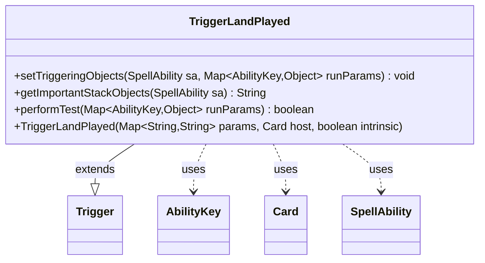

---
aliases:
  - TriggerLandPlayed
tags:
  - java/class
  - module/forge-game
  - pkg/forge/game/trigger
fqn: forge.game.trigger.TriggerLandPlayed
package: forge.game.trigger
module: forge-game
kind: Class
---

# TriggerLandPlayed

**Package:** `forge.game.trigger`   **Module:** `forge-game`   **Kind:** Class



## Relationships
**Extends:**
- [[forge.game.trigger.Trigger|Trigger]]
**Uses:**
- [[forge.game.ability.AbilityKey|AbilityKey]]
- [[forge.game.card.Card|Card]]
- [[forge.game.spellability.SpellAbility|SpellAbility]]

## Design Description

Land-played trigger: a concrete `Trigger` subclass that fires whenever a land enters play, supporting Forge's trigger system for cards that react to land plays.

Extending `Trigger`, it overrides `setTriggeringObjects` to expose the played `Card` to the firing `SpellAbility` via the `AbilityKey.Card` slot, and `getImportantStackObjects` to produce a localized stack description. Its core logic lives in `performTest`, which gates the trigger against the declarative parameters of a card's scripted ability — checking the land's `Origin` zone, `ValidCard`/`ValidSA` restrictions, and an optional `NotFirstLand` clause (verified through the controller's lands-played count). This keeps trigger behavior fully data-driven, collaborating with `Card`, `SpellAbility`, and `AbilityKey` rather than hard-coding individual card effects.

## Source
`forge-game/src/main/java/forge/game/trigger/TriggerLandPlayed.java`

```java
/*
 * Forge: Play Magic: the Gathering.
 * Copyright (C) 2011  Forge Team
 *
 * This program is free software: you can redistribute it and/or modify
 * it under the terms of the GNU General Public License as published by
 * the Free Software Foundation, either version 3 of the License, or
 * (at your option) any later version.
 *
 * This program is distributed in the hope that it will be useful,
 * but WITHOUT ANY WARRANTY; without even the implied warranty of
 * MERCHANTABILITY or FITNESS FOR A PARTICULAR PURPOSE.  See the
 * GNU General Public License for more details.
 *
 * You should have received a copy of the GNU General Public License
 * along with this program.  If not, see <http://www.gnu.org/licenses/>.
 */
package forge.game.trigger;

import java.util.Map;

import org.apache.commons.lang3.ArrayUtils;

import forge.game.ability.AbilityKey;
import forge.game.card.Card;
import forge.game.spellability.SpellAbility;
import forge.util.Localizer;

/**
 * <p>
 * Trigger_LandPlayed class.
 * </p>
 *
 * @author Forge
 * @version $Id$
 */
public class TriggerLandPlayed extends Trigger {

    /**
     * <p>
     * Constructor for Trigger_LandPlayed.
     * </p>
     *
     * @param params
     *            a {@link java.util.HashMap} object.
     * @param host
     *            a {@link forge.game.card.Card} object.
     * @param intrinsic
     *            the intrinsic
     */
    public TriggerLandPlayed(final Map<String, String> params, final Card host, final boolean intrinsic) {
        super(params, host, intrinsic);
    }

    /** {@inheritDoc} */
    @Override
    public final void setTriggeringObjects(final SpellAbility sa, Map<AbilityKey, Object> runParams) {
        sa.setTriggeringObjectsFrom(runParams, AbilityKey.Card);
    }

    @Override
    public String getImportantStackObjects(SpellAbility sa) {
        StringBuilder sb = new StringBuilder();
        sb.append(Localizer.getInstance().getMessage("lblLandPlayed")).append(": ").append(sa.getTriggeringObject(AbilityKey.Card));
        return sb.toString();
    }

    /** {@inheritDoc}
     * @param runParams*/
    @Override
    public final boolean performTest(final Map<AbilityKey, Object> runParams) {
        if (hasParam("Origin")) {
            if (!getParam("Origin").equals("Any")) {
                if (getParam("Origin") == null) {
                    return false;
                }
                if (!ArrayUtils.contains(
                    getParam("Origin").split(","), runParams.get(AbilityKey.Origin)
                )) {
                    return false;
                }
            }
        }

        if (!matchesValidParam("ValidCard", runParams.get(AbilityKey.Card))) {
            return false;
        }

        if (!matchesValidParam("ValidSA", runParams.get(AbilityKey.SpellAbility))) {
            return false;
        }

        if (hasParam("NotFirstLand")) {
            Card land = (Card) runParams.get(AbilityKey.Card);
            if (land.getController().getLandsPlayedThisTurn() < 1) {
                return false;
            }
        }
        return true;
    }

}
```

## Python
`forge/game/trigger/TriggerLandPlayed.py`

```python
from forge.game.trigger.Trigger import Trigger
from forge.game.ability.AbilityKey import AbilityKey
from forge.game.card.Card import Card
from forge.game.spellability.SpellAbility import SpellAbility
from forge.util.Localizer import Localizer


class TriggerLandPlayed(Trigger):

    def __init__(self, params: dict[str, str], host: Card, intrinsic: bool):
        super().__init__(params, host, intrinsic)

    def setTriggeringObjects(self, sa: SpellAbility, runParams: dict[AbilityKey, object]) -> None:
        sa.setTriggeringObjectsFrom(runParams, AbilityKey.Card)

    def getImportantStackObjects(self, sa: SpellAbility) -> str:
        sb = []
        sb.append(Localizer.getInstance().getMessage("lblLandPlayed"))
        sb.append(": ")
        sb.append(str(sa.getTriggeringObject(AbilityKey.Card)))
        return "".join(sb)

    def performTest(self, runParams: dict[AbilityKey, object]) -> bool:
        if self.hasParam("Origin"):
            if self.getParam("Origin") != "Any":
                if self.getParam("Origin") is None:
                    return False
                if runParams.get(AbilityKey.Origin) not in self.getParam("Origin").split(","):
                    return False

        if not self.matchesValidParam("ValidCard", runParams.get(AbilityKey.Card)):
            return False

        if not self.matchesValidParam("ValidSA", runParams.get(AbilityKey.SpellAbility)):
            return False

        if self.hasParam("NotFirstLand"):
            land = runParams.get(AbilityKey.Card)
            if land.getController().getLandsPlayedThisTurn() < 1:
                return False
        return True
```
