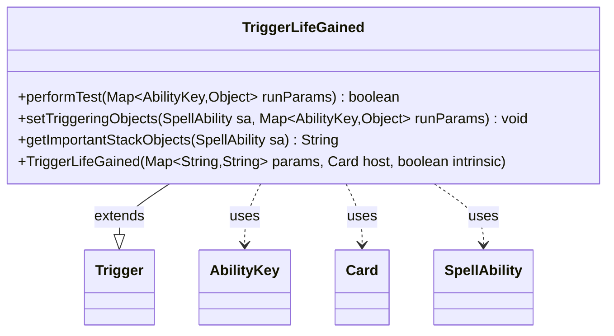

---
aliases:
  - TriggerLifeGained
tags:
  - java/class
  - module/forge-game
  - pkg/forge/game/trigger
fqn: forge.game.trigger.TriggerLifeGained
package: forge.game.trigger
module: forge-game
kind: Class
---

# TriggerLifeGained

**Package:** `forge.game.trigger`   **Module:** `forge-game`   **Kind:** Class



## Relationships
**Extends:**
- [[forge.game.trigger.Trigger|Trigger]]
**Uses:**
- [[forge.game.ability.AbilityKey|AbilityKey]]
- [[forge.game.card.Card|Card]]
- [[forge.game.spellability.SpellAbility|SpellAbility]]

## Design Description

Trigger that fires when a player gains life. As a concrete subclass of `Trigger`, it overrides `performTest` to evaluate trigger conditions—filtering on `ValidPlayer` and `ValidSource`, an optional `FirstTime` flag, and an optional `Spell` requirement that checks whether the life gain originated from a spell. It reads game state through `AbilityKey`-keyed run parameters, is constructed with a parameter map plus its host `Card`, and collaborates with `SpellAbility` to expose the triggering player and life amount: `setTriggeringObjects` binds those values onto the firing ability, while `getImportantStackObjects` produces a localized, human-readable summary for the stack. The design follows the engine's data-driven trigger pattern, where declarative card parameters govern behavior rather than hardcoded logic.

## Source
`forge-game/src/main/java/forge/game/trigger/TriggerLifeGained.java`

```java
/*
 * Forge: Play Magic: the Gathering.
 * Copyright (C) 2011  Forge Team
 *
 * This program is free software: you can redistribute it and/or modify
 * it under the terms of the GNU General Public License as published by
 * the Free Software Foundation, either version 3 of the License, or
 * (at your option) any later version.
 * 
 * This program is distributed in the hope that it will be useful,
 * but WITHOUT ANY WARRANTY; without even the implied warranty of
 * MERCHANTABILITY or FITNESS FOR A PARTICULAR PURPOSE.  See the
 * GNU General Public License for more details.
 * 
 * You should have received a copy of the GNU General Public License
 * along with this program.  If not, see <http://www.gnu.org/licenses/>.
 */
package forge.game.trigger;

import java.util.Map;

import forge.game.ability.AbilityKey;
import forge.game.card.Card;
import forge.game.spellability.SpellAbility;
import forge.util.Localizer;

/**
 * <p>
 * Trigger_LifeGained class.
 * </p>
 * 
 * @author Forge
 */
public class TriggerLifeGained extends Trigger {

    /**
     * <p>
     * Constructor for Trigger_LifeGained.
     * </p>
     * 
     * @param params
     *            a {@link java.util.Map} object.
     * @param host
     *            a {@link forge.game.card.Card} object.
     * @param intrinsic
     *            the intrinsic
     */
    public TriggerLifeGained(final Map<String, String> params, final Card host, final boolean intrinsic) {
        super(params, host, intrinsic);
    }

    /** {@inheritDoc}
     * @param runParams*/
    @Override
    public final boolean performTest(final Map<AbilityKey, Object> runParams) {
        if (!matchesValidParam("ValidPlayer", runParams.get(AbilityKey.Player))) {
            return false;
        }

        if (!matchesValidParam("ValidSource", runParams.get(AbilityKey.Source))) {
            return false;
        }

        if (hasParam("FirstTime")) {
            if (!(boolean) runParams.get(AbilityKey.FirstTime)) {
                return false;
            }
        }

        if (hasParam("Spell")) {
            final SpellAbility spellAbility = (SpellAbility) runParams.get(AbilityKey.SourceSA);
            if (spellAbility == null || !spellAbility.getRootAbility().isSpell()) {
                return false;
            }
        }

        return true;
    }

    /** {@inheritDoc} */
    @Override
    public final void setTriggeringObjects(final SpellAbility sa, Map<AbilityKey, Object> runParams) {
        sa.setTriggeringObjectsFrom(runParams, AbilityKey.LifeAmount, AbilityKey.Player);
    }

    @Override
    public String getImportantStackObjects(SpellAbility sa) {
        StringBuilder sb = new StringBuilder();
        sb.append(Localizer.getInstance().getMessage("lblPlayer")).append(": ").append(sa.getTriggeringObject(AbilityKey.Player)).append(", ");
        sb.append(Localizer.getInstance().getMessage("lblGainedAmount")).append(": ").append(sa.getTriggeringObject(AbilityKey.LifeAmount));
        return sb.toString();
    }
}
```

## Python
`forge/game/trigger/TriggerLifeGained.py`

```python
from forge.game.trigger.Trigger import Trigger
from forge.game.ability.AbilityKey import AbilityKey
from forge.game.card.Card import Card
from forge.game.spellability.SpellAbility import SpellAbility
from forge.util.Localizer import Localizer


class TriggerLifeGained(Trigger):
    """
    Trigger_LifeGained class.

    @author Forge
    """

    def __init__(self, params: dict[str, str], host: Card, intrinsic: bool):
        super().__init__(params, host, intrinsic)

    def performTest(self, runParams: dict[AbilityKey, object]) -> bool:
        if not self.matchesValidParam("ValidPlayer", runParams.get(AbilityKey.Player)):
            return False

        if not self.matchesValidParam("ValidSource", runParams.get(AbilityKey.Source)):
            return False

        if self.hasParam("FirstTime"):
            if not runParams.get(AbilityKey.FirstTime):
                return False

        if self.hasParam("Spell"):
            spellAbility = runParams.get(AbilityKey.SourceSA)
            if spellAbility is None or not spellAbility.getRootAbility().isSpell():
                return False

        return True

    def setTriggeringObjects(self, sa: SpellAbility, runParams: dict[AbilityKey, object]) -> None:
        sa.setTriggeringObjectsFrom(runParams, AbilityKey.LifeAmount, AbilityKey.Player)

    def getImportantStackObjects(self, sa: SpellAbility) -> str:
        sb = []
        sb.append(Localizer.getInstance().getMessage("lblPlayer"))
        sb.append(": ")
        sb.append(str(sa.getTriggeringObject(AbilityKey.Player)))
        sb.append(", ")
        sb.append(Localizer.getInstance().getMessage("lblGainedAmount"))
        sb.append(": ")
        sb.append(str(sa.getTriggeringObject(AbilityKey.LifeAmount)))
        return "".join(sb)
```
