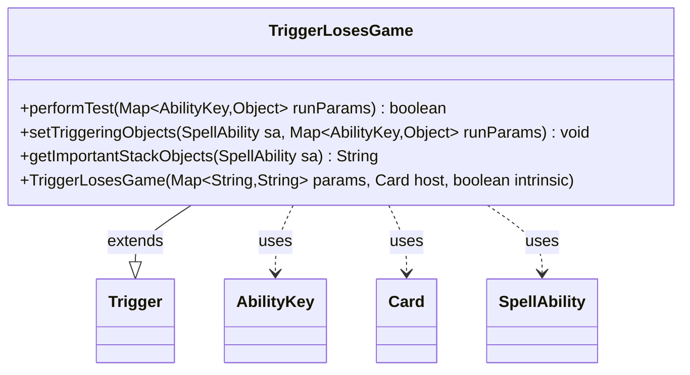

---
aliases:
  - TriggerLosesGame
tags:
  - java/class
  - module/forge-game
  - pkg/forge/game/trigger
fqn: forge.game.trigger.TriggerLosesGame
package: forge.game.trigger
module: forge-game
kind: Class
---

# TriggerLosesGame

**Package:** `forge.game.trigger`   **Module:** `forge-game`   **Kind:** Class



## Relationships
**Extends:**
- [[forge.game.trigger.Trigger|Trigger]]
**Uses:**
- [[forge.game.ability.AbilityKey|AbilityKey]]
- [[forge.game.card.Card|Card]]
- [[forge.game.spellability.SpellAbility|SpellAbility]]

## Design Description

TriggerLosesGame is a concrete trigger that fires when a player loses the game, modeling Magic's "whenever a player loses the game" triggered abilities. As a subclass of Trigger, it implements the framework's template-method contract: performTest gates activation by checking the losing player against the trigger's optional ValidPlayer filter, setTriggeringObjects publishes the losing Player into the spell ability's triggering context via AbilityKey, and getImportantStackObjects produces a localized, human-readable summary for the stack.

Its design intent is deliberately minimal—it carries no state of its own beyond what the constructor forwards to the superclass, delegating parameter parsing, host-card binding, and intrinsic handling to Trigger. Collaboration is keyed entirely through AbilityKey.Player, keeping the trigger decoupled from concrete game-state types while relying on SpellAbility as the conduit for triggering data and Localizer for presentation.

## Source
`forge-game/src/main/java/forge/game/trigger/TriggerLosesGame.java`

```java
package forge.game.trigger;

import java.util.Map;

import forge.game.ability.AbilityKey;
import forge.game.card.Card;
import forge.game.spellability.SpellAbility;
import forge.util.Localizer;

/** 
 * TODO: Write javadoc for this type.
 *
 */
public class TriggerLosesGame extends Trigger {
    /**
     * <p>
     * Constructor for Trigger_Shuffled.
     * </p>
     * 
     * @param params
     *            a {@link java.util.HashMap} object.
     * @param host
     *            a {@link forge.game.card.Card} object.
     * @param intrinsic
     *            the intrinsic
     */
    public TriggerLosesGame(final Map<String, String> params, final Card host, final boolean intrinsic) {
        super(params, host, intrinsic);
    }

    /** {@inheritDoc}
     * @param runParams*/
    @Override
    public final boolean performTest(final Map<AbilityKey, Object> runParams) {
        if (!matchesValidParam("ValidPlayer", runParams.get(AbilityKey.Player))) {
            return false;
        }

        return true;
    }

    /** {@inheritDoc} */
    @Override
    public final void setTriggeringObjects(final SpellAbility sa, Map<AbilityKey, Object> runParams) {
        sa.setTriggeringObjectsFrom(runParams, AbilityKey.Player);
    }

    @Override
    public String getImportantStackObjects(SpellAbility sa) {
        StringBuilder sb = new StringBuilder();
        sb.append(Localizer.getInstance().getMessage("lblPlayer")).append(": ").append(sa.getTriggeringObject(AbilityKey.Player));
        return sb.toString();
    }
}
```

## Python
`forge/game/trigger/TriggerLosesGame.py`

```python
from typing import Map  # noqa

from forge.game.trigger.Trigger import Trigger
from forge.game.ability.AbilityKey import AbilityKey
from forge.game.card.Card import Card
from forge.game.spellability.SpellAbility import SpellAbility
from forge.util.Localizer import Localizer


# TODO: Write javadoc for this type.
class TriggerLosesGame(Trigger):
    def __init__(self, params: dict[str, str], host: Card, intrinsic: bool):
        super().__init__(params, host, intrinsic)

    def performTest(self, runParams: dict[AbilityKey, object]) -> bool:
        if not self.matchesValidParam("ValidPlayer", runParams.get(AbilityKey.Player)):
            return False

        return True

    def setTriggeringObjects(self, sa: SpellAbility, runParams: dict[AbilityKey, object]) -> None:
        sa.setTriggeringObjectsFrom(runParams, AbilityKey.Player)

    def getImportantStackObjects(self, sa: SpellAbility) -> str:
        sb = []
        sb.append(Localizer.getInstance().getMessage("lblPlayer"))
        sb.append(": ")
        sb.append(str(sa.getTriggeringObject(AbilityKey.Player)))
        return "".join(sb)
```
