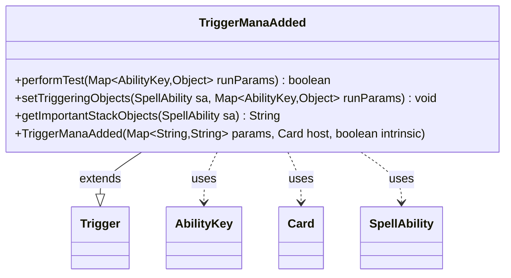

---
aliases:
  - TriggerManaAdded
tags:
  - java/class
  - module/forge-game
  - pkg/forge/game/trigger
fqn: forge.game.trigger.TriggerManaAdded
package: forge.game.trigger
module: forge-game
kind: Class
---

# TriggerManaAdded

**Package:** `forge.game.trigger`   **Module:** `forge-game`   **Kind:** Class



## Relationships
**Extends:**
- [[forge.game.trigger.Trigger|Trigger]]
**Uses:**
- [[forge.game.ability.AbilityKey|AbilityKey]]
- [[forge.game.card.Card|Card]]
- [[forge.game.spellability.SpellAbility|SpellAbility]]

## Design Description

TriggerManaAdded is a concrete trigger that fires when mana is added to a player's pool, typically from a mana-producing ability. As a subclass of Trigger, it specializes the framework's template by implementing the matching and binding hooks: performTest screens candidate events against the trigger's configured parameters—ValidSource, ValidSA, Player, and the produced mana color—using the host card's chosen color when "ChosenColor" is specified. setTriggeringObjects then exposes the source card, controlling player, and produced mana to the resulting SpellAbility for use in its effect.

It collaborates with AbilityKey to read typed values from the runtime parameter map, with Card and SpellAbility as the event's source and resolved ability, and with MagicColor and TextUtil to normalize mana into comparable string form. getImportantStackObjects supplies a localized stack description of the produced mana, reflecting an intent to keep trigger logic data-driven and presentation localized.

## Source
`forge-game/src/main/java/forge/game/trigger/TriggerManaAdded.java`

```java
/*
 * Forge: Play Magic: the Gathering.
 * Copyright (C) 2011  Forge Team
 *
 * This program is free software: you can redistribute it and/or modify
 * it under the terms of the GNU General Public License as published by
 * the Free Software Foundation, either version 3 of the License, or
 * (at your option) any later version.
 *
 * This program is distributed in the hope that it will be useful,
 * but WITHOUT ANY WARRANTY; without even the implied warranty of
 * MERCHANTABILITY or FITNESS FOR A PARTICULAR PURPOSE.  See the
 * GNU General Public License for more details.
 *
 * You should have received a copy of the GNU General Public License
 * along with this program.  If not, see <http://www.gnu.org/licenses/>.
 */
package forge.game.trigger;

import forge.card.MagicColor;
import forge.game.ability.AbilityKey;
import forge.game.card.Card;
import forge.game.spellability.SpellAbility;
import forge.util.Localizer;

import java.util.Map;

import static forge.util.TextUtil.toManaString;

/**
 * <p>
 * Trigger_ManaAdded class.
 * </p>
 *
 * @author Forge
 * @version $Id$
 */
public class TriggerManaAdded extends Trigger {

    /**
     * <p>
     * Constructor for Trigger_TapsForMana.
     * </p>
     *
     * @param params
     *            a {@link java.util.HashMap} object.
     * @param host
     *            a {@link forge.game.card.Card} object.
     * @param intrinsic
     *            the intrinsic
     */
    public TriggerManaAdded(final Map<String, String> params, final Card host, final boolean intrinsic) {
        super(params, host, intrinsic);
    }

    /** {@inheritDoc}
     * @param runParams*/
    @Override
    public final boolean performTest(final Map<AbilityKey, Object> runParams) {
        if (!matchesValidParam("ValidSource", runParams.get(AbilityKey.Card))) {
            return false;
        }
        if (!matchesValidParam("ValidSA", runParams.get(AbilityKey.AbilityMana))) {
            return false;
        }
        if (!matchesValidParam("Player", runParams.get(AbilityKey.Player))) {
            return false;
        }

        if (hasParam("Produced")) {
            Object prod = runParams.get(AbilityKey.Produced);
            if (!(prod instanceof String)) {
                return false;
            }
            String produced = (String) prod;
            if ("ChosenColor".equals(getParam("Produced"))) {
                if (!this.getHostCard().hasChosenColor() || !produced.contains(MagicColor.toShortString(this.getHostCard().getChosenColor()))) {
                    return false;
                }
            } else if (!produced.contains(MagicColor.toShortString(this.getParam("Produced")))) {
                return false;
            }
        }
        return true;
    }

    /** {@inheritDoc} */
    @Override
    public final void setTriggeringObjects(final SpellAbility sa, Map<AbilityKey, Object> runParams) {
        sa.setTriggeringObjectsFrom(runParams, AbilityKey.Card, AbilityKey.Player, AbilityKey.Produced);
    }

    @Override
    public String getImportantStackObjects(SpellAbility sa) {
        return Localizer.getInstance().getMessage("lblProduced") + ": " +
                toManaString(sa.getTriggeringObject(AbilityKey.Produced).toString());
    }
}
```

## Python
`forge/game/trigger/TriggerManaAdded.py`

```python
package forge.game.trigger

from typing import Any

from forge.card.MagicColor import MagicColor
from forge.game.ability.AbilityKey import AbilityKey
from forge.game.card.Card import Card
from forge.game.spellability.SpellAbility import SpellAbility
from forge.util.Localizer import Localizer
from forge.util.TextUtil import toManaString
from forge.game.trigger.Trigger import Trigger


class TriggerManaAdded(Trigger):
    def __init__(self, params: dict[str, str], host: Card, intrinsic: bool):
        super().__init__(params, host, intrinsic)

    def performTest(self, runParams: dict[AbilityKey, Any]) -> bool:
        if not self.matchesValidParam("ValidSource", runParams.get(AbilityKey.Card)):
            return False
        if not self.matchesValidParam("ValidSA", runParams.get(AbilityKey.AbilityMana)):
            return False
        if not self.matchesValidParam("Player", runParams.get(AbilityKey.Player)):
            return False

        if self.hasParam("Produced"):
            prod = runParams.get(AbilityKey.Produced)
            if not isinstance(prod, str):
                return False
            produced = prod
            if "ChosenColor" == self.getParam("Produced"):
                if not self.getHostCard().hasChosenColor() or MagicColor.toShortString(self.getHostCard().getChosenColor()) not in produced:
                    return False
            elif MagicColor.toShortString(self.getParam("Produced")) not in produced:
                return False
        return True

    def setTriggeringObjects(self, sa: SpellAbility, runParams: dict[AbilityKey, Any]) -> None:
        sa.setTriggeringObjectsFrom(runParams, AbilityKey.Card, AbilityKey.Player, AbilityKey.Produced)

    def getImportantStackObjects(self, sa: SpellAbility) -> str:
        return Localizer.getInstance().getMessage("lblProduced") + ": " + \
            toManaString(str(sa.getTriggeringObject(AbilityKey.Produced)))
```
