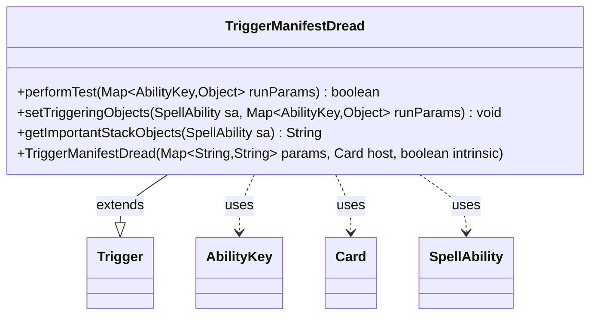

---
aliases:
  - TriggerManifestDread
tags:
  - java/class
  - module/forge-game
  - pkg/forge/game/trigger
fqn: forge.game.trigger.TriggerManifestDread
package: forge.game.trigger
module: forge-game
kind: Class
---

# TriggerManifestDread

**Package:** `forge.game.trigger` &nbsp; **Module:** `forge-game` &nbsp; **Kind:** Class



## Relationships
**Extends:**
- [[forge.game.trigger.Trigger|Trigger]]
**Uses:**
- [[forge.game.ability.AbilityKey|AbilityKey]]
- [[forge.game.card.Card|Card]]
- [[forge.game.spellability.SpellAbility|SpellAbility]]

## Design Description

Manifest Dread requires a player to look at the top two cards of their library, manifest one face down, and put the other into the graveyard.

The `TriggerManifestDread` class models the triggered ability that fires when a Manifest Dread event resolves. Extending the abstract `Trigger` base class, it overrides the standard trigger lifecycle: `performTest` gates firing through the optional `ValidPlayer` parameter against the acting player, while `setTriggeringObjects` exposes the affected `Cards` to the resolving `SpellAbility` so dependent effects can reference them. It collaborates with `AbilityKey` to address run-parameter and triggering-object slots in a type-safe, enum-keyed map, and constructs from the standard `(params, host, intrinsic)` signature shared across triggers. The empty `getImportantStackObjects` implementation signals that this trigger contributes no distinguishing stack-description text, keeping the class a thin, declarative specialization of the generic trigger framework.

## Source
`forge-game/src/main/java/forge/game/trigger/TriggerManifestDread.java`

```java
package forge.game.trigger;

import java.util.Map;

import forge.game.ability.AbilityKey;
import forge.game.card.Card;
import forge.game.spellability.SpellAbility;

public class TriggerManifestDread extends Trigger {

    public TriggerManifestDread(Map<String, String> params, Card host, boolean intrinsic) {
        super(params, host, intrinsic);
    }

    @Override
    public boolean performTest(Map<AbilityKey, Object> runParams) {
        if (!matchesValidParam("ValidPlayer", runParams.get(AbilityKey.Player))) {
            return false;
        }
        return true;
    }

    @Override
    public void setTriggeringObjects(SpellAbility sa, Map<AbilityKey, Object> runParams) {
        sa.setTriggeringObject(AbilityKey.Cards, runParams.get(AbilityKey.Cards));

    }

    @Override
    public String getImportantStackObjects(SpellAbility sa) {
        // TODO Auto-generated method stub
        return "";
    }

}
```

## Python
`forge/game/trigger/TriggerManifestDread.py`

```python
package forge.game.trigger; module is forge/game/trigger/TriggerManifestDread.py.

from forge.game.trigger.Trigger import Trigger
from forge.game.ability.AbilityKey import AbilityKey
from forge.game.card.Card import Card
from forge.game.spellability.SpellAbility import SpellAbility


class TriggerManifestDread(Trigger):

    def __init__(self, params: dict[str, str], host: Card, intrinsic: bool):
        super().__init__(params, host, intrinsic)

    def performTest(self, runParams: dict[AbilityKey, object]) -> bool:
        if not self.matchesValidParam("ValidPlayer", runParams.get(AbilityKey.Player)):
            return False
        return True

    def setTriggeringObjects(self, sa: SpellAbility, runParams: dict[AbilityKey, object]) -> None:
        sa.setTriggeringObject(AbilityKey.Cards, runParams.get(AbilityKey.Cards))

    def getImportantStackObjects(self, sa: SpellAbility) -> str:
        # TODO Auto-generated method stub
        return ""
```
