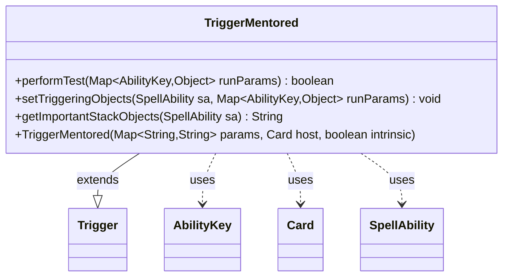

---
aliases:
  - TriggerMentored
tags:
  - java/class
  - module/forge-game
  - pkg/forge/game/trigger
fqn: forge.game.trigger.TriggerMentored
package: forge.game.trigger
module: forge-game
kind: Class
---

# TriggerMentored

**Package:** `forge.game.trigger` &nbsp; **Module:** `forge-game` &nbsp; **Kind:** Class



## Relationships
**Extends:**
- [[forge.game.trigger.Trigger|Trigger]]
**Uses:**
- [[forge.game.ability.AbilityKey|AbilityKey]]
- [[forge.game.card.Card|Card]]
- [[forge.game.spellability.SpellAbility|SpellAbility]]

## Design Description

Maintains the Forge trigger that fires when a creature with the Mentor keyword places a +1/+1 counter on a smaller-power attacker, signalling a "mentored" event. As a concrete subclass of `Trigger`, it overrides `performTest` to gate the event against the optional `ValidCard` and `ValidSource` constraints, `setTriggeringObjects` to expose the mentor (`Source`) and mentored creature (`Card`) to the resolving `SpellAbility` via shared `AbilityKey` slots, and `getImportantStackObjects` to produce a localized stack summary through `Localizer`. The design follows the engine's data-driven trigger pattern: behavior is configured by string parameters parsed in the superclass, while this class supplies only the keyword-specific matching and triggering-object wiring, collaborating with `Card` and `SpellAbility` rather than holding state of its own.

## Source
`forge-game/src/main/java/forge/game/trigger/TriggerMentored.java`

```java
package forge.game.trigger;

import java.util.Map;

import forge.game.ability.AbilityKey;
import forge.game.card.Card;
import forge.game.spellability.SpellAbility;
import forge.util.Localizer;

public class TriggerMentored extends Trigger {

    public TriggerMentored(Map<String, String> params, Card host, boolean intrinsic) {
        super(params, host, intrinsic);
    }

    @Override
    public boolean performTest(Map<AbilityKey, Object> runParams) {
        if (!matchesValidParam("ValidCard", runParams.get(AbilityKey.Card))) {
            return false;
        }

        if (!matchesValidParam("ValidSource", runParams.get(AbilityKey.Source))) {
            return false;
        }

        return true;
    }

    @Override
    public void setTriggeringObjects(SpellAbility sa, Map<AbilityKey, Object> runParams) {
        sa.setTriggeringObjectsFrom(runParams, AbilityKey.Card, AbilityKey.Source);
    }

    @Override
    public String getImportantStackObjects(SpellAbility sa) {
        StringBuilder sb = new StringBuilder();
        sb.append(Localizer.getInstance().getMessage("lblMentor")).append(": ").append(sa.getTriggeringObject(AbilityKey.Source)).append(", ");
        sb.append(Localizer.getInstance().getMessage("lblMentored")).append(": ").append(sa.getTriggeringObject(AbilityKey.Card));
        return sb.toString();
    }

}
```

## Python
`forge/game/trigger/TriggerMentored.py`

```python
from forge.game.trigger.Trigger import Trigger
from forge.game.ability.AbilityKey import AbilityKey
from forge.game.card.Card import Card
from forge.game.spellability.SpellAbility import SpellAbility
from forge.util.Localizer import Localizer


class TriggerMentored(Trigger):

    def __init__(self, params: dict[str, str], host: Card, intrinsic: bool):
        super().__init__(params, host, intrinsic)

    def performTest(self, runParams: dict[AbilityKey, object]) -> bool:
        if not self.matchesValidParam("ValidCard", runParams.get(AbilityKey.Card)):
            return False

        if not self.matchesValidParam("ValidSource", runParams.get(AbilityKey.Source)):
            return False

        return True

    def setTriggeringObjects(self, sa: SpellAbility, runParams: dict[AbilityKey, object]) -> None:
        sa.setTriggeringObjectsFrom(runParams, AbilityKey.Card, AbilityKey.Source)

    def getImportantStackObjects(self, sa: SpellAbility) -> str:
        sb = []
        sb.append(Localizer.getInstance().getMessage("lblMentor"))
        sb.append(": ")
        sb.append(str(sa.getTriggeringObject(AbilityKey.Source)))
        sb.append(", ")
        sb.append(Localizer.getInstance().getMessage("lblMentored"))
        sb.append(": ")
        sb.append(str(sa.getTriggeringObject(AbilityKey.Card)))
        return "".join(sb)
```
