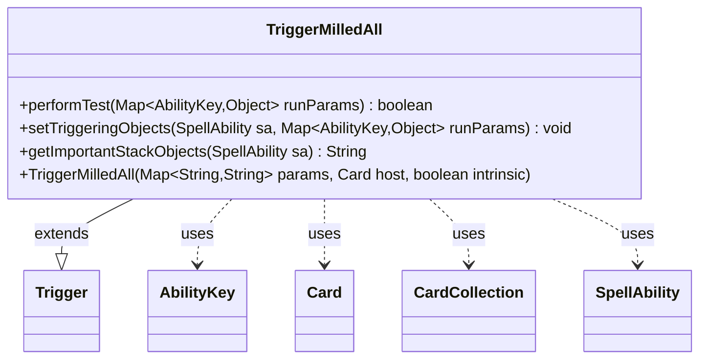

---
aliases:
  - TriggerMilledAll
tags:
  - java/class
  - module/forge-game
  - pkg/forge/game/trigger
fqn: forge.game.trigger.TriggerMilledAll
package: forge.game.trigger
module: forge-game
kind: Class
---

# TriggerMilledAll

**Package:** `forge.game.trigger` &nbsp; **Module:** `forge-game` &nbsp; **Kind:** Class



## Relationships
**Extends:**
- [[forge.game.trigger.Trigger|Trigger]]
**Uses:**
- [[forge.game.ability.AbilityKey|AbilityKey]]
- [[forge.game.card.Card|Card]]
- [[forge.game.card.CardCollection|CardCollection]]
- [[forge.game.spellability.SpellAbility|SpellAbility]]

## Source
`forge-game/src/main/java/forge/game/trigger/TriggerMilledAll.java`

```java
package forge.game.trigger;

import forge.game.ability.AbilityKey;
import forge.game.card.Card;
import forge.game.card.CardCollection;
import forge.game.card.CardLists;
import forge.game.spellability.SpellAbility;
import forge.util.Localizer;

import java.util.Map;

/**
 * <p>
 * TriggerMilledAll class.
 * </p>
 */
public class TriggerMilledAll extends Trigger {

    /**
     * <p>
     * Constructor for TriggerMilledAll
     * </p>
     *
     * @param params
     *            a {@link java.util.HashMap} object.
     * @param host
     *            a {@link forge.game.card.Card} object.
     * @param intrinsic
     *            the intrinsic
     */
    public TriggerMilledAll(final Map<String, String> params, final Card host, final boolean intrinsic) {
        super(params, host, intrinsic);
    }

    /** {@inheritDoc}
     * @param runParams*/
    @Override
    public final boolean performTest(final Map<AbilityKey, Object> runParams) {
        if (!matchesValidParam("ValidCard", runParams.get(AbilityKey.Cards))) {
            return false;
        }

        return true;
    }

    /** {@inheritDoc} */
    @Override
    public final void setTriggeringObjects(final SpellAbility sa, Map<AbilityKey, Object> runParams) {
        CardCollection cards = (CardCollection) runParams.get(AbilityKey.Cards);

        if (hasParam("ValidCard")) {
            cards = CardLists.getValidCards(cards, getParam("ValidCard"), getHostCard().getController(),
                    getHostCard(), this);
        }

        sa.setTriggeringObject(AbilityKey.Cards, cards);
        sa.setTriggeringObject(AbilityKey.Amount, cards.size());
    }

    @Override
    public String getImportantStackObjects(SpellAbility sa) {
        StringBuilder sb = new StringBuilder();
        sb.append(Localizer.getInstance().getMessage("lblAmount")).append(": ").append(sa.getTriggeringObject(AbilityKey.Amount));
        return sb.toString();
    }
}
```
