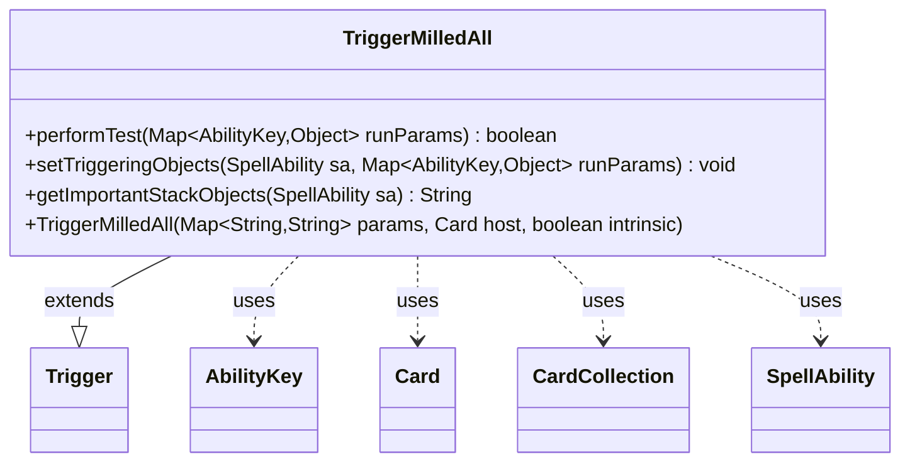

---
aliases:
  - TriggerMilledAll
tags:
  - java/class
  - module/forge-game
  - pkg/forge/game/trigger
fqn: forge.game.trigger.TriggerMilledAll
package: forge.game.trigger
module: forge-game
kind: Class
---

# TriggerMilledAll

**Package:** `forge.game.trigger` &nbsp; **Module:** `forge-game` &nbsp; **Kind:** Class



## Relationships
**Extends:**
- [[forge.game.trigger.Trigger|Trigger]]
**Uses:**
- [[forge.game.ability.AbilityKey|AbilityKey]]
- [[forge.game.card.Card|Card]]
- [[forge.game.card.CardCollection|CardCollection]]
- [[forge.game.spellability.SpellAbility|SpellAbility]]

## Design Description

TriggerMilledAll is a concrete trigger that fires when a group of cards is milled together, recognizing the game event and packaging its details for the triggered ability to consume. Extending `Trigger`, it overrides `performTest` to gate firing on an optional `ValidCard` filter, and `setTriggeringObjects` to expose the matching cards and their count via `AbilityKey.Cards` and `AbilityKey.Amount` on the `SpellAbility`. It collaborates with `CardCollection` and `CardLists` to filter the milled set against the host card's controller and perspective, and overrides `getImportantStackObjects` to surface a localized amount for stack display. The design follows Forge's data-driven trigger pattern: behavior is parameterized by the script-supplied params map rather than hard-coded, keeping the class a thin, reusable adapter between raw game events and ability resolution.

## Source
`forge-game/src/main/java/forge/game/trigger/TriggerMilledAll.java`

```java
package forge.game.trigger;

import forge.game.ability.AbilityKey;
import forge.game.card.Card;
import forge.game.card.CardCollection;
import forge.game.card.CardLists;
import forge.game.spellability.SpellAbility;
import forge.util.Localizer;

import java.util.Map;

/**
 * <p>
 * TriggerMilledAll class.
 * </p>
 */
public class TriggerMilledAll extends Trigger {

    /**
     * <p>
     * Constructor for TriggerMilledAll
     * </p>
     *
     * @param params
     *            a {@link java.util.HashMap} object.
     * @param host
     *            a {@link forge.game.card.Card} object.
     * @param intrinsic
     *            the intrinsic
     */
    public TriggerMilledAll(final Map<String, String> params, final Card host, final boolean intrinsic) {
        super(params, host, intrinsic);
    }

    /** {@inheritDoc}
     * @param runParams*/
    @Override
    public final boolean performTest(final Map<AbilityKey, Object> runParams) {
        if (!matchesValidParam("ValidCard", runParams.get(AbilityKey.Cards))) {
            return false;
        }

        return true;
    }

    /** {@inheritDoc} */
    @Override
    public final void setTriggeringObjects(final SpellAbility sa, Map<AbilityKey, Object> runParams) {
        CardCollection cards = (CardCollection) runParams.get(AbilityKey.Cards);

        if (hasParam("ValidCard")) {
            cards = CardLists.getValidCards(cards, getParam("ValidCard"), getHostCard().getController(),
                    getHostCard(), this);
        }

        sa.setTriggeringObject(AbilityKey.Cards, cards);
        sa.setTriggeringObject(AbilityKey.Amount, cards.size());
    }

    @Override
    public String getImportantStackObjects(SpellAbility sa) {
        StringBuilder sb = new StringBuilder();
        sb.append(Localizer.getInstance().getMessage("lblAmount")).append(": ").append(sa.getTriggeringObject(AbilityKey.Amount));
        return sb.toString();
    }
}
```

## Python
`forge/game/trigger/TriggerMilledAll.py`

```python
from forge.game.ability.AbilityKey import AbilityKey
from forge.game.card.Card import Card
from forge.game.card.CardCollection import CardCollection
from forge.game.card.CardLists import CardLists
from forge.game.spellability.SpellAbility import SpellAbility
from forge.util.Localizer import Localizer
from forge.game.trigger.Trigger import Trigger


class TriggerMilledAll(Trigger):
    """
    TriggerMilledAll class.
    """

    def __init__(self, params: dict[str, str], host: Card, intrinsic: bool):
        super().__init__(params, host, intrinsic)

    def performTest(self, runParams: dict[AbilityKey, object]) -> bool:
        if not self.matchesValidParam("ValidCard", runParams.get(AbilityKey.Cards)):
            return False

        return True

    def setTriggeringObjects(self, sa: SpellAbility, runParams: dict[AbilityKey, object]) -> None:
        cards = runParams.get(AbilityKey.Cards)

        if self.hasParam("ValidCard"):
            cards = CardLists.getValidCards(cards, self.getParam("ValidCard"), self.getHostCard().getController(),
                    self.getHostCard(), self)

        sa.setTriggeringObject(AbilityKey.Cards, cards)
        sa.setTriggeringObject(AbilityKey.Amount, cards.size())

    def getImportantStackObjects(self, sa: SpellAbility) -> str:
        sb = []
        sb.append(Localizer.getInstance().getMessage("lblAmount"))
        sb.append(": ")
        sb.append(str(sa.getTriggeringObject(AbilityKey.Amount)))
        return "".join(sb)
```
