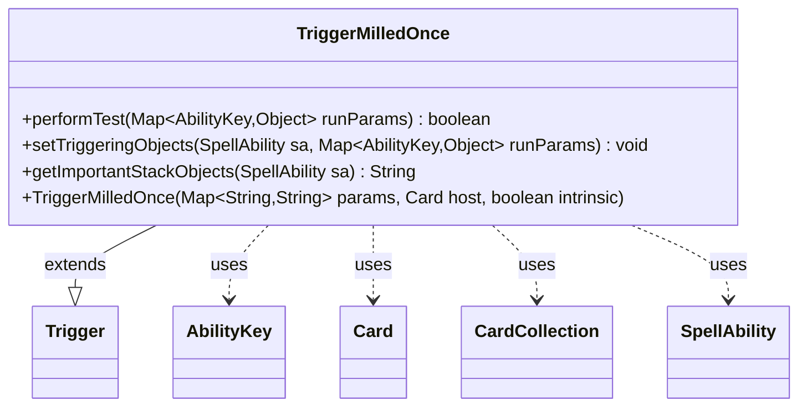

---
aliases:
  - TriggerMilledOnce
tags:
  - java/class
  - module/forge-game
  - pkg/forge/game/trigger
fqn: forge.game.trigger.TriggerMilledOnce
package: forge.game.trigger
module: forge-game
kind: Class
---

# TriggerMilledOnce

**Package:** `forge.game.trigger` &nbsp; **Module:** `forge-game` &nbsp; **Kind:** Class



## Relationships
**Extends:**
- [[forge.game.trigger.Trigger|Trigger]]
**Uses:**
- [[forge.game.ability.AbilityKey|AbilityKey]]
- [[forge.game.card.Card|Card]]
- [[forge.game.card.CardCollection|CardCollection]]
- [[forge.game.spellability.SpellAbility|SpellAbility]]

## Design Description

Mills cards from a library and fires a triggered ability the first time a milling event occurs, capturing the whole batch in one trigger rather than per-card. As a concrete subclass of `Trigger`, it implements the standard trigger contract: `performTest` gates firing by matching the milled cards and their owner against the optional `ValidPlayer` and `ValidCard` restrictions, while `setTriggeringObjects` filters the milled `CardCollection` (via `CardLists`) and exposes the resulting cards, their count (`Amount`), and the affected `Player` as triggering objects keyed by `AbilityKey` on the `SpellAbility`. It collaborates with `Card` for host context and controller resolution, and overrides `getImportantStackObjects` to surface the affected player in the stack description, using `Localizer` for display text. The design centralizes a one-shot, batch-oriented milled trigger, keeping card-validity matching declarative through host-relative `ValidCard` evaluation.

## Source
`forge-game/src/main/java/forge/game/trigger/TriggerMilledOnce.java`

```java
package forge.game.trigger;

import forge.game.ability.AbilityKey;
import forge.game.card.Card;
import forge.game.card.CardCollection;
import forge.game.card.CardLists;
import forge.game.spellability.SpellAbility;
import forge.util.Localizer;

import java.util.Map;

/**
 * <p>
 * TriggerMilledAll class.
 * </p>
 */
public class TriggerMilledOnce extends Trigger {

    /**
     * <p>
     * Constructor for TriggerMilledOnce
     * </p>
     *
     * @param params
     *            a {@link java.util.HashMap} object.
     * @param host
     *            a {@link forge.game.card.Card} object.
     * @param intrinsic
     *            the intrinsic
     */
    public TriggerMilledOnce(final Map<String, String> params, final Card host, final boolean intrinsic) {
        super(params, host, intrinsic);
    }

    /** {@inheritDoc}
     * @param runParams*/
    @Override
    public final boolean performTest(final Map<AbilityKey, Object> runParams) {
        if (!matchesValidParam("ValidPlayer", runParams.get(AbilityKey.Player))) {
            return false;
        }
        if (!matchesValidParam("ValidCard", runParams.get(AbilityKey.Cards))) {
            return false;
        }

        return true;
    }

    /** {@inheritDoc} */
    @Override
    public final void setTriggeringObjects(final SpellAbility sa, Map<AbilityKey, Object> runParams) {
        CardCollection cards = (CardCollection) runParams.get(AbilityKey.Cards);

        if (hasParam("ValidCard")) {
            cards = CardLists.getValidCards(cards, getParam("ValidCard"), getHostCard().getController(),
                    getHostCard(), this);
        }

        sa.setTriggeringObject(AbilityKey.Cards, cards);
        sa.setTriggeringObject(AbilityKey.Amount, cards.size());
        sa.setTriggeringObjectsFrom(runParams, AbilityKey.Player);
    }

    @Override
    public String getImportantStackObjects(SpellAbility sa) {
        StringBuilder sb = new StringBuilder();
        sb.append(Localizer.getInstance().getMessage("lblPlayer")).append(": ");
        sb.append(sa.getTriggeringObject(AbilityKey.Player));
        return sb.toString();
    }
}
```

## Python
`forge/game/trigger/TriggerMilledOnce.py`

```python
package forge.game.trigger

from forge.game.ability.AbilityKey import AbilityKey
from forge.game.card.Card import Card
from forge.game.card.CardCollection import CardCollection
from forge.game.card.CardLists import CardLists
from forge.game.spellability.SpellAbility import SpellAbility
from forge.util.Localizer import Localizer
from forge.game.trigger.Trigger import Trigger


class TriggerMilledOnce(Trigger):
    """
    TriggerMilledAll class.
    """

    def __init__(self, params: dict[str, str], host: Card, intrinsic: bool):
        super().__init__(params, host, intrinsic)

    def performTest(self, runParams: dict[AbilityKey, object]) -> bool:
        if not self.matchesValidParam("ValidPlayer", runParams.get(AbilityKey.Player)):
            return False
        if not self.matchesValidParam("ValidCard", runParams.get(AbilityKey.Cards)):
            return False

        return True

    def setTriggeringObjects(self, sa: SpellAbility, runParams: dict[AbilityKey, object]) -> None:
        cards = runParams.get(AbilityKey.Cards)

        if self.hasParam("ValidCard"):
            cards = CardLists.getValidCards(cards, self.getParam("ValidCard"), self.getHostCard().getController(),
                    self.getHostCard(), self)

        sa.setTriggeringObject(AbilityKey.Cards, cards)
        sa.setTriggeringObject(AbilityKey.Amount, cards.size())
        sa.setTriggeringObjectsFrom(runParams, AbilityKey.Player)

    def getImportantStackObjects(self, sa: SpellAbility) -> str:
        sb = []
        sb.append(Localizer.getInstance().getMessage("lblPlayer"))
        sb.append(": ")
        sb.append(str(sa.getTriggeringObject(AbilityKey.Player)))
        return "".join(sb)
```
