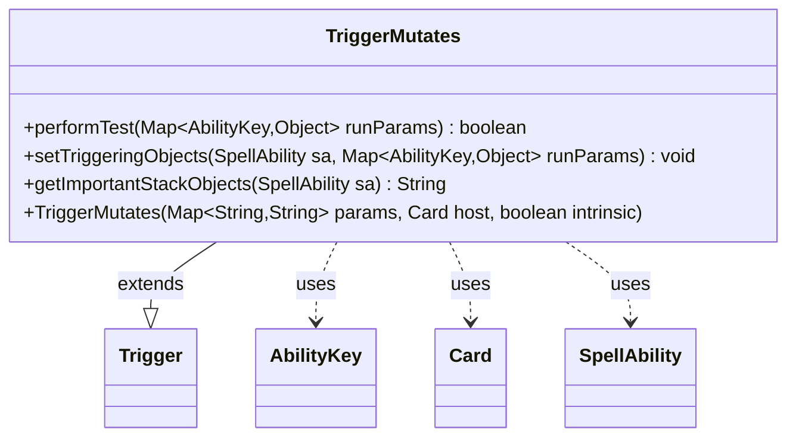

---
aliases:
  - TriggerMutates
tags:
  - java/class
  - module/forge-game
  - pkg/forge/game/trigger
fqn: forge.game.trigger.TriggerMutates
package: forge.game.trigger
module: forge-game
kind: Class
---

# TriggerMutates

**Package:** `forge.game.trigger` &nbsp; **Module:** `forge-game` &nbsp; **Kind:** Class



## Relationships
**Extends:**
- [[forge.game.trigger.Trigger|Trigger]]
**Uses:**
- [[forge.game.ability.AbilityKey|AbilityKey]]
- [[forge.game.card.Card|Card]]
- [[forge.game.spellability.SpellAbility|SpellAbility]]

## Design Description

TriggerMutates is a concrete trigger that fires when a creature mutates, modeling Magic's mutate mechanic within Forge's event-driven trigger system. Extending Trigger, it overrides the framework's three extension points: performTest filters firings against the optional "ValidCard" parameter, setTriggeringObjects exposes the mutating card to the resolving SpellAbility under AbilityKey.Card, and getImportantStackObjects produces a human-readable stack description.

Constructed from a string parameter map, host Card, and intrinsic flag, it carries no state of its own, delegating all configuration to its superclass and relying on the AbilityKey-keyed runParams map to communicate game state. This keeps the class a thin, declarative specialization whose only responsibility is recognizing and reporting the mutate event, consistent with Forge's pattern of one lightweight Trigger subclass per triggered-ability type.

## Source
`forge-game/src/main/java/forge/game/trigger/TriggerMutates.java`

```java
package forge.game.trigger;

import java.util.Map;

import forge.game.ability.AbilityKey;
import forge.game.card.Card;
import forge.game.spellability.SpellAbility;

public class TriggerMutates extends Trigger {
    public TriggerMutates(final Map<String, String> params, final Card host, final boolean intrinsic) {
        super(params, host, intrinsic);
    }

    @Override
    public boolean performTest(Map<AbilityKey, Object> runParams) {
        if (!matchesValidParam("ValidCard", runParams.get(AbilityKey.Card))) {
            return false;
        }

        return true;
    }

    @Override
    public void setTriggeringObjects(SpellAbility sa, Map<AbilityKey, Object> runParams) {
        sa.setTriggeringObject(AbilityKey.Card, runParams.get(AbilityKey.Card));
    }

    @Override
    public String getImportantStackObjects(SpellAbility sa) {
        StringBuilder sb = new StringBuilder();

        sb.append("Mutates").append(": ").append(sa.getTriggeringObject(AbilityKey.Card));
        return sb.toString();
    }
}
```

## Python
`forge/game/trigger/TriggerMutates.py`

```python
from forge.game.trigger.Trigger import Trigger
from forge.game.ability.AbilityKey import AbilityKey
from forge.game.card.Card import Card
from forge.game.spellability.SpellAbility import SpellAbility


class TriggerMutates(Trigger):
    def __init__(self, params: dict[str, str], host: Card, intrinsic: bool):
        super().__init__(params, host, intrinsic)

    def performTest(self, runParams: dict[AbilityKey, object]) -> bool:
        if not self.matchesValidParam("ValidCard", runParams.get(AbilityKey.Card)):
            return False

        return True

    def setTriggeringObjects(self, sa: SpellAbility, runParams: dict[AbilityKey, object]) -> None:
        sa.setTriggeringObject(AbilityKey.Card, runParams.get(AbilityKey.Card))

    def getImportantStackObjects(self, sa: SpellAbility) -> str:
        sb = []

        sb.append("Mutates")
        sb.append(": ")
        sb.append(str(sa.getTriggeringObject(AbilityKey.Card)))
        return "".join(sb)
```
