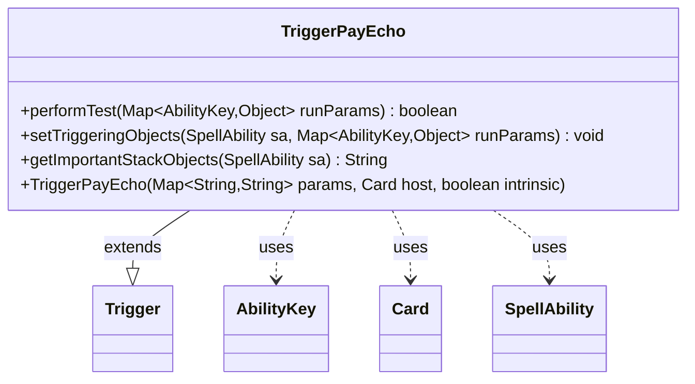

---
aliases:
  - TriggerPayEcho
tags:
  - java/class
  - module/forge-game
  - pkg/forge/game/trigger
fqn: forge.game.trigger.TriggerPayEcho
package: forge.game.trigger
module: forge-game
kind: Class
---

# TriggerPayEcho

**Package:** `forge.game.trigger`   **Module:** `forge-game`   **Kind:** Class



## Relationships
**Extends:**
- [[forge.game.trigger.Trigger|Trigger]]
**Uses:**
- [[forge.game.ability.AbilityKey|AbilityKey]]
- [[forge.game.card.Card|Card]]
- [[forge.game.spellability.SpellAbility|SpellAbility]]

## Design Description

TriggerPayEcho is a concrete trigger that fires in response to echo-cost payment events, extending the abstract `Trigger` base class within Forge's trigger framework. It overrides `performTest` to gate activation on whether the echo was paid—comparing the `EchoPaid` run parameter against the `Paid` parameter (with an XOR to support both "paid" and "not paid" listeners)—and on a `ValidCard` filter, returning true only when both conditions match.

Collaborating through `AbilityKey`-keyed run parameters, it bridges raw game events to the trigger system: `setTriggeringObjects` copies the relevant `Card` into the firing `SpellAbility` so downstream effects can reference it. The empty `getImportantStackObjects` signals no card-specific stack description is needed. The design follows the engine's data-driven pattern, where card-script parameters (`Paid`, `ValidCard`) configure generic trigger behavior rather than hardcoding it.

## Source
`forge-game/src/main/java/forge/game/trigger/TriggerPayEcho.java`

```java
/*
 * Forge: Play Magic: the Gathering.
 * Copyright (C) 2011  Forge Team
 *
 * This program is free software: you can redistribute it and/or modify
 * it under the terms of the GNU General Public License as published by
 * the Free Software Foundation, either version 3 of the License, or
 * (at your option) any later version.
 * 
 * This program is distributed in the hope that it will be useful,
 * but WITHOUT ANY WARRANTY; without even the implied warranty of
 * MERCHANTABILITY or FITNESS FOR A PARTICULAR PURPOSE.  See the
 * GNU General Public License for more details.
 * 
 * You should have received a copy of the GNU General Public License
 * along with this program.  If not, see <http://www.gnu.org/licenses/>.
 */
package forge.game.trigger;

import java.util.Map;

import forge.game.ability.AbilityKey;
import forge.game.card.Card;
import forge.game.spellability.SpellAbility;

/**
 * <p>
 * TriggerPayEcho class.
 * </p>
 * 
 * @author Forge
 * @version $Id: TriggerPayEcho.java 17802 2012-10-31 08:05:14Z Max mtg $
 */
public class TriggerPayEcho extends Trigger {

    /**
     * <p>
     * Constructor for Trigger_LifeGained.
     * </p>
     * 
     * @param params
     *            a {@link java.util.HashMap} object.
     * @param host
     *            a {@link forge.game.card.Card} object.
     * @param intrinsic
     *            the intrinsic
     */
    public TriggerPayEcho(final Map<String, String> params, final Card host, final boolean intrinsic) {
        super(params, host, intrinsic);
    }

    /** {@inheritDoc}
     * @param runParams*/
    @Override
    public final boolean performTest(final Map<AbilityKey, Object> runParams) {
        if (hasParam("Paid")) {
            Boolean paid = (Boolean) runParams.get(AbilityKey.EchoPaid);
            if (getParam("Paid").equals("True") ^ paid) {
                return false;
            }
        }
        if (!matchesValidParam("ValidCard", runParams.get(AbilityKey.Card))) {
            return false;
        }

        return true;
    }

    /** {@inheritDoc} */
    @Override
    public final void setTriggeringObjects(final SpellAbility sa, Map<AbilityKey, Object> runParams) {
        sa.setTriggeringObjectsFrom(runParams, AbilityKey.Card);
    }

    @Override
    public String getImportantStackObjects(SpellAbility sa) {
        return "";
    }
}
```

## Python
`forge/game/trigger/TriggerPayEcho.py`

```python
from forge.game.ability.AbilityKey import AbilityKey
from forge.game.card.Card import Card
from forge.game.spellability.SpellAbility import SpellAbility
from forge.game.trigger.Trigger import Trigger


class TriggerPayEcho(Trigger):
    def __init__(self, params: dict[str, str], host: Card, intrinsic: bool):
        super().__init__(params, host, intrinsic)

    def performTest(self, runParams: dict[AbilityKey, object]) -> bool:
        if self.hasParam("Paid"):
            paid = runParams.get(AbilityKey.EchoPaid)
            if (self.getParam("Paid") == "True") ^ bool(paid):
                return False
        if not self.matchesValidParam("ValidCard", runParams.get(AbilityKey.Card)):
            return False

        return True

    def setTriggeringObjects(self, sa: SpellAbility, runParams: dict[AbilityKey, object]) -> None:
        sa.setTriggeringObjectsFrom(runParams, AbilityKey.Card)

    def getImportantStackObjects(self, sa: SpellAbility) -> str:
        return ""
```
