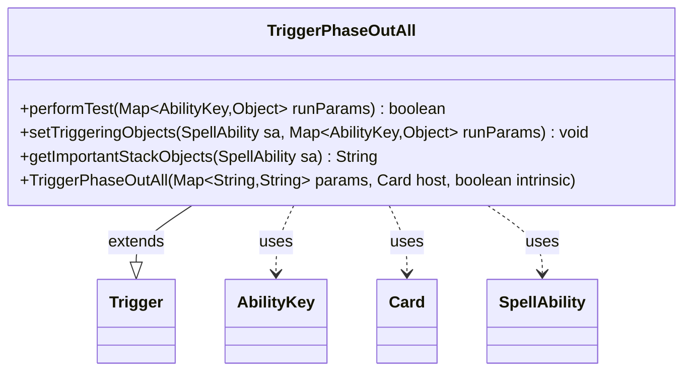

---
aliases:
  - TriggerPhaseOutAll
tags:
  - java/class
  - module/forge-game
  - pkg/forge/game/trigger
fqn: forge.game.trigger.TriggerPhaseOutAll
package: forge.game.trigger
module: forge-game
kind: Class
---

# TriggerPhaseOutAll

**Package:** `forge.game.trigger`   **Module:** `forge-game`   **Kind:** Class



## Relationships
**Extends:**
- [[forge.game.trigger.Trigger|Trigger]]
**Uses:**
- [[forge.game.ability.AbilityKey|AbilityKey]]
- [[forge.game.card.Card|Card]]
- [[forge.game.spellability.SpellAbility|SpellAbility]]

## Design Description

TriggerPhaseOutAll is a concrete trigger that fires when one or more cards phase out, allowing card abilities to respond to that game event. As a subclass of Trigger, it implements the framework's template methods: performTest gates activation by checking the phased-out cards against the optional ValidCards restriction, setTriggeringObjects filters those cards and exposes them to the resolving SpellAbility under the AbilityKey.Cards key, and getImportantStackObjects produces a localized, human-readable summary for the stack display.

Its design follows the engine's data-driven convention—behavior is configured through the string parameter map passed at construction rather than hardcoded—so a single class serves many card definitions. It collaborates with AbilityKey for typed run-parameter access, Card for the affected objects, and SpellAbility as the trigger's executing context, while delegating restriction matching and localization to shared utilities to keep the trigger logic minimal.

## Source
`forge-game/src/main/java/forge/game/trigger/TriggerPhaseOutAll.java`

```java
package forge.game.trigger;

import forge.game.ability.AbilityKey;
import forge.game.card.Card;
import forge.game.card.CardPredicates;
import forge.game.spellability.SpellAbility;
import forge.util.IterableUtil;
import forge.util.Localizer;

import java.util.Map;

public class TriggerPhaseOutAll extends Trigger {

    public TriggerPhaseOutAll(final Map<String, String> params, final Card host, final boolean intrinsic) {
        super(params, host, intrinsic);
    }

    @Override
    public boolean performTest(Map<AbilityKey, Object> runParams) {
        if (!matchesValidParam("ValidCards", runParams.get(AbilityKey.Cards))) {
            return false;
        }

        return true;
    }

    @Override
    public void setTriggeringObjects(SpellAbility sa, Map<AbilityKey, Object> runParams) {
        Iterable<Card> cards = (Iterable<Card>) runParams.get(AbilityKey.Cards);
        if (hasParam("ValidCards")) {
            cards = IterableUtil.filter(cards, CardPredicates.restriction(getParam("ValidCards").split(","),
                    getHostCard().getController(), getHostCard(), this));
        }

        sa.setTriggeringObject(AbilityKey.Cards, cards);
    }

    @Override
    public String getImportantStackObjects(SpellAbility sa) {
        StringBuilder sb = new StringBuilder();
        sb.append(Localizer.getInstance().getMessage("lblPhasedOut")).append(": ");
        sb.append(sa.getTriggeringObject(AbilityKey.Cards));
        return sb.toString();
    }
}
```

## Python
`forge/game/trigger/TriggerPhaseOutAll.py`

```python
from forge.game.ability.AbilityKey import AbilityKey
from forge.game.card.Card import Card
from forge.game.card.CardPredicates import CardPredicates
from forge.game.spellability.SpellAbility import SpellAbility
from forge.game.trigger.Trigger import Trigger
from forge.util.IterableUtil import IterableUtil
from forge.util.Localizer import Localizer


class TriggerPhaseOutAll(Trigger):

    def __init__(self, params: dict[str, str], host: Card, intrinsic: bool):
        super().__init__(params, host, intrinsic)

    def performTest(self, runParams: dict[AbilityKey, object]) -> bool:
        if not self.matchesValidParam("ValidCards", runParams.get(AbilityKey.Cards)):
            return False

        return True

    def setTriggeringObjects(self, sa: SpellAbility, runParams: dict[AbilityKey, object]) -> None:
        cards = runParams.get(AbilityKey.Cards)
        if self.hasParam("ValidCards"):
            cards = IterableUtil.filter(cards, CardPredicates.restriction(self.getParam("ValidCards").split(","),
                    self.getHostCard().getController(), self.getHostCard(), self))

        sa.setTriggeringObject(AbilityKey.Cards, cards)

    def getImportantStackObjects(self, sa: SpellAbility) -> str:
        sb = []
        sb.append(Localizer.getInstance().getMessage("lblPhasedOut"))
        sb.append(": ")
        sb.append(str(sa.getTriggeringObject(AbilityKey.Cards)))
        return "".join(sb)
```
