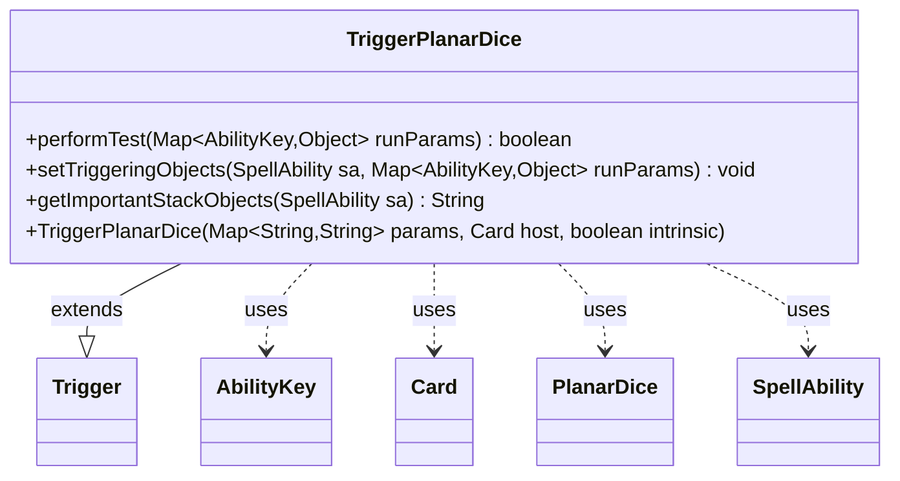

---
aliases:
  - TriggerPlanarDice
tags:
  - java/class
  - module/forge-game
  - pkg/forge/game/trigger
fqn: forge.game.trigger.TriggerPlanarDice
package: forge.game.trigger
module: forge-game
kind: Class
---

# TriggerPlanarDice

**Package:** `forge.game.trigger`   **Module:** `forge-game`   **Kind:** Class



## Relationships
**Extends:**
- [[forge.game.trigger.Trigger|Trigger]]
**Uses:**
- [[forge.game.PlanarDice|PlanarDice]]
- [[forge.game.ability.AbilityKey|AbilityKey]]
- [[forge.game.card.Card|Card]]
- [[forge.game.spellability.SpellAbility|SpellAbility]]

## Design Description

The Forge MTG engine triggers an ability when a player rolls the planar die during a planechase game. TriggerPlanarDice extends Trigger, the abstract base for all event-driven trigger conditions, and specializes it for planar-dice rolls.

Its performTest method gates firing on a ValidPlayer constraint and, optionally, on a specific roll outcome by comparing the trigger's configured Result parameter—parsed via PlanarDice.smartValueOf—against the actual rolled value supplied through AbilityKey.Result. setTriggeringObjects exposes the rolling Player to the resolving SpellAbility, and getImportantStackObjects builds a localized, human-readable label identifying that roller. The design follows Forge's parameter-driven trigger pattern, where declarative card-script parameters configure shared trigger machinery rather than bespoke per-card logic, keeping the class a thin, focused adapter between game events and AbilityKey-keyed run parameters.

## Source
`forge-game/src/main/java/forge/game/trigger/TriggerPlanarDice.java`

```java
package forge.game.trigger;

import java.util.Map;

import forge.game.PlanarDice;
import forge.game.ability.AbilityKey;
import forge.game.card.Card;
import forge.game.spellability.SpellAbility;
import forge.util.Localizer;

/** 
 * TODO: Write javadoc for this type.
 *
 */
public class TriggerPlanarDice extends Trigger {

    /**
     * <p>
     * Constructor for Trigger_RollPlanarDice.
     * </p>
     * 
     * @param params
     *            a {@link java.util.HashMap} object.
     * @param host
     *            a {@link forge.game.card.Card} object.
     * @param intrinsic
     *            the intrinsic
     */
    public TriggerPlanarDice(final Map<String, String> params, final Card host, final boolean intrinsic) {
        super(params, host, intrinsic);
    }

    /* (non-Javadoc)
     * @see forge.card.trigger.Trigger#performTest(java.util.Map)
     */
    @Override
    public boolean performTest(Map<AbilityKey, Object> runParams) {
        if (!matchesValidParam("ValidPlayer", runParams.get(AbilityKey.Player))) {
            return false;
        }

        if (hasParam("Result")) {
            PlanarDice cond = PlanarDice.smartValueOf(getParam("Result"));
            if (cond != runParams.get(AbilityKey.Result)) {
                return false;
            }
        }

        return true;
    }

    @Override
    public void setTriggeringObjects(SpellAbility sa, Map<AbilityKey, Object> runParams) {
        sa.setTriggeringObjectsFrom(runParams, AbilityKey.Player);
    }

    @Override
    public String getImportantStackObjects(SpellAbility sa) {
        StringBuilder sb = new StringBuilder();
        sb.append(Localizer.getInstance().getMessage("lblRoller")).append(": ").append(sa.getTriggeringObject(AbilityKey.Player));
        return sb.toString();
    }
}
```

## Python
`forge/game/trigger/TriggerPlanarDice.py`

```python
package forge.game.trigger

from forge.game.PlanarDice import PlanarDice
from forge.game.ability.AbilityKey import AbilityKey
from forge.game.card.Card import Card
from forge.game.spellability.SpellAbility import SpellAbility
from forge.util.Localizer import Localizer
from forge.game.trigger.Trigger import Trigger


# TODO: Write javadoc for this type.
class TriggerPlanarDice(Trigger):

    def __init__(self, params: dict[str, str], host: Card, intrinsic: bool):
        super().__init__(params, host, intrinsic)

    def performTest(self, runParams: dict[AbilityKey, object]) -> bool:
        if not self.matchesValidParam("ValidPlayer", runParams.get(AbilityKey.Player)):
            return False

        if self.hasParam("Result"):
            cond = PlanarDice.smartValueOf(self.getParam("Result"))
            if cond != runParams.get(AbilityKey.Result):
                return False

        return True

    def setTriggeringObjects(self, sa: SpellAbility, runParams: dict[AbilityKey, object]) -> None:
        sa.setTriggeringObjectsFrom(runParams, AbilityKey.Player)

    def getImportantStackObjects(self, sa: SpellAbility) -> str:
        sb = []
        sb.append(Localizer.getInstance().getMessage("lblRoller"))
        sb.append(": ")
        sb.append(str(sa.getTriggeringObject(AbilityKey.Player)))
        return "".join(sb)
```
