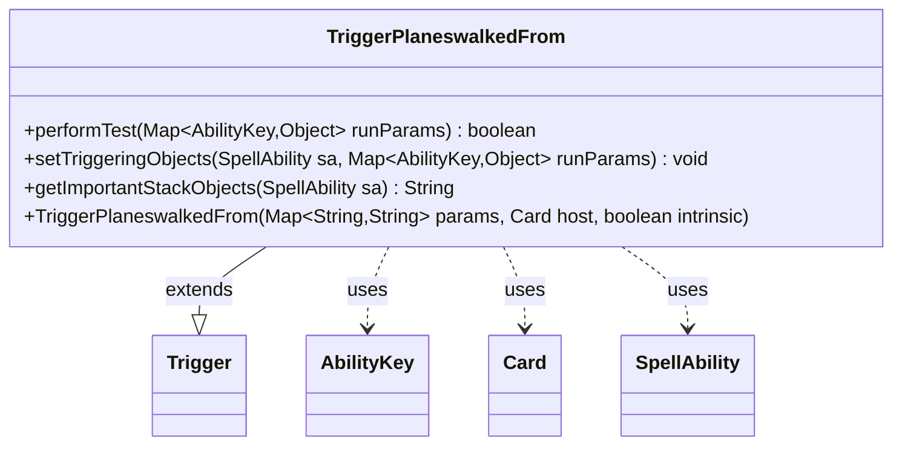

---
aliases:
  - TriggerPlaneswalkedFrom
tags:
  - java/class
  - module/forge-game
  - pkg/forge/game/trigger
fqn: forge.game.trigger.TriggerPlaneswalkedFrom
package: forge.game.trigger
module: forge-game
kind: Class
---

# TriggerPlaneswalkedFrom

**Package:** `forge.game.trigger` &nbsp; **Module:** `forge-game` &nbsp; **Kind:** Class



## Relationships
**Extends:**
- [[forge.game.trigger.Trigger|Trigger]]
**Uses:**
- [[forge.game.ability.AbilityKey|AbilityKey]]
- [[forge.game.card.Card|Card]]
- [[forge.game.spellability.SpellAbility|SpellAbility]]

## Design Description

TriggerPlaneswalkedFrom is a concrete trigger that fires when one or more permanents leave a plane (the "planeswalked away from" event) in Forge's Planechase support. Extending the abstract Trigger base class, it implements the standard trigger contract: performTest gates firing by matching the configured ValidCard predicate against the Cards run parameter, setTriggeringObjects records the departed cards as triggering objects, and getImportantStackObjects produces a localized stack description. It collaborates with AbilityKey to key into the typed runParams map, Card as its host permanent, and SpellAbility to carry triggering state. The design keeps the class minimal, delegating construction and shared machinery to its supertype and reusing the AbilityKey.Cards convention so the engine's generic trigger-handling pipeline can drive it uniformly.

## Source
`forge-game/src/main/java/forge/game/trigger/TriggerPlaneswalkedFrom.java`

```java
package forge.game.trigger;

import java.util.Map;

import forge.game.ability.AbilityKey;
import forge.game.card.Card;
import forge.game.spellability.SpellAbility;
import forge.util.Localizer;

/** 
 * TODO: Write javadoc for this type.
 *
 */
public class TriggerPlaneswalkedFrom extends Trigger {

    /**
     * <p>
     * Constructor for Trigger_PlaneswalkedTo.
     * </p>
     * 
     * @param params
     *            a {@link java.util.HashMap} object.
     * @param host
     *            a {@link forge.game.card.Card} object.
     * @param intrinsic
     *            the intrinsic
     */
    public TriggerPlaneswalkedFrom(final Map<String, String> params, final Card host, final boolean intrinsic) {
        super(params, host, intrinsic);
    }

    /* (non-Javadoc)
     * @see forge.card.trigger.Trigger#performTest(java.util.Map)
     */
    @Override
    public boolean performTest(final Map<AbilityKey, Object> runParams) {
        if (!matchesValidParam("ValidCard", runParams.get(AbilityKey.Cards))) {
            return false;
        }

        return true;
    }

    @Override
    public void setTriggeringObjects(final SpellAbility sa, Map<AbilityKey, Object> runParams) {
        sa.setTriggeringObjectsFrom(runParams, AbilityKey.Cards);
    }

    @Override
    public String getImportantStackObjects(SpellAbility sa) {
        StringBuilder sb = new StringBuilder();
        sb.append(Localizer.getInstance().getMessage("lblPlaneswalkedFrom")).append(": ").append(sa.getTriggeringObject(AbilityKey.Cards));
        return sb.toString();
    }

}
```

## Python
`forge/game/trigger/TriggerPlaneswalkedFrom.py`

```python
package forge.game.trigger

from typing import Map

from forge.game.trigger.Trigger import Trigger
from forge.game.ability.AbilityKey import AbilityKey
from forge.game.card.Card import Card
from forge.game.spellability.SpellAbility import SpellAbility
from forge.util.Localizer import Localizer


class TriggerPlaneswalkedFrom(Trigger):
    """
    TODO: Write javadoc for this type.
    """

    def __init__(self, params: dict[str, str], host: Card, intrinsic: bool):
        """
        Constructor for Trigger_PlaneswalkedTo.

        :param params: a dict object.
        :param host: a forge.game.card.Card object.
        :param intrinsic: the intrinsic
        """
        super().__init__(params, host, intrinsic)

    def performTest(self, runParams: dict[AbilityKey, object]) -> bool:
        if not self.matchesValidParam("ValidCard", runParams.get(AbilityKey.Cards)):
            return False

        return True

    def setTriggeringObjects(self, sa: SpellAbility, runParams: dict[AbilityKey, object]) -> None:
        sa.setTriggeringObjectsFrom(runParams, AbilityKey.Cards)

    def getImportantStackObjects(self, sa: SpellAbility) -> str:
        sb = []
        sb.append(Localizer.getInstance().getMessage("lblPlaneswalkedFrom"))
        sb.append(": ")
        sb.append(str(sa.getTriggeringObject(AbilityKey.Cards)))
        return "".join(sb)
```
