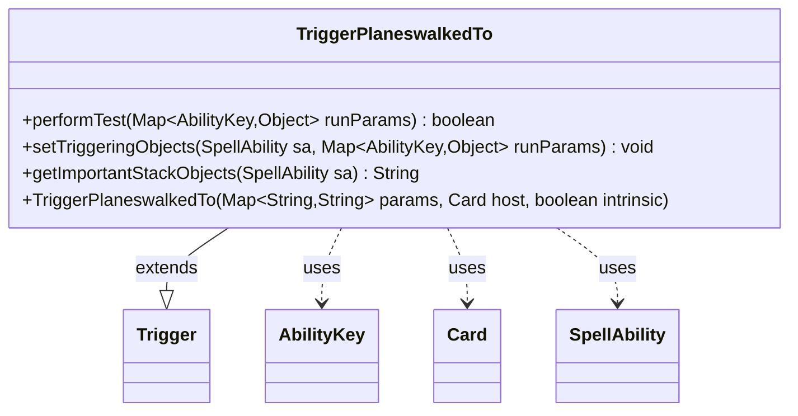

---
aliases:
  - TriggerPlaneswalkedTo
tags:
  - java/class
  - module/forge-game
  - pkg/forge/game/trigger
fqn: forge.game.trigger.TriggerPlaneswalkedTo
package: forge.game.trigger
module: forge-game
kind: Class
---

# TriggerPlaneswalkedTo

**Package:** `forge.game.trigger`   **Module:** `forge-game`   **Kind:** Class



## Relationships
**Extends:**
- [[forge.game.trigger.Trigger|Trigger]]
**Uses:**
- [[forge.game.ability.AbilityKey|AbilityKey]]
- [[forge.game.card.Card|Card]]
- [[forge.game.spellability.SpellAbility|SpellAbility]]

## Design Description

TriggerPlaneswalkedTo is a concrete trigger that fires when one or more cards planeswalk to a given plane in Forge's Planechase variant. Extending the abstract `Trigger` base class, it implements the standard trigger contract: `performTest` filters the event through the `ValidCard` parameter against the cards supplied in the run parameters, `setTriggeringObjects` binds those cards onto the resolving `SpellAbility` under the `Cards` key, and `getImportantStackObjects` renders a localized description for stack display. Its collaborators are minimal and characteristic of the trigger hierarchy: it keys all event data through `AbilityKey`, is hosted by a `Card`, and populates a `SpellAbility`. The design intent is a thin, declarative specialization—delegating construction and shared behavior to `Trigger` while contributing only the event-specific matching and binding logic, with user-facing text routed through `Localizer` for internationalization.

## Source
`forge-game/src/main/java/forge/game/trigger/TriggerPlaneswalkedTo.java`

```java
package forge.game.trigger;

import java.util.Map;

import forge.game.ability.AbilityKey;
import forge.game.card.Card;
import forge.game.spellability.SpellAbility;
import forge.util.Localizer;

/** 
 * TODO: Write javadoc for this type.
 *
 */
public class TriggerPlaneswalkedTo extends Trigger {

    /**
     * <p>
     * Constructor for Trigger_PlaneswalkedTo.
     * </p>
     * 
     * @param params
     *            a {@link java.util.HashMap} object.
     * @param host
     *            a {@link forge.game.card.Card} object.
     * @param intrinsic
     *            the intrinsic
     */
    public TriggerPlaneswalkedTo(final Map<String, String> params, final Card host, final boolean intrinsic) {
        super(params, host, intrinsic);
    }
    
    /* (non-Javadoc)
     * @see forge.card.trigger.Trigger#performTest(java.util.Map)
     */
    @Override
    public boolean performTest(Map<AbilityKey, Object> runParams) {
        if (!matchesValidParam("ValidCard", runParams.get(AbilityKey.Cards))) {
            return false;
        }

        return true;
    }

    @Override
    public void setTriggeringObjects(SpellAbility sa, Map<AbilityKey, Object> runParams) {
        sa.setTriggeringObjectsFrom(runParams, AbilityKey.Cards);
    }

    @Override
    public String getImportantStackObjects(SpellAbility sa) {
        StringBuilder sb = new StringBuilder();
        sb.append(Localizer.getInstance().getMessage("lblPlaneswalkedTo")).append(": ").append(sa.getTriggeringObject(AbilityKey.Cards));
        return sb.toString();
    }
}
```

## Python
`forge/game/trigger/TriggerPlaneswalkedTo.py`

```python
from typing import Map  # noqa
from forge.game.trigger.Trigger import Trigger
from forge.game.ability.AbilityKey import AbilityKey
from forge.game.card.Card import Card
from forge.game.spellability.SpellAbility import SpellAbility
from forge.util.Localizer import Localizer


# TODO: Write javadoc for this type.
class TriggerPlaneswalkedTo(Trigger):

    def __init__(self, params: dict[str, str], host: Card, intrinsic: bool):
        super().__init__(params, host, intrinsic)

    def performTest(self, runParams: dict[AbilityKey, object]) -> bool:
        if not self.matchesValidParam("ValidCard", runParams.get(AbilityKey.Cards)):
            return False

        return True

    def setTriggeringObjects(self, sa: SpellAbility, runParams: dict[AbilityKey, object]) -> None:
        sa.setTriggeringObjectsFrom(runParams, AbilityKey.Cards)

    def getImportantStackObjects(self, sa: SpellAbility) -> str:
        sb = []
        sb.append(Localizer.getInstance().getMessage("lblPlaneswalkedTo"))
        sb.append(": ")
        sb.append(str(sa.getTriggeringObject(AbilityKey.Cards)))
        return "".join(sb)
```
