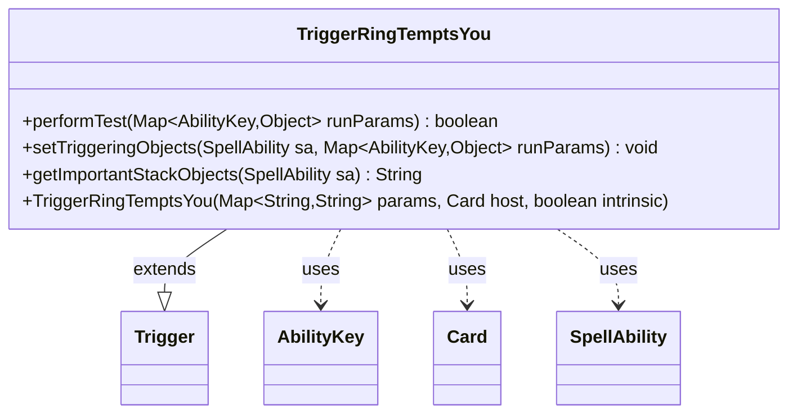

---
aliases:
  - TriggerRingTemptsYou
tags:
  - java/class
  - module/forge-game
  - pkg/forge/game/trigger
fqn: forge.game.trigger.TriggerRingTemptsYou
package: forge.game.trigger
module: forge-game
kind: Class
---

# TriggerRingTemptsYou

**Package:** `forge.game.trigger` &nbsp; **Module:** `forge-game` &nbsp; **Kind:** Class



## Relationships
**Extends:**
- [[forge.game.trigger.Trigger|Trigger]]
**Uses:**
- [[forge.game.ability.AbilityKey|AbilityKey]]
- [[forge.game.card.Card|Card]]
- [[forge.game.spellability.SpellAbility|SpellAbility]]

## Design Description

TriggerRingTemptsYou represents the "the Ring tempts you" triggered ability introduced by Lord of the Rings cards, firing when a player is tempted by the Ring. Extending the abstract Trigger base class, it specializes the standard trigger contract: performTest filters firings against the configured ValidPlayer and ValidCard parameters, while setTriggeringObjects exposes the relevant Player and Card to the resolving SpellAbility via AbilityKey-keyed run parameters. It collaborates with AbilityKey to address trigger data, Card as its host, and SpellAbility as the ability it populates. The design follows Forge's data-driven trigger pattern: behavior is defined declaratively through string params and the inherited matchesValidParam helper, keeping the subclass minimal. getImportantStackObjects supplies a localized, player-focused stack description for the game UI.

## Source
`forge-game/src/main/java/forge/game/trigger/TriggerRingTemptsYou.java`

```java
package forge.game.trigger;

import forge.game.ability.AbilityKey;
import forge.game.card.Card;
import forge.game.spellability.SpellAbility;
import forge.util.Localizer;

import java.util.Map;

public class TriggerRingTemptsYou extends Trigger {

    public TriggerRingTemptsYou(Map<String, String> params, Card host, boolean intrinsic) {
        super(params, host, intrinsic);
    }

    @Override
    public boolean performTest(Map<AbilityKey, Object> runParams) {
        if (!matchesValidParam("ValidPlayer", runParams.get(AbilityKey.Player))) {
            return false;
        }

        if (!matchesValidParam("ValidCard", runParams.get(AbilityKey.Card))) {
            return false;
        }
        return true;
    }

    /** {@inheritDoc} */
    @Override
    public final void setTriggeringObjects(final SpellAbility sa, Map<AbilityKey, Object> runParams) {
        sa.setTriggeringObjectsFrom(runParams, AbilityKey.Player, AbilityKey.Card);
    }

    @Override
    public String getImportantStackObjects(SpellAbility sa) {
        StringBuilder sb = new StringBuilder();
        sb.append(Localizer.getInstance().getMessage("lblPlayer")).append(": ");
        sb.append(sa.getTriggeringObject(AbilityKey.Player)).append(", ");
        return sb.toString();
    }
}
```

## Python
`forge/game/trigger/TriggerRingTemptsYou.py`

```python
package forge.game.trigger;

from forge.game.ability.AbilityKey import AbilityKey
from forge.game.card.Card import Card
from forge.game.spellability.SpellAbility import SpellAbility
from forge.util.Localizer import Localizer

from forge.game.trigger.Trigger import Trigger


class TriggerRingTemptsYou(Trigger):

    def __init__(self, params: dict[str, str], host: Card, intrinsic: bool):
        super().__init__(params, host, intrinsic)

    def performTest(self, runParams: dict[AbilityKey, object]) -> bool:
        if not self.matchesValidParam("ValidPlayer", runParams.get(AbilityKey.Player)):
            return False

        if not self.matchesValidParam("ValidCard", runParams.get(AbilityKey.Card)):
            return False
        return True

    def setTriggeringObjects(self, sa: SpellAbility, runParams: dict[AbilityKey, object]) -> None:
        sa.setTriggeringObjectsFrom(runParams, AbilityKey.Player, AbilityKey.Card)

    def getImportantStackObjects(self, sa: SpellAbility) -> str:
        sb = []
        sb.append(Localizer.getInstance().getMessage("lblPlayer"))
        sb.append(": ")
        sb.append(str(sa.getTriggeringObject(AbilityKey.Player)))
        sb.append(", ")
        return "".join(sb)
```
