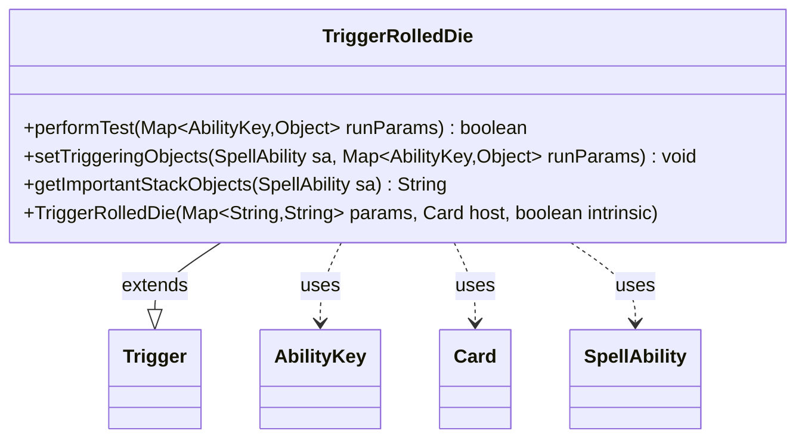

---
aliases:
  - TriggerRolledDie
tags:
  - java/class
  - module/forge-game
  - pkg/forge/game/trigger
fqn: forge.game.trigger.TriggerRolledDie
package: forge.game.trigger
module: forge-game
kind: Class
---

# TriggerRolledDie

**Package:** `forge.game.trigger`   **Module:** `forge-game`   **Kind:** Class



## Relationships
**Extends:**
- [[forge.game.trigger.Trigger|Trigger]]
**Uses:**
- [[forge.game.ability.AbilityKey|AbilityKey]]
- [[forge.game.card.Card|Card]]
- [[forge.game.spellability.SpellAbility|SpellAbility]]

## Design Description

Trigger that fires in response to a die roll, evaluating whether a roll event satisfies the conditions a card defines. As a concrete subclass of `Trigger`, it overrides `performTest` to match the roll against optional parameters—the rolling player, the result (supporting numeric values, the `Highest` keyword, and comparison expressions), natural results, die sides, and Attraction-visit rolls—returning whether the trigger should fire. It reads roll data from the `runParams` map keyed by `AbilityKey`, and `setTriggeringObjects` forwards the result and player onto the firing `SpellAbility` so dependent effects can reference them. `getImportantStackObjects` builds a localized stack description naming the player and result, reflecting an intent to surface roll context to players. The design keeps each card's trigger condition data-driven through string parameters interpreted at test time.

## Source
`forge-game/src/main/java/forge/game/trigger/TriggerRolledDie.java`

```java
package forge.game.trigger;

import java.util.Map;

import org.apache.commons.lang3.StringUtils;

import forge.game.ability.AbilityKey;
import forge.game.card.Card;
import forge.game.spellability.SpellAbility;
import forge.util.Expressions;
import forge.util.Localizer;

public class TriggerRolledDie extends Trigger {

    public TriggerRolledDie(final Map<String, String> params, final Card host, final boolean intrinsic) {
        super(params, host, intrinsic);
    }

    /** {@inheritDoc}
     * @param runParams
     */
    @Override
    public final boolean performTest(final Map<AbilityKey, Object> runParams) {
        if (!matchesValidParam("ValidPlayer", runParams.get(AbilityKey.Player))) {
            return false;
        }
        if (hasParam("RolledToVisitAttractions")) {
            if (!(boolean) runParams.getOrDefault(AbilityKey.RolledToVisitAttractions, false))
                return false;
        }
        if (hasParam("ValidResult")) {
            String[] params = getParam("ValidResult").split(",");
            int result = (int) runParams.get(AbilityKey.Result);
            if (hasParam("Natural") && runParams.containsKey(AbilityKey.NaturalResult)) {
                result = (int) runParams.get(AbilityKey.NaturalResult);
            }
            for (String param : params) {
                if (StringUtils.isNumeric(param)) {
                    if (param.equals("" + result)) return true;
                } else if (param.equals("Highest")) {
                    final int sides = (int) runParams.get(AbilityKey.Sides);
                    if (result == sides) return true;
                } else {
                    final String comp = param.substring(0, 2);
                    final int rightSide = Integer.parseInt(param.substring(2));
                    if (Expressions.compare(result, comp, rightSide)) return true;
                }
            }
            return false;
        }
        if (hasParam("ValidSides")) {
            final int validSides = Integer.parseInt(getParam("ValidSides"));
            final int sides = (int) runParams.get(AbilityKey.Sides);
            if (sides == validSides) return true;
        }

        if (hasParam("Number")) {
            if (((Integer) runParams.get(AbilityKey.Number)) != Integer.parseInt(getParam("Number"))) {
                return false;
            }
        } 
        return true;
    }

    /** {@inheritDoc} */
    @Override
    public final void setTriggeringObjects(final SpellAbility sa, Map<AbilityKey, Object> runParams) {
        sa.setTriggeringObjectsFrom(runParams, AbilityKey.Result, AbilityKey.Player);
    }

    @Override
    public String getImportantStackObjects(SpellAbility sa) {
        return Localizer.getInstance().getMessage("lblPlayer") + ": " + sa.getTriggeringObject(AbilityKey.Player) + ", " +
                Localizer.getInstance().getMessage("lblResultIs", sa.getTriggeringObject(AbilityKey.Result));
    }
}
```

## Python
`forge/game/trigger/TriggerRolledDie.py`

```python
from forge.game.trigger.Trigger import Trigger
from forge.game.ability.AbilityKey import AbilityKey
from forge.game.card.Card import Card
from forge.game.spellability.SpellAbility import SpellAbility
from forge.util.Expressions import Expressions
from forge.util.Localizer import Localizer


class TriggerRolledDie(Trigger):

    def __init__(self, params: dict[str, str], host: Card, intrinsic: bool):
        super().__init__(params, host, intrinsic)

    def performTest(self, runParams: dict[AbilityKey, object]) -> bool:
        if not self.matchesValidParam("ValidPlayer", runParams.get(AbilityKey.Player)):
            return False
        if self.hasParam("RolledToVisitAttractions"):
            if not runParams.get(AbilityKey.RolledToVisitAttractions, False):
                return False
        if self.hasParam("ValidResult"):
            params = self.getParam("ValidResult").split(",")
            result = runParams.get(AbilityKey.Result)
            if self.hasParam("Natural") and AbilityKey.NaturalResult in runParams:
                result = runParams.get(AbilityKey.NaturalResult)
            for param in params:
                if param.isnumeric():
                    if param == "" + str(result):
                        return True
                elif param == "Highest":
                    sides = runParams.get(AbilityKey.Sides)
                    if result == sides:
                        return True
                else:
                    comp = param[0:2]
                    rightSide = int(param[2:])
                    if Expressions.compare(result, comp, rightSide):
                        return True
            return False
        if self.hasParam("ValidSides"):
            validSides = int(self.getParam("ValidSides"))
            sides = runParams.get(AbilityKey.Sides)
            if sides == validSides:
                return True

        if self.hasParam("Number"):
            if runParams.get(AbilityKey.Number) != int(self.getParam("Number")):
                return False
        return True

    def setTriggeringObjects(self, sa: SpellAbility, runParams: dict[AbilityKey, object]) -> None:
        sa.setTriggeringObjectsFrom(runParams, AbilityKey.Result, AbilityKey.Player)

    def getImportantStackObjects(self, sa: SpellAbility) -> str:
        return Localizer.getInstance().getMessage("lblPlayer") + ": " + str(sa.getTriggeringObject(AbilityKey.Player)) + ", " + \
            Localizer.getInstance().getMessage("lblResultIs", sa.getTriggeringObject(AbilityKey.Result))
```
