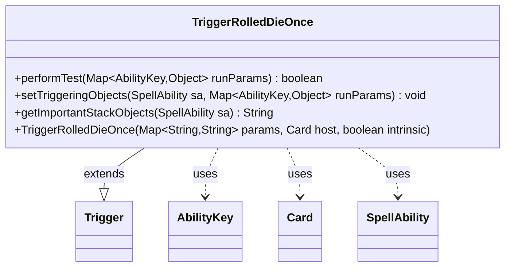

---
aliases:
  - TriggerRolledDieOnce
tags:
  - java/class
  - module/forge-game
  - pkg/forge/game/trigger
fqn: forge.game.trigger.TriggerRolledDieOnce
package: forge.game.trigger
module: forge-game
kind: Class
---

# TriggerRolledDieOnce

**Package:** `forge.game.trigger`   **Module:** `forge-game`   **Kind:** Class



## Relationships
**Extends:**
- [[forge.game.trigger.Trigger|Trigger]]
**Uses:**
- [[forge.game.ability.AbilityKey|AbilityKey]]
- [[forge.game.card.Card|Card]]
- [[forge.game.spellability.SpellAbility|SpellAbility]]

## Design Description

TriggerRolledDieOnce is a concrete trigger that fires in response to a player rolling a die, used chiefly to detect rolls made to visit Attractions. As a subclass of `Trigger`, it implements the framework's template-method contract: `performTest` filters firing conditions against the run parameters—checking the `ValidPlayer` restriction and, optionally, the `RolledToVisitAttractions` flag—while `setTriggeringObjects` exposes the rolling player and result to the resolving `SpellAbility`, and `getImportantStackObjects` produces a localized stack description.

It collaborates with `AbilityKey` to look up typed run-parameter values, `Card` as the trigger's host, and `SpellAbility` as the resolving effect. The design keeps state out of the class entirely, delegating construction and shared behavior to `Trigger` and routing all data through the `AbilityKey`-keyed parameter map, so the trigger remains a lightweight, declarative matcher driven by card-script parameters.

## Source
`forge-game/src/main/java/forge/game/trigger/TriggerRolledDieOnce.java`

```java
package forge.game.trigger;

import java.util.Map;

import forge.game.ability.AbilityKey;
import forge.game.card.Card;
import forge.game.spellability.SpellAbility;
import forge.util.Localizer;

public class TriggerRolledDieOnce extends Trigger {

    public TriggerRolledDieOnce(final Map<String, String> params, final Card host, final boolean intrinsic) {
        super(params, host, intrinsic);
    }

    /** {@inheritDoc}
     * @param runParams
     */
    @Override
    public final boolean performTest(final Map<AbilityKey, Object> runParams) {
        if (!matchesValidParam("ValidPlayer", runParams.get(AbilityKey.Player))) {
            return false;
        }
        if (hasParam("RolledToVisitAttractions")) {
            if (!(boolean) runParams.getOrDefault(AbilityKey.RolledToVisitAttractions, false))
                return false;
        }
        return true;
    }

    /** {@inheritDoc} */
    @Override
    public final void setTriggeringObjects(final SpellAbility sa, Map<AbilityKey, Object> runParams) {
        sa.setTriggeringObjectsFrom(runParams, AbilityKey.Result, AbilityKey.Player);
    }

    @Override
    public String getImportantStackObjects(SpellAbility sa) {
        return Localizer.getInstance().getMessage("lblPlayer") + ": " + sa.getTriggeringObject(AbilityKey.Player) + ", " +
                Localizer.getInstance().getMessage("lblResultIs", sa.getTriggeringObject(AbilityKey.Result));
    }
}
```

## Python
`forge/game/trigger/TriggerRolledDieOnce.py`

```python
from forge.game.trigger.Trigger import Trigger
from forge.game.ability.AbilityKey import AbilityKey
from forge.game.card.Card import Card
from forge.game.spellability.SpellAbility import SpellAbility
from forge.util.Localizer import Localizer

from typing import Map


class TriggerRolledDieOnce(Trigger):

    def __init__(self, params: dict[str, str], host: Card, intrinsic: bool):
        super().__init__(params, host, intrinsic)

    def performTest(self, runParams: dict[AbilityKey, object]) -> bool:
        if not self.matchesValidParam("ValidPlayer", runParams.get(AbilityKey.Player)):
            return False
        if self.hasParam("RolledToVisitAttractions"):
            if not bool(runParams.get(AbilityKey.RolledToVisitAttractions, False)):
                return False
        return True

    def setTriggeringObjects(self, sa: SpellAbility, runParams: dict[AbilityKey, object]) -> None:
        sa.setTriggeringObjectsFrom(runParams, AbilityKey.Result, AbilityKey.Player)

    def getImportantStackObjects(self, sa: SpellAbility) -> str:
        return Localizer.getInstance().getMessage("lblPlayer") + ": " + str(sa.getTriggeringObject(AbilityKey.Player)) + ", " + \
                Localizer.getInstance().getMessage("lblResultIs", sa.getTriggeringObject(AbilityKey.Result))
```
