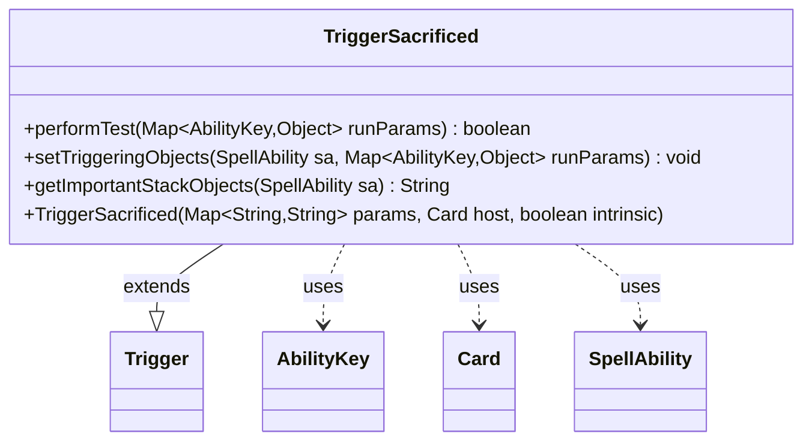

---
aliases:
  - TriggerSacrificed
tags:
  - java/class
  - module/forge-game
  - pkg/forge/game/trigger
fqn: forge.game.trigger.TriggerSacrificed
package: forge.game.trigger
module: forge-game
kind: Class
---

# TriggerSacrificed

**Package:** `forge.game.trigger`   **Module:** `forge-game`   **Kind:** Class



## Relationships
**Extends:**
- [[forge.game.trigger.Trigger|Trigger]]
**Uses:**
- [[forge.game.ability.AbilityKey|AbilityKey]]
- [[forge.game.card.Card|Card]]
- [[forge.game.spellability.SpellAbility|SpellAbility]]

## Design Description

The class TriggerSacrificed is a concrete trigger that fires when a card is sacrificed, modeling Magic: the Gathering's "whenever ... is sacrificed" triggered abilities. Extending the abstract Trigger base class, it supplies the event-specific behavior the framework expects: performTest filters the sacrifice event against the ability's optional ValidCard, ValidPlayer, and ValidCause restrictions (plus a WhileKeyword condition), setTriggeringObjects binds the sacrificed Card into the resolving SpellAbility, and getImportantStackObjects produces a localized stack description.

Its collaborators reflect this role: AbilityKey provides typed keys into the runtime parameter map, Card is the sacrificed permanent, and SpellAbility is the triggered ability being set up. The design follows a template-method pattern—the parent orchestrates trigger evaluation while this subclass overrides only the sacrifice-specific hooks—keeping each trigger type small, declarative, and data-driven through string parameters.

## Source
`forge-game/src/main/java/forge/game/trigger/TriggerSacrificed.java`

```java
/*
 * Forge: Play Magic: the Gathering.
 * Copyright (C) 2011  Forge Team
 *
 * This program is free software: you can redistribute it and/or modify
 * it under the terms of the GNU General Public License as published by
 * the Free Software Foundation, either version 3 of the License, or
 * (at your option) any later version.
 * 
 * This program is distributed in the hope that it will be useful,
 * but WITHOUT ANY WARRANTY; without even the implied warranty of
 * MERCHANTABILITY or FITNESS FOR A PARTICULAR PURPOSE.  See the
 * GNU General Public License for more details.
 * 
 * You should have received a copy of the GNU General Public License
 * along with this program.  If not, see <http://www.gnu.org/licenses/>.
 */
package forge.game.trigger;

import forge.game.ability.AbilityKey;
import forge.game.card.Card;
import forge.game.spellability.SpellAbility;
import forge.util.Localizer;

import java.util.Map;

/**
 * <p>
 * Trigger_Sacrificed class.
 * </p>
 * 
 * @author Forge
 * @version $Id$
 */
public class TriggerSacrificed extends Trigger {

    /**
     * <p>
     * Constructor for Trigger_Sacrificed.
     * </p>
     * 
     * @param params
     *            a {@link java.util.HashMap} object.
     * @param host
     *            a {@link forge.game.card.Card} object.
     * @param intrinsic
     *            the intrinsic
     */
    public TriggerSacrificed(final Map<String, String> params, final Card host, final boolean intrinsic) {
        super(params, host, intrinsic);
    }

    /** {@inheritDoc}
     * @param runParams*/
    @Override
    public final boolean performTest(final Map<AbilityKey, Object> runParams) {
        if (!matchesValidParam("ValidCard", runParams.get(AbilityKey.Card))) {
            return false;
        }
        if (!matchesValidParam("ValidPlayer", runParams.get(AbilityKey.Player))) {
            return false;
        }
        if (!matchesValidParam("ValidCause", runParams.get(AbilityKey.Cause))) {
            return false;
        }
        if (hasParam("WhileKeyword") && !whileKeywordCheck(getParam("WhileKeyword"), runParams)) {
            return false;
        }

        return true;
    }

    /** {@inheritDoc} */
    @Override
    public final void setTriggeringObjects(final SpellAbility sa, Map<AbilityKey, Object> runParams) {
        sa.setTriggeringObjectsFrom(runParams, AbilityKey.Card);
    }

    @Override
    public String getImportantStackObjects(SpellAbility sa) {
        return Localizer.getInstance().getMessage("lblSacrificed") + ": " +
                sa.getTriggeringObject(AbilityKey.Card);
    }

}
```

## Python
`forge/game/trigger/TriggerSacrificed.py`

```python
package forge.game.trigger

from forge.game.ability.AbilityKey import AbilityKey
from forge.game.card.Card import Card
from forge.game.spellability.SpellAbility import SpellAbility
from forge.util.Localizer import Localizer
from forge.game.trigger.Trigger import Trigger


class TriggerSacrificed(Trigger):

    def __init__(self, params: dict[str, str], host: Card, intrinsic: bool):
        super().__init__(params, host, intrinsic)

    def performTest(self, runParams: dict[AbilityKey, object]) -> bool:
        if not self.matchesValidParam("ValidCard", runParams.get(AbilityKey.Card)):
            return False
        if not self.matchesValidParam("ValidPlayer", runParams.get(AbilityKey.Player)):
            return False
        if not self.matchesValidParam("ValidCause", runParams.get(AbilityKey.Cause)):
            return False
        if self.hasParam("WhileKeyword") and not self.whileKeywordCheck(self.getParam("WhileKeyword"), runParams):
            return False

        return True

    def setTriggeringObjects(self, sa: SpellAbility, runParams: dict[AbilityKey, object]) -> None:
        sa.setTriggeringObjectsFrom(runParams, AbilityKey.Card)

    def getImportantStackObjects(self, sa: SpellAbility) -> str:
        return Localizer.getInstance().getMessage("lblSacrificed") + ": " + \
                str(sa.getTriggeringObject(AbilityKey.Card))
```
