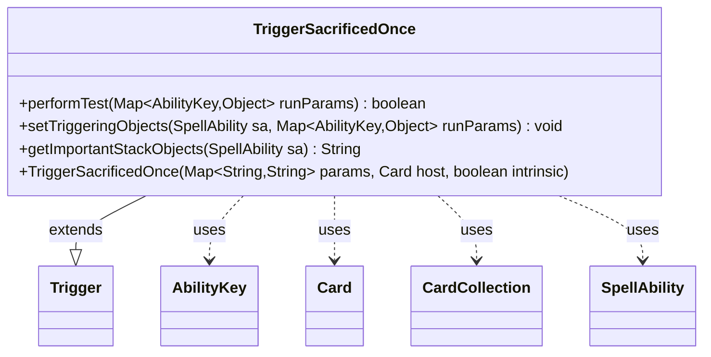

---
aliases:
  - TriggerSacrificedOnce
tags:
  - java/class
  - module/forge-game
  - pkg/forge/game/trigger
fqn: forge.game.trigger.TriggerSacrificedOnce
package: forge.game.trigger
module: forge-game
kind: Class
---

# TriggerSacrificedOnce

**Package:** `forge.game.trigger` &nbsp; **Module:** `forge-game` &nbsp; **Kind:** Class



## Relationships
**Extends:**
- [[forge.game.trigger.Trigger|Trigger]]
**Uses:**
- [[forge.game.ability.AbilityKey|AbilityKey]]
- [[forge.game.card.Card|Card]]
- [[forge.game.card.CardCollection|CardCollection]]
- [[forge.game.spellability.SpellAbility|SpellAbility]]

## Design Description

TriggerSacrificedOnce is a concrete trigger that fires when one or more cards are sacrificed, extending the abstract Trigger base class within Forge's event-driven triggered-ability system. Its performTest method gates activation by matching the configured ValidPlayer, ValidCause, and ValidCard parameters against the triggering run parameters (keyed via AbilityKey), allowing card scripts to declaratively constrain when the trigger applies.

When the trigger fires, setTriggeringObjects optionally filters the sacrificed CardCollection through CardLists.getValidCards relative to the host card's controller, then exposes the matching cards, their count (Amount), and the responsible Player and Cause to the resulting SpellAbility. getImportantStackObjects builds a localized, player-and-amount summary for stack display. The design follows the engine's parameter-driven trigger convention, keeping reusable matching logic in the supertype while this subclass supplies only the sacrifice-specific testing and binding behavior.

## Source
`forge-game/src/main/java/forge/game/trigger/TriggerSacrificedOnce.java`

```java
package forge.game.trigger;

import java.util.Map;

import forge.game.ability.AbilityKey;
import forge.game.card.Card;
import forge.game.card.CardCollection;
import forge.game.card.CardLists;
import forge.game.spellability.SpellAbility;
import forge.util.Localizer;

public class TriggerSacrificedOnce extends Trigger {

    public TriggerSacrificedOnce(Map<String, String> params, Card host, boolean intrinsic) {
        super(params, host, intrinsic);
    }

    @Override
    public boolean performTest(Map<AbilityKey, Object> runParams) {
        if (!matchesValidParam("ValidPlayer", runParams.get(AbilityKey.Player))) {
            return false;
        }
        if (!matchesValidParam("ValidCause", runParams.get(AbilityKey.Cause))) {
            return false;
        }
        if (!matchesValidParam("ValidCard", runParams.get(AbilityKey.Cards))) {
            return false;
        }
        return true;
    }

    @Override
    public void setTriggeringObjects(SpellAbility sa, Map<AbilityKey, Object> runParams) {
        CardCollection cards = (CardCollection) runParams.get(AbilityKey.Cards);

        if (hasParam("ValidCard")) {
            cards = CardLists.getValidCards(cards, getParam("ValidCard"), getHostCard().getController(), getHostCard(), this);
        }

        sa.setTriggeringObject(AbilityKey.Cards, cards);
        sa.setTriggeringObject(AbilityKey.Amount, cards.size());
        sa.setTriggeringObjectsFrom(runParams, AbilityKey.Player, AbilityKey.Cause);
    }

    @Override
    public String getImportantStackObjects(SpellAbility sa) {
        StringBuilder sb = new StringBuilder();
        sb.append(Localizer.getInstance().getMessage("lblPlayer")).append(": ").append(sa.getTriggeringObject(AbilityKey.Player)).append(", ");
        sb.append(Localizer.getInstance().getMessage("lblAmount")).append(": ").append(sa.getTriggeringObject(AbilityKey.Amount));
        return sb.toString();
    }

}
```

## Python
`forge/game/trigger/TriggerSacrificedOnce.py`

```python
from forge.game.trigger.Trigger import Trigger
from forge.game.ability.AbilityKey import AbilityKey
from forge.game.card.Card import Card
from forge.game.card.CardCollection import CardCollection
from forge.game.card.CardLists import CardLists
from forge.game.spellability.SpellAbility import SpellAbility
from forge.util.Localizer import Localizer


class TriggerSacrificedOnce(Trigger):

    def __init__(self, params: dict[str, str], host: Card, intrinsic: bool):
        super().__init__(params, host, intrinsic)

    def performTest(self, runParams: dict[AbilityKey, object]) -> bool:
        if not self.matchesValidParam("ValidPlayer", runParams.get(AbilityKey.Player)):
            return False
        if not self.matchesValidParam("ValidCause", runParams.get(AbilityKey.Cause)):
            return False
        if not self.matchesValidParam("ValidCard", runParams.get(AbilityKey.Cards)):
            return False
        return True

    def setTriggeringObjects(self, sa: SpellAbility, runParams: dict[AbilityKey, object]) -> None:
        cards = runParams.get(AbilityKey.Cards)

        if self.hasParam("ValidCard"):
            cards = CardLists.getValidCards(cards, self.getParam("ValidCard"), self.getHostCard().getController(), self.getHostCard(), self)

        sa.setTriggeringObject(AbilityKey.Cards, cards)
        sa.setTriggeringObject(AbilityKey.Amount, cards.size())
        sa.setTriggeringObjectsFrom(runParams, AbilityKey.Player, AbilityKey.Cause)

    def getImportantStackObjects(self, sa: SpellAbility) -> str:
        sb = []
        sb.append(Localizer.getInstance().getMessage("lblPlayer"))
        sb.append(": ")
        sb.append(str(sa.getTriggeringObject(AbilityKey.Player)))
        sb.append(", ")
        sb.append(Localizer.getInstance().getMessage("lblAmount"))
        sb.append(": ")
        sb.append(str(sa.getTriggeringObject(AbilityKey.Amount)))
        return "".join(sb)
```
