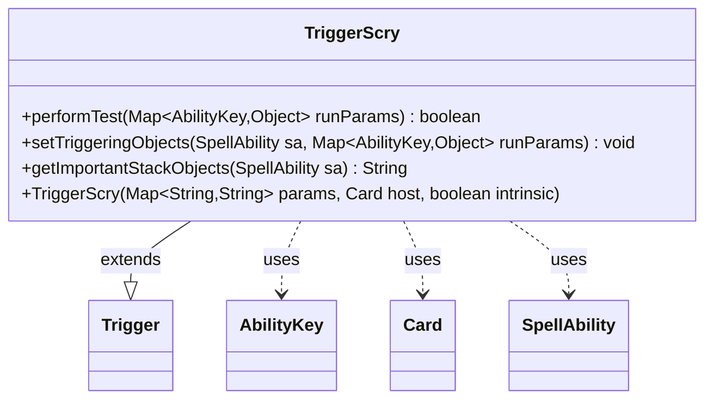

---
aliases:
  - TriggerScry
tags:
  - java/class
  - module/forge-game
  - pkg/forge/game/trigger
fqn: forge.game.trigger.TriggerScry
package: forge.game.trigger
module: forge-game
kind: Class
---

# TriggerScry

**Package:** `forge.game.trigger`   **Module:** `forge-game`   **Kind:** Class



## Relationships
**Extends:**
- [[forge.game.trigger.Trigger|Trigger]]
**Uses:**
- [[forge.game.ability.AbilityKey|AbilityKey]]
- [[forge.game.card.Card|Card]]
- [[forge.game.spellability.SpellAbility|SpellAbility]]

## Design Description

Forge's TriggerScry implements the Magic "scry" triggered ability, extending the abstract Trigger base class to model events that fire when a player scries. It overrides performTest to gate firing on trigger conditions—validating the scrying player against the ValidPlayer parameter and, when ToBottom is set, requiring that at least one card was put on the bottom—and setTriggeringObjects to expose the player, scry count, and bottom count through AbilityKey lookups for the resulting SpellAbility. getImportantStackObjects builds a localized stack description naming the scryer and scry amount. Collaborating with Card (its host) and SpellAbility (the ability it parameterizes), the class follows the engine's convention of one lightweight Trigger subclass per ability type, keyed off AbilityKey-mapped run parameters and using Localizer for player-facing text.

## Source
`forge-game/src/main/java/forge/game/trigger/TriggerScry.java`

```java
/*
 * Forge: Play Magic: the Gathering.
 * Copyright (C) 2011  Forge Team
 *
 * This program is free software: you can redistribute it and/or modify
 * it under the terms of the GNU General Public License as published by
 * the Free Software Foundation, either version 3 of the License, or
 * (at your option) any later version.
 * 
 * This program is distributed in the hope that it will be useful,
 * but WITHOUT ANY WARRANTY; without even the implied warranty of
 * MERCHANTABILITY or FITNESS FOR A PARTICULAR PURPOSE.  See the
 * GNU General Public License for more details.
 * 
 * You should have received a copy of the GNU General Public License
 * along with this program.  If not, see <http://www.gnu.org/licenses/>.
 */
package forge.game.trigger;

import java.util.Map;

import forge.game.ability.AbilityKey;
import forge.game.card.Card;
import forge.game.spellability.SpellAbility;
import forge.util.Localizer;

/**
 * <p>
 * Trigger_Scry class.
 * </p>
 * 
 * @author Forge
 * @version $Id: TriggerScry.java 21543 2013-05-19 21:35:20Z Max mtg $
 */
public class TriggerScry extends Trigger {

    /**
     * <p>
     * Constructor for Trigger_Scry.
     * </p>
     * 
     * @param params
     *            a {@link java.util.HashMap} object.
     * @param host
     *            a {@link forge.game.card.Card} object.
     * @param intrinsic
     *            the intrinsic
     */
    public TriggerScry(final Map<String, String> params, final Card host, final boolean intrinsic) {
        super(params, host, intrinsic);
    }

    /** {@inheritDoc}
     * @param runParams*/
    @Override
    public final boolean performTest(final Map<AbilityKey, Object> runParams) {
        if (!matchesValidParam("ValidPlayer", runParams.get(AbilityKey.Player))) {
            return false;
        }

        if (hasParam("ToBottom")) {
            Integer numBottom = (Integer) runParams.get(AbilityKey.ScryBottom);
            if (numBottom <= 0) {
                return false;
            }
        }

        return true;
    }

    /** {@inheritDoc} */
    @Override
    public final void setTriggeringObjects(final SpellAbility sa, Map<AbilityKey, Object> runParams) {
        sa.setTriggeringObjectsFrom(runParams, AbilityKey.Player, AbilityKey.ScryNum, AbilityKey.ScryBottom);
    }

    @Override
    public String getImportantStackObjects(SpellAbility sa) {
        StringBuilder sb = new StringBuilder();
        sb.append(Localizer.getInstance().getMessage("lblScryer")).append(": ");
        sb.append(sa.getTriggeringObject(AbilityKey.Player)).append(", ");
        sb.append(sa.getTriggeringObject(AbilityKey.ScryNum));
        return sb.toString();
    }
}
```

## Python
`forge/game/trigger/TriggerScry.py`

```python
from typing import Map  # placeholder

from forge.game.trigger.Trigger import Trigger
from forge.game.ability.AbilityKey import AbilityKey
from forge.game.card.Card import Card
from forge.game.spellability.SpellAbility import SpellAbility
from forge.util.Localizer import Localizer


class TriggerScry(Trigger):

    def __init__(self, params: dict[str, str], host: Card, intrinsic: bool):
        super().__init__(params, host, intrinsic)

    def performTest(self, runParams: dict[AbilityKey, object]) -> bool:
        if not self.matchesValidParam("ValidPlayer", runParams.get(AbilityKey.Player)):
            return False

        if self.hasParam("ToBottom"):
            numBottom = runParams.get(AbilityKey.ScryBottom)
            if numBottom <= 0:
                return False

        return True

    def setTriggeringObjects(self, sa: SpellAbility, runParams: dict[AbilityKey, object]) -> None:
        sa.setTriggeringObjectsFrom(runParams, AbilityKey.Player, AbilityKey.ScryNum, AbilityKey.ScryBottom)

    def getImportantStackObjects(self, sa: SpellAbility) -> str:
        sb = []
        sb.append(Localizer.getInstance().getMessage("lblScryer"))
        sb.append(": ")
        sb.append(str(sa.getTriggeringObject(AbilityKey.Player)))
        sb.append(", ")
        sb.append(str(sa.getTriggeringObject(AbilityKey.ScryNum)))
        return "".join(sb)
```
