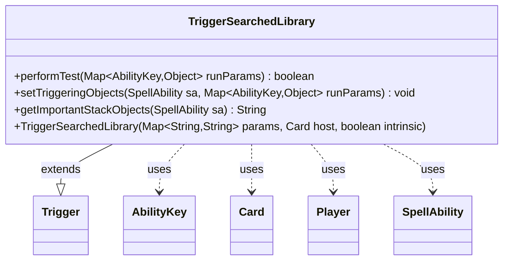

---
aliases:
  - TriggerSearchedLibrary
tags:
  - java/class
  - module/forge-game
  - pkg/forge/game/trigger
fqn: forge.game.trigger.TriggerSearchedLibrary
package: forge.game.trigger
module: forge-game
kind: Class
---

# TriggerSearchedLibrary

**Package:** `forge.game.trigger`   **Module:** `forge-game`   **Kind:** Class



## Relationships
**Extends:**
- [[forge.game.trigger.Trigger|Trigger]]
**Uses:**
- [[forge.game.ability.AbilityKey|AbilityKey]]
- [[forge.game.card.Card|Card]]
- [[forge.game.player.Player|Player]]
- [[forge.game.spellability.SpellAbility|SpellAbility]]

## Design Description

TriggerSearchedLibrary is a concrete trigger type that fires when a player searches a library, modeling the game event so card abilities can respond to it. As a subclass of `Trigger`, it implements the framework's template methods: `performTest` filters firings against the trigger's parameters—validating the searching player via `ValidPlayer` and, when `SearchOwnLibrary` is set, requiring the searcher and search target to coincide—while `setTriggeringObjects` and `getImportantStackObjects` expose the searching `Player` to the resolving `SpellAbility` and to UI/stack descriptions.

It collaborates primarily through the `AbilityKey` map that carries run parameters (`Player`, `Target`), reading host configuration supplied at construction by `Card`. The design follows the engine's data-driven trigger pattern: behavior is governed entirely by string parameters rather than bespoke logic, and localization (`lblSearcher`) keeps the stack description user-facing, keeping the class a thin, declarative specialization of the shared trigger machinery.

## Source
`forge-game/src/main/java/forge/game/trigger/TriggerSearchedLibrary.java`

```java
/*
 * Forge: Play Magic: the Gathering.
 * Copyright (C) 2011  Forge Team
 *
 * This program is free software: you can redistribute it and/or modify
 * it under the terms of the GNU General Public License as published by
 * the Free Software Foundation, either version 3 of the License, or
 * (at your option) any later version.
 * 
 * This program is distributed in the hope that it will be useful,
 * but WITHOUT ANY WARRANTY; without even the implied warranty of
 * MERCHANTABILITY or FITNESS FOR A PARTICULAR PURPOSE.  See the
 * GNU General Public License for more details.
 * 
 * You should have received a copy of the GNU General Public License
 * along with this program.  If not, see <http://www.gnu.org/licenses/>.
 */
package forge.game.trigger;

import java.util.Map;

import forge.game.ability.AbilityKey;
import forge.game.card.Card;
import forge.game.player.Player;
import forge.game.spellability.SpellAbility;
import forge.util.Localizer;

/**
 * <p>
 * TriggerSearchedLibrary class.
 * </p>
 * 
 * @author Forge
 * @version $Id: TriggerSearchedLibrary.java 23787 2013-11-24 07:09:23Z Max mtg $
 */
public class TriggerSearchedLibrary extends Trigger {

    /**
     * <p>
     * Constructor for TriggerSearchedLibrary.
     * </p>
     * 
     * @param params
     *            a {@link java.util.HashMap} object.
     * @param host
     *            a {@link forge.game.card.Card} object.
     * @param intrinsic
     *            the intrinsic
     */
    public TriggerSearchedLibrary(final Map<String, String> params, final Card host, final boolean intrinsic) {
        super(params, host, intrinsic);
    }

    /** {@inheritDoc}
     * @param runParams*/
    @Override
    public final boolean performTest(final Map<AbilityKey, Object> runParams) {
        if (!matchesValidParam("ValidPlayer", runParams.get(AbilityKey.Player))) {
            return false;
        }
        if (hasParam("SearchOwnLibrary")) {
            Player target = (Player) runParams.get(AbilityKey.Target);
            if (!target.equals(runParams.get(AbilityKey.Player))) {
                return false;
            }
        }

        return true;
    }

    /** {@inheritDoc} */
    @Override
    public final void setTriggeringObjects(final SpellAbility sa, Map<AbilityKey, Object> runParams) {
        sa.setTriggeringObjectsFrom(runParams, AbilityKey.Player);
    }

    @Override
    public String getImportantStackObjects(SpellAbility sa) {
        StringBuilder sb = new StringBuilder();
        sb.append(Localizer.getInstance().getMessage("lblSearcher")).append(": ").append(sa.getTriggeringObject(AbilityKey.Player));
        return sb.toString();
    }
}
```

## Python
`forge/game/trigger/TriggerSearchedLibrary.py`

```python
from forge.game.trigger.Trigger import Trigger

from forge.game.ability.AbilityKey import AbilityKey
from forge.game.card.Card import Card
from forge.game.player.Player import Player
from forge.game.spellability.SpellAbility import SpellAbility
from forge.util.Localizer import Localizer


class TriggerSearchedLibrary(Trigger):
    """
    TriggerSearchedLibrary class.

    @author Forge
    @version $Id: TriggerSearchedLibrary.java 23787 2013-11-24 07:09:23Z Max mtg $
    """

    def __init__(self, params: dict[str, str], host: Card, intrinsic: bool):
        """
        Constructor for TriggerSearchedLibrary.

        @param params a HashMap object.
        @param host a Card object.
        @param intrinsic the intrinsic
        """
        super().__init__(params, host, intrinsic)

    def performTest(self, runParams: dict[AbilityKey, object]) -> bool:
        if not self.matchesValidParam("ValidPlayer", runParams.get(AbilityKey.Player)):
            return False
        if self.hasParam("SearchOwnLibrary"):
            target = runParams.get(AbilityKey.Target)
            if not target.equals(runParams.get(AbilityKey.Player)):
                return False

        return True

    def setTriggeringObjects(self, sa: SpellAbility, runParams: dict[AbilityKey, object]) -> None:
        sa.setTriggeringObjectsFrom(runParams, AbilityKey.Player)

    def getImportantStackObjects(self, sa: SpellAbility) -> str:
        sb = []
        sb.append(Localizer.getInstance().getMessage("lblSearcher"))
        sb.append(": ")
        sb.append(sa.getTriggeringObject(AbilityKey.Player))
        return "".join(str(x) for x in sb)
```
