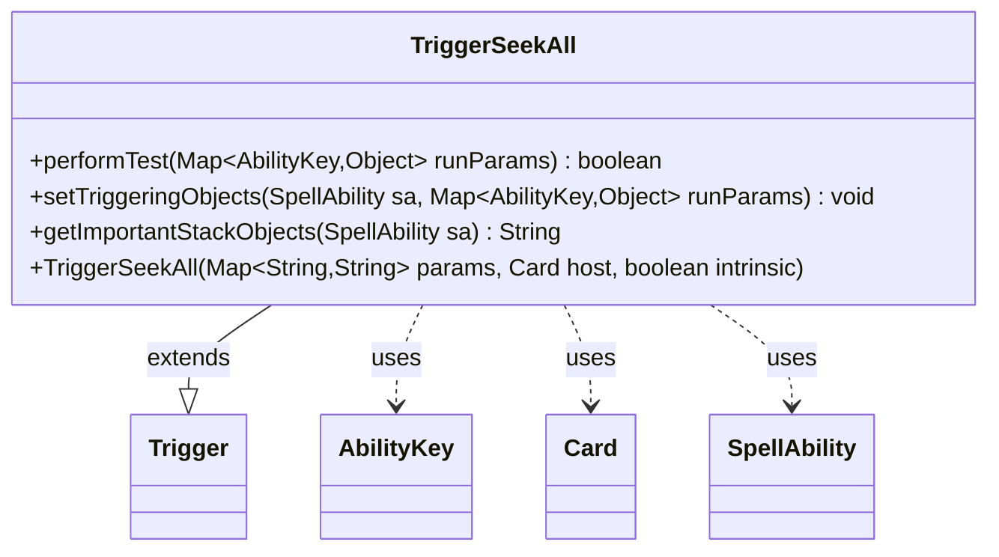

---
aliases:
  - TriggerSeekAll
tags:
  - java/class
  - module/forge-game
  - pkg/forge/game/trigger
fqn: forge.game.trigger.TriggerSeekAll
package: forge.game.trigger
module: forge-game
kind: Class
---

# TriggerSeekAll

**Package:** `forge.game.trigger` &nbsp; **Module:** `forge-game` &nbsp; **Kind:** Class



## Relationships
**Extends:**
- [[forge.game.trigger.Trigger|Trigger]]
**Uses:**
- [[forge.game.ability.AbilityKey|AbilityKey]]
- [[forge.game.card.Card|Card]]
- [[forge.game.spellability.SpellAbility|SpellAbility]]

## Design Description

TriggerSeekAll is a concrete trigger that fires for the "seek" mechanic, detecting when a player seeks cards and exposing the relevant game objects to the resolving ability. As a subclass of `Trigger`, it implements the framework's template-method hooks: `performTest` gates activation by matching the configured `ValidPlayer` restriction against the event's player, `setTriggeringObjects` binds the triggering player and the sought `Cards` onto the `SpellAbility` for use in its effect, and `getImportantStackObjects` produces a localized, human-readable stack summary. It collaborates with `AbilityKey` to key run-parameters, `Card` as its declaring host, and `SpellAbility` as the effect carrier. The class deliberately holds no state of its own, delegating construction to the superclass and relying entirely on the shared run-parameter map, which keeps each trigger type a thin, declarative adapter over Forge's generic triggering engine.

## Source
`forge-game/src/main/java/forge/game/trigger/TriggerSeekAll.java`

```java
package forge.game.trigger;

import forge.game.ability.AbilityKey;
import forge.game.card.Card;
import forge.game.spellability.SpellAbility;
import forge.util.Localizer;

import java.util.Map;

public class TriggerSeekAll extends Trigger {

    public TriggerSeekAll(Map<String, String> params, Card host, boolean intrinsic) {
        super(params, host, intrinsic);
    }

    @Override
    public boolean performTest(Map<AbilityKey, Object> runParams) {
        if (!matchesValidParam("ValidPlayer", runParams.get(AbilityKey.Player))) {
            return false;
        }
        return true;
    }

    @Override
    public void setTriggeringObjects(SpellAbility sa, Map<AbilityKey, Object> runParams) {
        sa.setTriggeringObjectsFrom(runParams, AbilityKey.Player);
        sa.setTriggeringObjectsFrom(runParams, AbilityKey.Cards);
    }

    @Override
    public String getImportantStackObjects(SpellAbility sa) {
        StringBuilder sb = new StringBuilder();
        sb.append(Localizer.getInstance().getMessage("lblPlayer")).append(": ");
        sb.append(sa.getTriggeringObject(AbilityKey.Player));
        return sb.toString();
    }
}
```

## Python
`forge/game/trigger/TriggerSeekAll.py`

```python
from forge.game.trigger.Trigger import Trigger
from forge.game.ability.AbilityKey import AbilityKey
from forge.game.card.Card import Card
from forge.game.spellability.SpellAbility import SpellAbility
from forge.util.Localizer import Localizer

from typing import Map


class TriggerSeekAll(Trigger):

    def __init__(self, params: dict[str, str], host: Card, intrinsic: bool):
        super().__init__(params, host, intrinsic)

    def performTest(self, runParams: dict[AbilityKey, object]) -> bool:
        if not self.matchesValidParam("ValidPlayer", runParams.get(AbilityKey.Player)):
            return False
        return True

    def setTriggeringObjects(self, sa: SpellAbility, runParams: dict[AbilityKey, object]) -> None:
        sa.setTriggeringObjectsFrom(runParams, AbilityKey.Player)
        sa.setTriggeringObjectsFrom(runParams, AbilityKey.Cards)

    def getImportantStackObjects(self, sa: SpellAbility) -> str:
        sb = []
        sb.append(Localizer.getInstance().getMessage("lblPlayer"))
        sb.append(": ")
        sb.append(str(sa.getTriggeringObject(AbilityKey.Player)))
        return "".join(sb)
```
