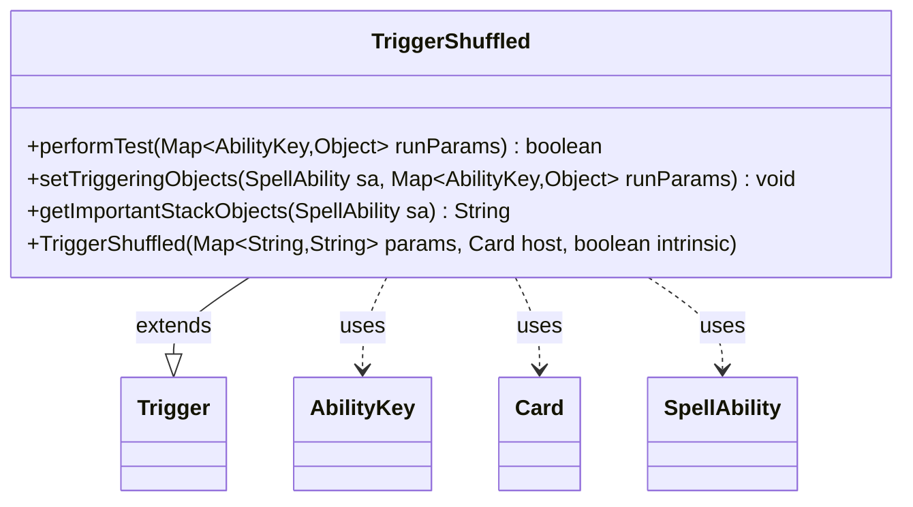

---
aliases:
  - TriggerShuffled
tags:
  - java/class
  - module/forge-game
  - pkg/forge/game/trigger
fqn: forge.game.trigger.TriggerShuffled
package: forge.game.trigger
module: forge-game
kind: Class
---

# TriggerShuffled

**Package:** `forge.game.trigger`   **Module:** `forge-game`   **Kind:** Class



## Relationships
**Extends:**
- [[forge.game.trigger.Trigger|Trigger]]
**Uses:**
- [[forge.game.ability.AbilityKey|AbilityKey]]
- [[forge.game.card.Card|Card]]
- [[forge.game.spellability.SpellAbility|SpellAbility]]

## Design Description

TriggerShuffled is a concrete trigger that fires when a library is shuffled, extending the abstract Trigger base class within Forge's event-driven triggered-ability framework. It specializes the template by implementing performTest to gate firing against the event's run parameters—matching the ValidPlayer constraint and optionally requiring that the shuffle came from an effect (ShuffleFromEffect) or was caused by the shuffling player themselves (ShuffleBySelfControlled).

Collaborating through AbilityKey-keyed run parameters, it extracts the shuffling Player via setTriggeringObjects to populate the resolving SpellAbility, and surfaces a localized description through getImportantStackObjects. The design follows Forge's data-driven pattern: behavioral variation is expressed via string params rather than subclassing, keeping each trigger type a thin, declarative specialization of the shared matching and triggering machinery.

## Source
`forge-game/src/main/java/forge/game/trigger/TriggerShuffled.java`

```java
/*
 * Forge: Play Magic: the Gathering.
 * Copyright (C) 2011  Forge Team
 *
 * This program is free software: you can redistribute it and/or modify
 * it under the terms of the GNU General Public License as published by
 * the Free Software Foundation, either version 3 of the License, or
 * (at your option) any later version.
 * 
 * This program is distributed in the hope that it will be useful,
 * but WITHOUT ANY WARRANTY; without even the implied warranty of
 * MERCHANTABILITY or FITNESS FOR A PARTICULAR PURPOSE.  See the
 * GNU General Public License for more details.
 * 
 * You should have received a copy of the GNU General Public License
 * along with this program.  If not, see <http://www.gnu.org/licenses/>.
 */
package forge.game.trigger;

import java.util.Map;

import forge.game.ability.AbilityKey;
import forge.game.card.Card;
import forge.game.spellability.SpellAbility;
import forge.util.Localizer;

/**
 * <p>
 * Trigger_Shuffled class.
 * </p>
 * 
 * @author Forge
 * @version $Id$
 */
public class TriggerShuffled extends Trigger {

    /**
     * <p>
     * Constructor for Trigger_Shuffled.
     * </p>
     * 
     * @param params
     *            a {@link java.util.HashMap} object.
     * @param host
     *            a {@link forge.game.card.Card} object.
     * @param intrinsic
     *            the intrinsic
     */
    public TriggerShuffled(final Map<String, String> params, final Card host, final boolean intrinsic) {
        super(params, host, intrinsic);
    }

    /** {@inheritDoc}
     * @param runParams*/
    @Override
    public final boolean performTest(final Map<AbilityKey, Object> runParams) {
        if (!matchesValidParam("ValidPlayer", runParams.get(AbilityKey.Player))) {
            return false;
        }

        if (hasParam("ShuffleFromEffect")) {
            if (null == runParams.get(AbilityKey.Source)) {
                return false;
            }
        }
        if (hasParam("ShuffleBySelfControlled")) {
            SpellAbility source = (SpellAbility) runParams.get(AbilityKey.Source);
            if (!source.getActivatingPlayer().equals(runParams.get(AbilityKey.Player))) {
                return false;
            }
        }
        return true;
    }

    /** {@inheritDoc} */
    @Override
    public final void setTriggeringObjects(final SpellAbility sa, Map<AbilityKey, Object> runParams) {
        sa.setTriggeringObjectsFrom(runParams, AbilityKey.Player);
    }

    @Override
    public String getImportantStackObjects(SpellAbility sa) {
        StringBuilder sb = new StringBuilder();
        sb.append(Localizer.getInstance().getMessage("lblShuffler")).append(": ").append(sa.getTriggeringObject(AbilityKey.Player));
        return sb.toString();
    }
}
```

## Python
`forge/game/trigger/TriggerShuffled.py`

```python
from forge.game.trigger.Trigger import Trigger
from forge.game.ability.AbilityKey import AbilityKey
from forge.game.card.Card import Card
from forge.game.spellability.SpellAbility import SpellAbility
from forge.util.Localizer import Localizer


class TriggerShuffled(Trigger):

    def __init__(self, params: dict[str, str], host: Card, intrinsic: bool):
        super().__init__(params, host, intrinsic)

    def performTest(self, runParams: dict[AbilityKey, object]) -> bool:
        if not self.matchesValidParam("ValidPlayer", runParams.get(AbilityKey.Player)):
            return False

        if self.hasParam("ShuffleFromEffect"):
            if runParams.get(AbilityKey.Source) is None:
                return False
        if self.hasParam("ShuffleBySelfControlled"):
            source = runParams.get(AbilityKey.Source)
            if not source.getActivatingPlayer().equals(runParams.get(AbilityKey.Player)):
                return False
        return True

    def setTriggeringObjects(self, sa: SpellAbility, runParams: dict[AbilityKey, object]) -> None:
        sa.setTriggeringObjectsFrom(runParams, AbilityKey.Player)

    def getImportantStackObjects(self, sa: SpellAbility) -> str:
        sb = []
        sb.append(Localizer.getInstance().getMessage("lblShuffler"))
        sb.append(": ")
        sb.append(str(sa.getTriggeringObject(AbilityKey.Player)))
        return "".join(sb)
```
