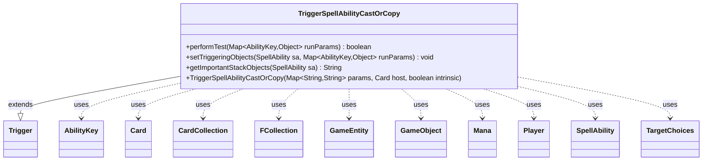

---
aliases:
  - TriggerSpellAbilityCastOrCopy
tags:
  - java/class
  - module/forge-game
  - pkg/forge/game/trigger
fqn: forge.game.trigger.TriggerSpellAbilityCastOrCopy
package: forge.game.trigger
module: forge-game
kind: Class
---

# TriggerSpellAbilityCastOrCopy

**Package:** `forge.game.trigger`   **Module:** `forge-game`   **Kind:** Class



## Relationships
**Extends:**
- [[forge.game.trigger.Trigger|Trigger]]
**Uses:**
- [[forge.game.GameEntity|GameEntity]]
- [[forge.game.GameObject|GameObject]]
- [[forge.game.ability.AbilityKey|AbilityKey]]
- [[forge.game.card.Card|Card]]
- [[forge.game.card.CardCollection|CardCollection]]
- [[forge.game.mana.Mana|Mana]]
- [[forge.game.player.Player|Player]]
- [[forge.game.spellability.SpellAbility|SpellAbility]]
- [[forge.game.spellability.TargetChoices|TargetChoices]]
- [[forge.util.collect.FCollection|FCollection]]

## Design Description

TriggerSpellAbilityCastOrCopy is a concrete trigger that fires when a spell or ability is cast or copied, encapsulating the conditions under which such an event should activate a card's triggered ability. Extending the abstract Trigger base class, it overrides performTest to evaluate a rich set of optional parameters—validating the casting player, the cast card and spell ability, targets, mana spent (colorless, snow), X costs, single-target constraints, and per-turn cast counts—returning whether the event qualifies. It collaborates with SpellAbility, Card, Player, and target/mana types (TargetChoices, Mana, GameEntity) drawn from the runtime parameter map keyed by AbilityKey. setTriggeringObjects then exposes the relevant game state (the cause, its targets, activator, storm count, life paid) for downstream effect resolution. The design reflects a data-driven pattern where script-supplied parameters declaratively gate trigger behavior rather than requiring bespoke subclasses.

## Source
`forge-game/src/main/java/forge/game/trigger/TriggerSpellAbilityCastOrCopy.java`

```java
/*
 * Forge: Play Magic: the Gathering.
 * Copyright (C) 2011  Forge Team
 *
 * This program is free software: you can redistribute it and/or modify
 * it under the terms of the GNU General Public License as published by
 * the Free Software Foundation, either version 3 of the License, or
 * (at your option) any later version.
 *
 * This program is distributed in the hope that it will be useful,
 * but WITHOUT ANY WARRANTY; without even the implied warranty of
 * MERCHANTABILITY or FITNESS FOR A PARTICULAR PURPOSE.  See the
 * GNU General Public License for more details.
 *
 * You should have received a copy of the GNU General Public License
 * along with this program.  If not, see <http://www.gnu.org/licenses/>.
 */
package forge.game.trigger;

import java.util.List;
import java.util.Map;
import java.util.Set;

import com.google.common.collect.Sets;

import forge.card.ColorSet;
import forge.game.GameEntity;
import forge.game.GameObject;
import forge.game.ability.AbilityKey;
import forge.game.card.Card;
import forge.game.card.CardCollection;
import forge.game.card.CardLists;
import forge.game.card.CardUtil;
import forge.game.mana.Mana;
import forge.game.player.Player;
import forge.game.spellability.SpellAbility;
import forge.game.spellability.TargetChoices;
import forge.util.Expressions;
import forge.util.Localizer;
import forge.util.collect.FCollection;

/**
 * <p>
 * Trigger_SpellAbilityCast class.
 * </p>
 *
 * @author Forge
 * @version $Id$
 */
public class TriggerSpellAbilityCastOrCopy extends Trigger {

    /**
     * <p>
     * Constructor for Trigger_SpellAbilityCast.
     * </p>
     *
     * @param params
     *            a {@link java.util.HashMap} object.
     * @param host
     *            a {@link forge.game.card.Card} object.
     * @param intrinsic
     *            the intrinsic
     */
    public TriggerSpellAbilityCastOrCopy(final Map<String, String> params, final Card host, final boolean intrinsic) {
        super(params, host, intrinsic);
    }

    /** {@inheritDoc}
     * @param runParams
     **/
    @Override
    public final boolean performTest(final Map<AbilityKey, Object> runParams) {
        final SpellAbility spellAbility = (SpellAbility) runParams.get(AbilityKey.SpellAbility);
        if (spellAbility == null) {
            System.out.println("TriggerSpellAbilityCast performTest encountered spellAbility == null. runParams2 = " + runParams);
            return false;
        }
        final Card cast = spellAbility.getHostCard();

        if (hasParam("ValidActivatingPlayer")) {
            Player activator = (Player) runParams.get(AbilityKey.Activator);

            if (!matchesValidParam("ValidActivatingPlayer", activator)) {
                return false;
            }
            if (hasParam("ActivatorThisTurnCast")) {
                final String compare = getParam("ActivatorThisTurnCast");
                final String valid = getParamOrDefault("ValidCard", "Card");
                List<Card> thisTurnCast = CardUtil.getThisTurnCast(valid, getHostCard(), this, getHostCard().getController());
                thisTurnCast = CardLists.filterControlledByAsList(thisTurnCast, activator);
                int left = thisTurnCast.size();
                int right = Integer.parseInt(compare.substring(2));
                if (!Expressions.compare(left, compare, right)) {
                    return false;
                }
            }
            if (hasParam("ActivatorThisTurnCastEach")) {
                final String compare = getParam("ActivatorThisTurnCastEach");
                final String valid = getParamOrDefault("ValidCard", "Card");
                boolean found = false;
                int right = Integer.parseInt(compare.substring(2));
                for (String v : valid.split(",")) {
                    if (!cast.isValid(v, getHostCard().getController(), getHostCard(), this)) {
                        continue;
                    }
                    List<Card> thisTurnCast = CardUtil.getThisTurnCast(v, getHostCard(), this, getHostCard().getController());
                    thisTurnCast = CardLists.filterControlledByAsList(thisTurnCast, activator);
                    int left = thisTurnCast.size();
                    if (Expressions.compare(left, compare, right)) {
                        found = true;
                        break;
                    }
                }
                if (!found) {
                    return false;
                }
            }
        }
        if (!matchesValidParam("ValidCard", cast)) {
            return false;
        }
        if (!matchesValidParam("ValidSA", spellAbility)) {
            return false;
        }
        if (!matchesValidParam("ValidSAonCard", spellAbility, cast)) {
            return false;
        }

        if (hasParam("TargetsValid")) {
            SpellAbility sa = spellAbility;

            boolean validTgtFound = false;
            while (sa != null && !validTgtFound) {
                for (final GameEntity ge : sa.getTargets().getTargetEntities()) {
                    if (matchesValidParam("TargetsValid", ge)) {
                        validTgtFound = true;
                        break;
                    }
                }
                sa = sa.getSubAbility();
            }
            if (!validTgtFound) {
                 return false;
            }
        }

        if (hasParam("CanTargetOtherCondition")) {
            final CardCollection candidates = new CardCollection();
            SpellAbility targetedSA = spellAbility;
            while (targetedSA != null) {
                if (targetedSA.usesTargeting() && targetedSA.getTargets().size() != 0) {
                    break;
                }
                targetedSA = targetedSA.getSubAbility();
            }
            if (targetedSA == null) {
                return false;
            }
            final List<GameEntity> candidateTargets = targetedSA.getTargetRestrictions().getAllCandidates(targetedSA, true);
            for (GameEntity card : candidateTargets) {
                if (card instanceof Card) {
                    candidates.add((Card) card);
                }
            }
            candidates.removeAll(targetedSA.getTargets().getTargetCards());
            String valid = getParam("CanTargetOtherCondition");
            if (CardLists.getValidCards(candidates, valid, spellAbility.getActivatingPlayer(), spellAbility.getHostCard(), spellAbility).isEmpty()) {
                return false;
            }
        }

        if (hasParam("HasXManaCost")) {
            final int numX;
            if (spellAbility.isActivatedAbility()) {
                numX = spellAbility.getPayCosts().hasManaCost() ? spellAbility.getPayCosts().getCostMana().getAmountOfX() : 0;
            } else {
                numX = cast.getManaCost().countX();
            }
            if (numX == 0) {
                return false;
            }
        }

        // use numTargets instead?
        if (hasParam("IsSingleTarget")) {
            Set<GameObject> targets = Sets.newHashSet();
            for (TargetChoices tc : spellAbility.getAllTargetChoices()) {
                targets.addAll(tc);
                if (targets.size() > 1) {
                    return false;
                }
            }
            if (targets.size() != 1) {
                return false;
            }
        }

        if (hasParam("NoColoredMana")) {
            for (Mana m : spellAbility.getPayingMana()) {
                if (!m.isColorless()) {
                    return false;
                }
            }
        }

        if (hasParam("SnowSpentForCardsColor")) {
            boolean found = false;
            for (Mana m : spellAbility.getPayingMana()) {
                if (!m.isSnow()) {
                    continue;
                }
                if (cast.getColor().sharesColorWith(ColorSet.fromMask(m.getColor()))) {
                    found = true;
                    break;
                }
            }
            if (!found) {
                return false;
            }
        }

        if (getSpawningAbility() != null && getSpawningAbility().hasParam("TriggersWhenSpent")) {
            if (!getTriggerRemembered().contains(spellAbility)) {
                return false;
            }
        }

        return true;
    }

    /** {@inheritDoc} */
    @Override
    public final void setTriggeringObjects(final SpellAbility sa, Map<AbilityKey, Object> runParams) {
        final SpellAbility cause = (SpellAbility) runParams.get(AbilityKey.SpellAbility);
        sa.setTriggeringObject(AbilityKey.Card, cause.getHostCard());
        sa.setTriggeringObject(AbilityKey.SpellAbility, cause);
        final List<TargetChoices> allTgts = cause.getAllTargetChoices();
        if (!allTgts.isEmpty()) {
            final FCollection<GameEntity> saTargets = new FCollection<>();
            for (TargetChoices tc : allTgts) {
                saTargets.addAll(tc.getTargetEntities());
            }
            sa.setTriggeringObject(AbilityKey.SpellAbilityTargets, saTargets);
        }
        sa.setTriggeringObject(AbilityKey.LifeAmount, cause.getAmountLifePaid());
        sa.setTriggeringObjectsFrom(
                runParams,
                AbilityKey.CardLKI,
                AbilityKey.Activator,
                AbilityKey.CurrentStormCount,
                AbilityKey.CurrentCastSpells
                );
    }

    @Override
    public String getImportantStackObjects(SpellAbility sa) {
        StringBuilder sb = new StringBuilder();
        sb.append(Localizer.getInstance().getMessage("lblCard")).append(": ").append(sa.getTriggeringObject(AbilityKey.Card)).append(", ");
        sb.append(Localizer.getInstance().getMessage("lblActivator")).append(": ").append(sa.getTriggeringObject(AbilityKey.Activator)).append(", ");
        sb.append(Localizer.getInstance().getMessage("lblSpellAbility")).append(": ").append(sa.getTriggeringObject(AbilityKey.SpellAbility));
        return sb.toString();
    }
}
```

## Python
`forge/game/trigger/TriggerSpellAbilityCastOrCopy.py`

```python
from forge.card.ColorSet import ColorSet
from forge.game.GameEntity import GameEntity
from forge.game.GameObject import GameObject
from forge.game.ability.AbilityKey import AbilityKey
from forge.game.card.Card import Card
from forge.game.card.CardCollection import CardCollection
from forge.game.card.CardLists import CardLists
from forge.game.card.CardUtil import CardUtil
from forge.game.mana.Mana import Mana
from forge.game.player.Player import Player
from forge.game.spellability.SpellAbility import SpellAbility
from forge.game.spellability.TargetChoices import TargetChoices
from forge.game.trigger.Trigger import Trigger
from forge.util.Expressions import Expressions
from forge.util.Localizer import Localizer
from forge.util.collect.FCollection import FCollection


class TriggerSpellAbilityCastOrCopy(Trigger):

    def __init__(self, params: dict[str, str], host: Card, intrinsic: bool):
        super().__init__(params, host, intrinsic)

    def performTest(self, runParams: dict[AbilityKey, object]) -> bool:
        spellAbility = runParams.get(AbilityKey.SpellAbility)
        if spellAbility is None:
            print("TriggerSpellAbilityCast performTest encountered spellAbility == null. runParams2 = " + str(runParams))
            return False
        cast = spellAbility.getHostCard()

        if self.hasParam("ValidActivatingPlayer"):
            activator = runParams.get(AbilityKey.Activator)

            if not self.matchesValidParam("ValidActivatingPlayer", activator):
                return False
            if self.hasParam("ActivatorThisTurnCast"):
                compare = self.getParam("ActivatorThisTurnCast")
                valid = self.getParamOrDefault("ValidCard", "Card")
                thisTurnCast = CardUtil.getThisTurnCast(valid, self.getHostCard(), self, self.getHostCard().getController())
                thisTurnCast = CardLists.filterControlledByAsList(thisTurnCast, activator)
                left = len(thisTurnCast)
                right = int(compare[2:])
                if not Expressions.compare(left, compare, right):
                    return False
            if self.hasParam("ActivatorThisTurnCastEach"):
                compare = self.getParam("ActivatorThisTurnCastEach")
                valid = self.getParamOrDefault("ValidCard", "Card")
                found = False
                right = int(compare[2:])
                for v in valid.split(","):
                    if not cast.isValid(v, self.getHostCard().getController(), self.getHostCard(), self):
                        continue
                    thisTurnCast = CardUtil.getThisTurnCast(v, self.getHostCard(), self, self.getHostCard().getController())
                    thisTurnCast = CardLists.filterControlledByAsList(thisTurnCast, activator)
                    left = len(thisTurnCast)
                    if Expressions.compare(left, compare, right):
                        found = True
                        break
                if not found:
                    return False
        if not self.matchesValidParam("ValidCard", cast):
            return False
        if not self.matchesValidParam("ValidSA", spellAbility):
            return False
        if not self.matchesValidParam("ValidSAonCard", spellAbility, cast):
            return False

        if self.hasParam("TargetsValid"):
            sa = spellAbility

            validTgtFound = False
            while sa is not None and not validTgtFound:
                for ge in sa.getTargets().getTargetEntities():
                    if self.matchesValidParam("TargetsValid", ge):
                        validTgtFound = True
                        break
                sa = sa.getSubAbility()
            if not validTgtFound:
                return False

        if self.hasParam("CanTargetOtherCondition"):
            candidates = CardCollection()
            targetedSA = spellAbility
            while targetedSA is not None:
                if targetedSA.usesTargeting() and targetedSA.getTargets().size() != 0:
                    break
                targetedSA = targetedSA.getSubAbility()
            if targetedSA is None:
                return False
            candidateTargets = targetedSA.getTargetRestrictions().getAllCandidates(targetedSA, True)
            for card in candidateTargets:
                if isinstance(card, Card):
                    candidates.add(card)
            candidates.removeAll(targetedSA.getTargets().getTargetCards())
            valid = self.getParam("CanTargetOtherCondition")
            if CardLists.getValidCards(candidates, valid, spellAbility.getActivatingPlayer(), spellAbility.getHostCard(), spellAbility).isEmpty():
                return False

        if self.hasParam("HasXManaCost"):
            if spellAbility.isActivatedAbility():
                numX = spellAbility.getPayCosts().getCostMana().getAmountOfX() if spellAbility.getPayCosts().hasManaCost() else 0
            else:
                numX = cast.getManaCost().countX()
            if numX == 0:
                return False

        # use numTargets instead?
        if self.hasParam("IsSingleTarget"):
            targets = set()
            for tc in spellAbility.getAllTargetChoices():
                targets.update(tc)
                if len(targets) > 1:
                    return False
            if len(targets) != 1:
                return False

        if self.hasParam("NoColoredMana"):
            for m in spellAbility.getPayingMana():
                if not m.isColorless():
                    return False

        if self.hasParam("SnowSpentForCardsColor"):
            found = False
            for m in spellAbility.getPayingMana():
                if not m.isSnow():
                    continue
                if cast.getColor().sharesColorWith(ColorSet.fromMask(m.getColor())):
                    found = True
                    break
            if not found:
                return False

        if self.getSpawningAbility() is not None and self.getSpawningAbility().hasParam("TriggersWhenSpent"):
            if spellAbility not in self.getTriggerRemembered():
                return False

        return True

    def setTriggeringObjects(self, sa: SpellAbility, runParams: dict[AbilityKey, object]) -> None:
        cause = runParams.get(AbilityKey.SpellAbility)
        sa.setTriggeringObject(AbilityKey.Card, cause.getHostCard())
        sa.setTriggeringObject(AbilityKey.SpellAbility, cause)
        allTgts = cause.getAllTargetChoices()
        if not allTgts.isEmpty():
            saTargets = FCollection()
            for tc in allTgts:
                saTargets.addAll(tc.getTargetEntities())
            sa.setTriggeringObject(AbilityKey.SpellAbilityTargets, saTargets)
        sa.setTriggeringObject(AbilityKey.LifeAmount, cause.getAmountLifePaid())
        sa.setTriggeringObjectsFrom(
            runParams,
            AbilityKey.CardLKI,
            AbilityKey.Activator,
            AbilityKey.CurrentStormCount,
            AbilityKey.CurrentCastSpells
        )

    def getImportantStackObjects(self, sa: SpellAbility) -> str:
        sb = []
        sb.append(Localizer.getInstance().getMessage("lblCard"))
        sb.append(": ")
        sb.append(str(sa.getTriggeringObject(AbilityKey.Card)))
        sb.append(", ")
        sb.append(Localizer.getInstance().getMessage("lblActivator"))
        sb.append(": ")
        sb.append(str(sa.getTriggeringObject(AbilityKey.Activator)))
        sb.append(", ")
        sb.append(Localizer.getInstance().getMessage("lblSpellAbility"))
        sb.append(": ")
        sb.append(str(sa.getTriggeringObject(AbilityKey.SpellAbility)))
        return "".join(sb)
```
