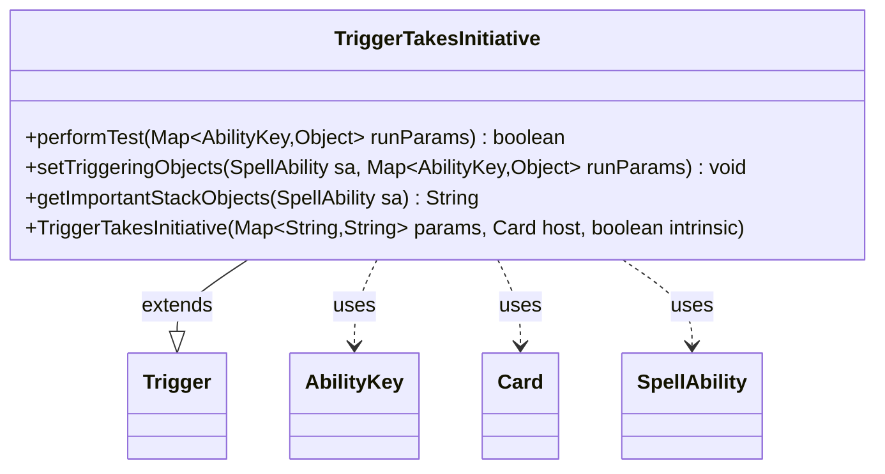

---
aliases:
  - TriggerTakesInitiative
tags:
  - java/class
  - module/forge-game
  - pkg/forge/game/trigger
fqn: forge.game.trigger.TriggerTakesInitiative
package: forge.game.trigger
module: forge-game
kind: Class
---

# TriggerTakesInitiative

**Package:** `forge.game.trigger`   **Module:** `forge-game`   **Kind:** Class



## Relationships
**Extends:**
- [[forge.game.trigger.Trigger|Trigger]]
**Uses:**
- [[forge.game.ability.AbilityKey|AbilityKey]]
- [[forge.game.card.Card|Card]]
- [[forge.game.spellability.SpellAbility|SpellAbility]]

## Design Description

TriggerTakesInitiative is a concrete trigger that fires when a player takes the initiative, a Forge mechanic tracked per-player. As a subclass of Trigger, it implements the framework's template-method contract: performTest gates firing by checking the triggering player against the trigger's optional ValidPlayer restriction, setTriggeringObjects exposes that player to the resolving SpellAbility, and getImportantStackObjects renders a localized player label for the stack display. It collaborates with AbilityKey to key into the runtime parameter map, Card as its host, and SpellAbility as the ability the trigger feeds. The design is deliberately minimal—delegating construction to the superclass and routing all triggering state through the single Player key—reflecting the data-driven, per-event nature of Forge's trigger system.

## Source
`forge-game/src/main/java/forge/game/trigger/TriggerTakesInitiative.java`

```java
package forge.game.trigger;

import forge.game.ability.AbilityKey;
import forge.game.card.Card;
import forge.game.spellability.SpellAbility;
import forge.util.Localizer;

import java.util.Map;

public class TriggerTakesInitiative extends Trigger {

    public TriggerTakesInitiative(Map<String, String> params, Card host, boolean intrinsic) {
        super(params, host, intrinsic);
    }

    @Override
    public boolean performTest(Map<AbilityKey, Object> runParams) {
        if (!matchesValidParam("ValidPlayer", runParams.get(AbilityKey.Player))) {
            return false;
        }
        return true;
    }

    /** {@inheritDoc} */
    @Override
    public final void setTriggeringObjects(final SpellAbility sa, Map<AbilityKey, Object> runParams) {
        sa.setTriggeringObjectsFrom(runParams, AbilityKey.Player);
    }

    @Override
    public String getImportantStackObjects(SpellAbility sa) {
        StringBuilder sb = new StringBuilder();
        sb.append(Localizer.getInstance().getMessage("lblPlayer")).append(": ");
        sb.append(sa.getTriggeringObject(AbilityKey.Player)).append(", ");
        return sb.toString();
    }
}
```

## Python
`forge/game/trigger/TriggerTakesInitiative.py`

```python
from forge.game.trigger.Trigger import Trigger
from forge.game.ability.AbilityKey import AbilityKey
from forge.game.card.Card import Card
from forge.game.spellability.SpellAbility import SpellAbility
from forge.util.Localizer import Localizer

import typing


class TriggerTakesInitiative(Trigger):

    def __init__(self, params: dict[str, str], host: Card, intrinsic: bool):
        super().__init__(params, host, intrinsic)

    def performTest(self, runParams: dict[AbilityKey, object]) -> bool:
        if not self.matchesValidParam("ValidPlayer", runParams.get(AbilityKey.Player)):
            return False
        return True

    def setTriggeringObjects(self, sa: SpellAbility, runParams: dict[AbilityKey, object]) -> None:
        sa.setTriggeringObjectsFrom(runParams, AbilityKey.Player)

    def getImportantStackObjects(self, sa: SpellAbility) -> str:
        sb = []
        sb.append(Localizer.getInstance().getMessage("lblPlayer"))
        sb.append(": ")
        sb.append(str(sa.getTriggeringObject(AbilityKey.Player)))
        sb.append(", ")
        return "".join(sb)
```
