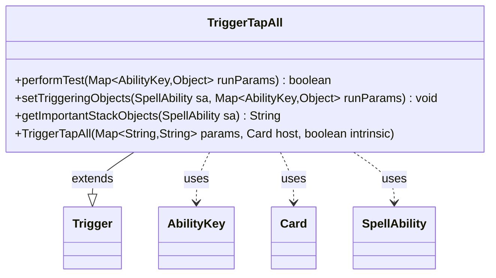

---
aliases:
  - TriggerTapAll
tags:
  - java/class
  - module/forge-game
  - pkg/forge/game/trigger
fqn: forge.game.trigger.TriggerTapAll
package: forge.game.trigger
module: forge-game
kind: Class
---

# TriggerTapAll

**Package:** `forge.game.trigger` &nbsp; **Module:** `forge-game` &nbsp; **Kind:** Class



## Relationships
**Extends:**
- [[forge.game.trigger.Trigger|Trigger]]
**Uses:**
- [[forge.game.ability.AbilityKey|AbilityKey]]
- [[forge.game.card.Card|Card]]
- [[forge.game.spellability.SpellAbility|SpellAbility]]

## Source
`forge-game/src/main/java/forge/game/trigger/TriggerTapAll.java`

```java
package forge.game.trigger;

import forge.game.ability.AbilityKey;
import forge.game.card.Card;
import forge.game.card.CardPredicates;
import forge.game.spellability.SpellAbility;
import forge.util.IterableUtil;
import forge.util.Localizer;

import java.util.Map;

public class TriggerTapAll extends Trigger {

    public TriggerTapAll(final Map<String, String> params, final Card host, final boolean intrinsic) {
        super(params, host, intrinsic);
    }

    @Override
    public boolean performTest(Map<AbilityKey, Object> runParams) {
        return matchesValidParam("ValidCards", runParams.get(AbilityKey.Cards));
    }

    @Override
    public void setTriggeringObjects(SpellAbility sa, Map<AbilityKey, Object> runParams) {
        Iterable<Card> cards = (Iterable<Card>) runParams.get(AbilityKey.Cards);
        if (hasParam("ValidCards")) {
            cards = IterableUtil.filter(cards, CardPredicates.restriction(getParam("ValidCards").split(","),
                    getHostCard().getController(), getHostCard(), this));
        }

        sa.setTriggeringObject(AbilityKey.Cards, cards);
    }

    @Override
    public String getImportantStackObjects(SpellAbility sa) {
        return Localizer.getInstance().getMessage("lblTapped") + ": " + sa.getTriggeringObject(AbilityKey.Cards);
    }
}
```
