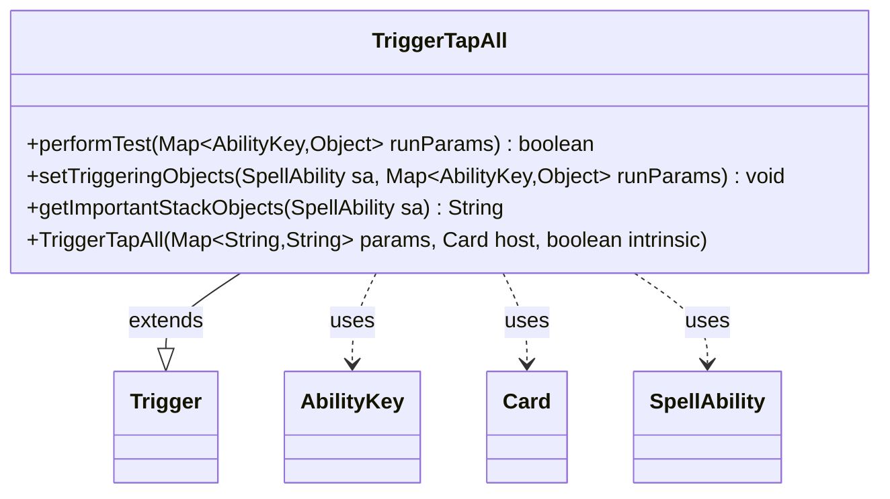

---
aliases:
  - TriggerTapAll
tags:
  - java/class
  - module/forge-game
  - pkg/forge/game/trigger
fqn: forge.game.trigger.TriggerTapAll
package: forge.game.trigger
module: forge-game
kind: Class
---

# TriggerTapAll

**Package:** `forge.game.trigger` &nbsp; **Module:** `forge-game` &nbsp; **Kind:** Class



## Relationships
**Extends:**
- [[forge.game.trigger.Trigger|Trigger]]
**Uses:**
- [[forge.game.ability.AbilityKey|AbilityKey]]
- [[forge.game.card.Card|Card]]
- [[forge.game.spellability.SpellAbility|SpellAbility]]

## Design Description

TriggerTapAll is a concrete trigger that fires when a group of cards is tapped, matching the behavior of Magic effects that respond to mass tapping. As a subclass of `Trigger`, it implements the framework's template methods: `performTest` checks the incoming `AbilityKey.Cards` collection against the optional `ValidCards` restriction, while `setTriggeringObjects` filters that collection through `CardPredicates.restriction` and exposes the surviving cards to the resolving `SpellAbility`. It collaborates with `AbilityKey` to read and write run parameters, `Card` for the tapped objects, and `SpellAbility` to publish triggering data and produce a localized stack description via `getImportantStackObjects`. The design keeps the class thin and declarative, deferring lifecycle and intrinsic handling to its superclass and driving its matching logic entirely from data-supplied parameters rather than hardcoded conditions.

## Source
`forge-game/src/main/java/forge/game/trigger/TriggerTapAll.java`

```java
package forge.game.trigger;

import forge.game.ability.AbilityKey;
import forge.game.card.Card;
import forge.game.card.CardPredicates;
import forge.game.spellability.SpellAbility;
import forge.util.IterableUtil;
import forge.util.Localizer;

import java.util.Map;

public class TriggerTapAll extends Trigger {

    public TriggerTapAll(final Map<String, String> params, final Card host, final boolean intrinsic) {
        super(params, host, intrinsic);
    }

    @Override
    public boolean performTest(Map<AbilityKey, Object> runParams) {
        return matchesValidParam("ValidCards", runParams.get(AbilityKey.Cards));
    }

    @Override
    public void setTriggeringObjects(SpellAbility sa, Map<AbilityKey, Object> runParams) {
        Iterable<Card> cards = (Iterable<Card>) runParams.get(AbilityKey.Cards);
        if (hasParam("ValidCards")) {
            cards = IterableUtil.filter(cards, CardPredicates.restriction(getParam("ValidCards").split(","),
                    getHostCard().getController(), getHostCard(), this));
        }

        sa.setTriggeringObject(AbilityKey.Cards, cards);
    }

    @Override
    public String getImportantStackObjects(SpellAbility sa) {
        return Localizer.getInstance().getMessage("lblTapped") + ": " + sa.getTriggeringObject(AbilityKey.Cards);
    }
}
```

## Python
`forge/game/trigger/TriggerTapAll.py`

```python
from forge.game.ability.AbilityKey import AbilityKey
from forge.game.card.Card import Card
from forge.game.card.CardPredicates import CardPredicates
from forge.game.spellability.SpellAbility import SpellAbility
from forge.util.IterableUtil import IterableUtil
from forge.util.Localizer import Localizer
from forge.game.trigger.Trigger import Trigger


class TriggerTapAll(Trigger):

    def __init__(self, params: dict[str, str], host: Card, intrinsic: bool):
        super().__init__(params, host, intrinsic)

    def performTest(self, runParams: dict[AbilityKey, object]) -> bool:
        return self.matchesValidParam("ValidCards", runParams.get(AbilityKey.Cards))

    def setTriggeringObjects(self, sa: SpellAbility, runParams: dict[AbilityKey, object]) -> None:
        cards = runParams.get(AbilityKey.Cards)
        if self.hasParam("ValidCards"):
            cards = IterableUtil.filter(cards, CardPredicates.restriction(self.getParam("ValidCards").split(","),
                    self.getHostCard().getController(), self.getHostCard(), self))

        sa.setTriggeringObject(AbilityKey.Cards, cards)

    def getImportantStackObjects(self, sa: SpellAbility) -> str:
        return Localizer.getInstance().getMessage("lblTapped") + ": " + str(sa.getTriggeringObject(AbilityKey.Cards))
```
