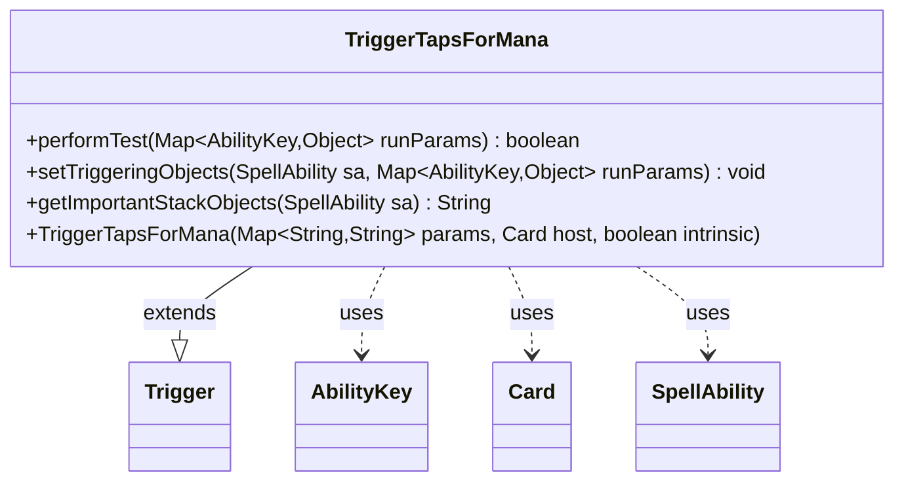

---
aliases:
  - TriggerTapsForMana
tags:
  - java/class
  - module/forge-game
  - pkg/forge/game/trigger
fqn: forge.game.trigger.TriggerTapsForMana
package: forge.game.trigger
module: forge-game
kind: Class
---

# TriggerTapsForMana

**Package:** `forge.game.trigger` &nbsp; **Module:** `forge-game` &nbsp; **Kind:** Class



## Relationships
**Extends:**
- [[forge.game.trigger.Trigger|Trigger]]
**Uses:**
- [[forge.game.ability.AbilityKey|AbilityKey]]
- [[forge.game.card.Card|Card]]
- [[forge.game.spellability.SpellAbility|SpellAbility]]

## Design Description

TriggerTapsForMana is a concrete trigger that fires when a permanent is tapped to produce mana. Extending the abstract Trigger base class, it overrides the framework's template-method hooks rather than defining its own lifecycle: performTest gates firing by matching the tapping Card and Activator against the trigger's Valid parameters and, optionally, checking the produced mana against a configured color (including the host's ChosenColor); setTriggeringObjects populates the SpellAbility with the Card, Produced, and Activator values pulled from the run parameters; and getImportantStackObjects builds a localized stack description.

The design keeps trigger conditions data-driven through the inherited params map and AbilityKey-keyed run parameters, so behavior is configured by card scripts rather than hard-coded. Collaboration with MagicColor for color normalization and Localizer for user-facing text reflects a clean separation between matching logic and presentation.

## Source
`forge-game/src/main/java/forge/game/trigger/TriggerTapsForMana.java`

```java
/*
 * Forge: Play Magic: the Gathering.
 * Copyright (C) 2011  Forge Team
 *
 * This program is free software: you can redistribute it and/or modify
 * it under the terms of the GNU General Public License as published by
 * the Free Software Foundation, either version 3 of the License, or
 * (at your option) any later version.
 * 
 * This program is distributed in the hope that it will be useful,
 * but WITHOUT ANY WARRANTY; without even the implied warranty of
 * MERCHANTABILITY or FITNESS FOR A PARTICULAR PURPOSE.  See the
 * GNU General Public License for more details.
 * 
 * You should have received a copy of the GNU General Public License
 * along with this program.  If not, see <http://www.gnu.org/licenses/>.
 */
package forge.game.trigger;

import static forge.util.TextUtil.toManaString;

import java.util.Map;

import forge.card.MagicColor;
import forge.game.ability.AbilityKey;
import forge.game.card.Card;
import forge.game.spellability.SpellAbility;
import forge.util.Localizer;

/**
 * <p>
 * Trigger_TapsForMana class.
 * </p>
 * 
 * @author Forge
 * @version $Id$
 */
public class TriggerTapsForMana extends Trigger {

    /**
     * <p>
     * Constructor for Trigger_TapsForMana.
     * </p>
     * 
     * @param params
     *            a {@link java.util.HashMap} object.
     * @param host
     *            a {@link forge.game.card.Card} object.
     * @param intrinsic
     *            the intrinsic
     */
    public TriggerTapsForMana(final Map<String, String> params, final Card host, final boolean intrinsic) {
        super(params, host, intrinsic);
    }

    /** {@inheritDoc}
     * @param runParams*/
    @Override
    public final boolean performTest(final Map<AbilityKey, Object> runParams) {
        if (!matchesValidParam("ValidCard", runParams.get(AbilityKey.Card))) {
            return false;
        }
        if (!matchesValidParam("Activator", runParams.get(AbilityKey.Activator))) {
            return false;
        }

        if (hasParam("Produced")) {
            Object prod = runParams.get(AbilityKey.Produced);
            if (!(prod instanceof String)) {
                return false;
            }
            String produced = (String) prod;
            if ("ChosenColor".equals(getParam("Produced"))) {
                if (!this.getHostCard().hasChosenColor() || !produced.contains(MagicColor.toShortString(this.getHostCard().getChosenColor()))) {
                    return false;
                }
            } else if (!produced.contains(MagicColor.toShortString(this.getParam("Produced")))) {
                return false;
            }
        }

        return true;
    }

    /** {@inheritDoc} */
    @Override
    public final void setTriggeringObjects(final SpellAbility sa, Map<AbilityKey, Object> runParams) {
        sa.setTriggeringObjectsFrom(runParams, AbilityKey.Card, AbilityKey.Produced, AbilityKey.Activator);
    }

    @Override
    public String getImportantStackObjects(SpellAbility sa) {
        return Localizer.getInstance().getMessage("lblTappedForMana") + ": " +
                sa.getTriggeringObject(AbilityKey.Card) + " " + Localizer.getInstance().getMessage("lblProduced") +
                ": " + toManaString(sa.getTriggeringObject(AbilityKey.Produced).toString());
    }

}
```

## Python
`forge/game/trigger/TriggerTapsForMana.py`

```python
from forge.game.trigger.Trigger import Trigger
from forge.card.MagicColor import MagicColor
from forge.game.ability.AbilityKey import AbilityKey
from forge.game.card.Card import Card
from forge.game.spellability.SpellAbility import SpellAbility
from forge.util.Localizer import Localizer
from forge.util.TextUtil import toManaString


class TriggerTapsForMana(Trigger):

    def __init__(self, params: dict[str, str], host: Card, intrinsic: bool):
        super().__init__(params, host, intrinsic)

    def performTest(self, runParams: dict[AbilityKey, object]) -> bool:
        if not self.matchesValidParam("ValidCard", runParams.get(AbilityKey.Card)):
            return False
        if not self.matchesValidParam("Activator", runParams.get(AbilityKey.Activator)):
            return False

        if self.hasParam("Produced"):
            prod = runParams.get(AbilityKey.Produced)
            if not isinstance(prod, str):
                return False
            produced = prod
            if "ChosenColor" == self.getParam("Produced"):
                if not self.getHostCard().hasChosenColor() or MagicColor.toShortString(self.getHostCard().getChosenColor()) not in produced:
                    return False
            elif MagicColor.toShortString(self.getParam("Produced")) not in produced:
                return False

        return True

    def setTriggeringObjects(self, sa: SpellAbility, runParams: dict[AbilityKey, object]) -> None:
        sa.setTriggeringObjectsFrom(runParams, AbilityKey.Card, AbilityKey.Produced, AbilityKey.Activator)

    def getImportantStackObjects(self, sa: SpellAbility) -> str:
        return Localizer.getInstance().getMessage("lblTappedForMana") + ": " + \
            str(sa.getTriggeringObject(AbilityKey.Card)) + " " + Localizer.getInstance().getMessage("lblProduced") + \
            ": " + toManaString(str(sa.getTriggeringObject(AbilityKey.Produced)))
```
