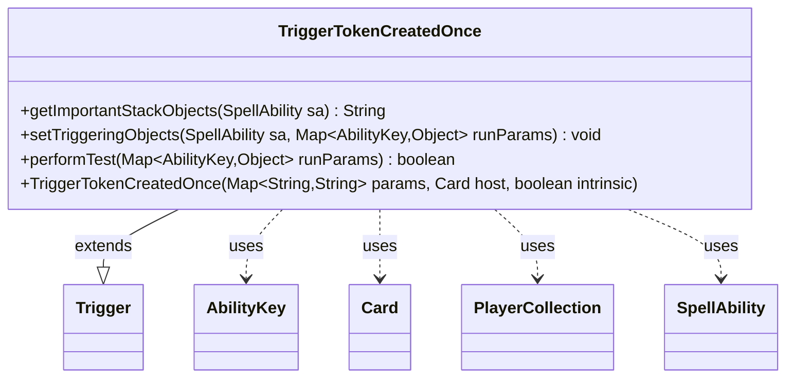

---
aliases:
  - TriggerTokenCreatedOnce
tags:
  - java/class
  - module/forge-game
  - pkg/forge/game/trigger
fqn: forge.game.trigger.TriggerTokenCreatedOnce
package: forge.game.trigger
module: forge-game
kind: Class
---

# TriggerTokenCreatedOnce

**Package:** `forge.game.trigger` &nbsp; **Module:** `forge-game` &nbsp; **Kind:** Class



## Relationships
**Extends:**
- [[forge.game.trigger.Trigger|Trigger]]
**Uses:**
- [[forge.game.ability.AbilityKey|AbilityKey]]
- [[forge.game.card.Card|Card]]
- [[forge.game.player.PlayerCollection|PlayerCollection]]
- [[forge.game.spellability.SpellAbility|SpellAbility]]

## Design Description

TriggerTokenCreatedOnce is a concrete trigger that fires in response to token-creation events, extending the abstract `Trigger` base class and conforming to its template-method contract by overriding `performTest`, `setTriggeringObjects`, and `getImportantStackObjects`. Its responsibility is to recognize when tokens are created, optionally filter them, and expose the matching tokens to the resolving ability.

In `setTriggeringObjects` it reads the created `Card` tokens from the `AbilityKey.Cards` run parameter, narrows them via the card-script `ValidToken` restriction, and publishes the result as the triggering object for the consuming `SpellAbility`. `performTest` gates activation on the same `ValidToken` match and, when `OnlyFirst` is specified, checks the `PlayerCollection` under `AbilityKey.FirstTime` against the host's defined players so the trigger fires only on a player's first token creation. The design keeps all behavior data-driven through card-script parameters, delegating restriction and player resolution to shared `AbilityUtils`/`CardPredicates` utilities rather than hardcoding logic.

## Source
`forge-game/src/main/java/forge/game/trigger/TriggerTokenCreatedOnce.java`

```java
/*
 * Forge: Play Magic: the Gathering.
 * Copyright (C) 2011  Forge Team
 *
 * This program is free software: you can redistribute it and/or modify
 * it under the terms of the GNU General Public License as published by
 * the Free Software Foundation, either version 3 of the License, or
 * (at your option) any later version.
 *
 * This program is distributed in the hope that it will be useful,
 * but WITHOUT ANY WARRANTY; without even the implied warranty of
 * MERCHANTABILITY or FITNESS FOR A PARTICULAR PURPOSE.  See the
 * GNU General Public License for more details.
 *
 * You should have received a copy of the GNU General Public License
 * along with this program.  If not, see <http://www.gnu.org/licenses/>.
 */
package forge.game.trigger;

import java.util.Collections;
import java.util.Map;

import forge.game.ability.AbilityKey;
import forge.game.ability.AbilityUtils;
import forge.game.card.Card;
import forge.game.card.CardPredicates;
import forge.game.player.PlayerCollection;
import forge.game.spellability.SpellAbility;
import forge.util.IterableUtil;

public class TriggerTokenCreatedOnce extends Trigger {

    public TriggerTokenCreatedOnce(final Map<String, String> params, final Card host, final boolean intrinsic) {
        super(params, host, intrinsic);
    }

    @Override
    public String getImportantStackObjects(SpellAbility sa) {
        return "";
    }

    /** {@inheritDoc} */
    @Override
    public final void setTriggeringObjects(final SpellAbility sa, Map<AbilityKey, Object> runParams) {
        @SuppressWarnings("unchecked")
        Iterable<Card> tokens = (Iterable<Card>) runParams.get(AbilityKey.Cards);
        if (hasParam("ValidToken")) {
            tokens = IterableUtil.filter(tokens, CardPredicates.restriction(getParam("ValidToken").split(","), getHostCard().getController(), getHostCard(), this));
        }

        sa.setTriggeringObject(AbilityKey.Cards, tokens);
    }

    /** {@inheritDoc}
     * @param runParams*/
    @Override
    public final boolean performTest(final Map<AbilityKey, Object> runParams) {
        if (!matchesValidParam("ValidToken", runParams.get(AbilityKey.Cards))) {
            return false;
        }

        if (hasParam("OnlyFirst")) {
            if (Collections.disjoint(((PlayerCollection) runParams.get(AbilityKey.FirstTime)), AbilityUtils.getDefinedPlayers(getHostCard(), getParam("OnlyFirst"), this))) {
                return false;
            }
        }
        return true;
    }

}
```

## Python
`forge/game/trigger/TriggerTokenCreatedOnce.py`

```python
from forge.game.trigger.Trigger import Trigger
from forge.game.ability.AbilityKey import AbilityKey
from forge.game.ability.AbilityUtils import AbilityUtils
from forge.game.card.Card import Card
from forge.game.card.CardPredicates import CardPredicates
from forge.game.player.PlayerCollection import PlayerCollection
from forge.game.spellability.SpellAbility import SpellAbility
from forge.util.IterableUtil import IterableUtil


class TriggerTokenCreatedOnce(Trigger):

    def __init__(self, params: dict[str, str], host: Card, intrinsic: bool):
        super().__init__(params, host, intrinsic)

    def getImportantStackObjects(self, sa: SpellAbility) -> str:
        return ""

    def setTriggeringObjects(self, sa: SpellAbility, runParams: dict[AbilityKey, object]) -> None:
        tokens = runParams.get(AbilityKey.Cards)
        if self.hasParam("ValidToken"):
            tokens = IterableUtil.filter(tokens, CardPredicates.restriction(self.getParam("ValidToken").split(","), self.getHostCard().getController(), self.getHostCard(), self))

        sa.setTriggeringObject(AbilityKey.Cards, tokens)

    def performTest(self, runParams: dict[AbilityKey, object]) -> bool:
        if not self.matchesValidParam("ValidToken", runParams.get(AbilityKey.Cards)):
            return False

        if self.hasParam("OnlyFirst"):
            if set(runParams.get(AbilityKey.FirstTime)).isdisjoint(AbilityUtils.getDefinedPlayers(self.getHostCard(), self.getParam("OnlyFirst"), self)):
                return False
        return True
```
