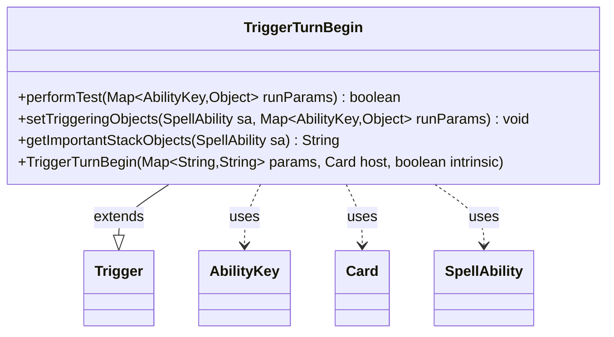

---
aliases:
  - TriggerTurnBegin
tags:
  - java/class
  - module/forge-game
  - pkg/forge/game/trigger
fqn: forge.game.trigger.TriggerTurnBegin
package: forge.game.trigger
module: forge-game
kind: Class
---

# TriggerTurnBegin

**Package:** `forge.game.trigger`   **Module:** `forge-game`   **Kind:** Class



## Relationships
**Extends:**
- [[forge.game.trigger.Trigger|Trigger]]
**Uses:**
- [[forge.game.ability.AbilityKey|AbilityKey]]
- [[forge.game.card.Card|Card]]
- [[forge.game.spellability.SpellAbility|SpellAbility]]

## Design Description

TriggerTurnBegin is a concrete trigger that fires at the beginning of a player's turn, allowing card scripts to respond to turn-start events. As its source comment notes, it is not a "real" game trigger but a scaffolding hook exposed for advanced card scripting. Extending the abstract Trigger base class, it implements the standard contract: performTest gates firing through the inherited matchesValidParam check against the optional ValidPlayer restriction, setTriggeringObjects records the active Player into the SpellAbility's triggering objects via the AbilityKey.Player key, and getImportantStackObjects produces a localized, human-readable summary of that player for stack display. Its design intent is deliberately minimal—delegating construction and most behavior to Trigger and using the shared AbilityKey map and SpellAbility collaborators—so it slots uniformly into Forge's data-driven trigger framework alongside its many sibling trigger subtypes.

## Source
`forge-game/src/main/java/forge/game/trigger/TriggerTurnBegin.java`

```java
package forge.game.trigger;

import java.util.Map;

import forge.game.ability.AbilityKey;
import forge.game.card.Card;
import forge.game.spellability.SpellAbility;
import forge.util.Localizer;

// Turn Begin isn't a "real" trigger, but is useful for Advanced Scripting Techniques
public class TriggerTurnBegin extends Trigger {
    public TriggerTurnBegin(final Map<String, String> params, final Card host, final boolean intrinsic) {
        super(params, host, intrinsic);
    }

    @Override
    public final boolean performTest(final Map<AbilityKey, Object> runParams) {
        if (!matchesValidParam("ValidPlayer", runParams.get(AbilityKey.Player))) {
            return false;
        }
        return true;
    }

    @Override
    public final void setTriggeringObjects(final SpellAbility sa, Map<AbilityKey, Object> runParams) {
        sa.setTriggeringObjectsFrom(runParams, AbilityKey.Player);
    }

    @Override
    public String getImportantStackObjects(SpellAbility sa) {
        StringBuilder sb = new StringBuilder();
        sb.append(Localizer.getInstance().getMessage("lblPlayer")).append(": ").append(sa.getTriggeringObject(AbilityKey.Player));
        return sb.toString();
    }
}
```

## Python
`forge/game/trigger/TriggerTurnBegin.py`

```python
from forge.game.trigger.Trigger import Trigger
from forge.game.ability.AbilityKey import AbilityKey
from forge.game.card.Card import Card
from forge.game.spellability.SpellAbility import SpellAbility
from forge.util.Localizer import Localizer

import typing


# Turn Begin isn't a "real" trigger, but is useful for Advanced Scripting Techniques
class TriggerTurnBegin(Trigger):
    def __init__(self, params: dict[str, str], host: Card, intrinsic: bool):
        super().__init__(params, host, intrinsic)

    def performTest(self, runParams: dict[AbilityKey, object]) -> bool:
        if not self.matchesValidParam("ValidPlayer", runParams.get(AbilityKey.Player)):
            return False
        return True

    def setTriggeringObjects(self, sa: SpellAbility, runParams: dict[AbilityKey, object]) -> None:
        sa.setTriggeringObjectsFrom(runParams, AbilityKey.Player)

    def getImportantStackObjects(self, sa: SpellAbility) -> str:
        sb = []
        sb.append(Localizer.getInstance().getMessage("lblPlayer"))
        sb.append(": ")
        sb.append(str(sa.getTriggeringObject(AbilityKey.Player)))
        return "".join(sb)
```
