---
aliases:
  - TriggerType
tags:
  - java/enum
  - module/forge-game
  - pkg/forge/game/trigger
fqn: forge.game.trigger.TriggerType
package: forge.game.trigger
module: forge-game
kind: Enum
---

# TriggerType

**Package:** `forge.game.trigger`   **Module:** `forge-game`   **Kind:** Enum



```mermaid
classDiagram
    class TriggerType {
        <<enumeration>>
        Abandoned
        AbilityCast
        AbilityResolves
        AbilityTriggered
        Adapt
        Airbend
        Always
        Attached
        AttackerBlocked
        AttackerBlockedOnce
        AttackerBlockedByCreature
        AttackersDeclared
        AttackersDeclaredOneTarget
        AttackerUnblocked
        AttackerUnblockedOnce
        Attacks
        BecomeMonarch
        BecomeMonstrous
        BecomeRenowned
        BecomesCrewed
        BecomesPlotted
        BecomesSaddled
        BecomesTarget
        BecomesTargetOnce
        BlockersDeclared
        Blocks
        CaseSolved
        Championed
        ChangesController
        ChangesZone
        ChangesZoneAll
        ChaosEnsues
        ClaimPrize
        Clashed
        ClassLevelGained
        CommitCrime
        ConjureAll
        CollectEvidence
        CounterAdded
        CounterAddedOnce
        CounterPlayerAddedAll
        CounterTypeAddedAll
        CounterAddedAll
        Countered
        CounterRemoved
        CounterRemovedOnce
        CrankContraption
        Crewed
        Cycled
        DamageAll
        DamageDealtOnce
        DamageDone
        DamageDoneOnce
        DamageDoneOnceByController
        DamagePreventedOnce
        DayTimeChanges
        Destroyed
        Devoured
        Discarded
        DiscardedAll
        Discover
        Drawn
        DungeonCompleted
        Earthbend
        Evolved
        ExcessDamage
        ExcessDamageAll
        ElementalBend
        Enlisted
        Exerted
        Exiled
        Exploited
        Explores
        Fight
        FightOnce
        Firebend
        FlippedCoin
        Forage
        Foretell
        FullyUnlock
        GiveGift
        Immediate
        Investigated
        LandPlayed
        LifeGained
        LifeLost
        LifeLostAll
        LosesGame
        ManaAdded
        ManaExpend
        ManifestDread
        Mentored
        Milled
        MilledOnce
        MilledAll
        Mutates
        NewGame
        PayCumulativeUpkeep
        PayEcho
        PayLife
        Phase
        PhaseIn
        PhaseOut
        PhaseOutAll
        PlanarDice
        PlaneswalkedFrom
        PlaneswalkedTo
        Proliferate
        RingTemptsYou
        RolledDie
        RolledDieOnce
        RoomEntered
        Saddled
        Sacrificed
        SacrificedOnce
        Scry
        SearchedLibrary
        SeekAll
        SetInMotion
        Shuffled
        Specializes
        SpellAbilityCast
        SpellAbilityCopy
        SpellCast
        SpellCastOrCopy
        SpellCopy
        Stationed
        Surveil
        TakesInitiative
        TapAll
        Taps
        TapsForMana
        TokenCreated
        TokenCreatedOnce
        Trains
        Transformed
        TurnBegin
        TurnFaceUp
        Unattached
        UnlockDoor
        UntapAll
        Untaps
        VisitAttraction
        Vote
        Waterbend
        -Constructor~Trigger~ constructor
        -findConstructor(Class~Trigger~ clasz) Constructor~Trigger~
        +smartValueOf(String value) TriggerType
        +createTrigger(Map~String,String~ mapParams, Card host, boolean intrinsic) Trigger
        ~TriggerType(Class~Trigger~ clasz)
    }
    TriggerType ..> Card : uses
    TriggerType ..> Trigger : uses
    TriggerType ..> TriggerAbandoned : uses
    TriggerType ..> TriggerAbilityResolves : uses
    TriggerType ..> TriggerAbilityTriggered : uses
    TriggerType ..> TriggerAdapt : uses
    TriggerType ..> TriggerAlways : uses
    TriggerType ..> TriggerAttached : uses
    TriggerType ..> TriggerAttackerBlocked : uses
    TriggerType ..> TriggerAttackerBlockedByCreature : uses
    TriggerType ..> TriggerAttackerBlockedOnce : uses
    TriggerType ..> TriggerAttackerUnblocked : uses
    TriggerType ..> TriggerAttackerUnblockedOnce : uses
    TriggerType ..> TriggerAttackersDeclared : uses
    TriggerType ..> TriggerAttacks : uses
    TriggerType ..> TriggerBecomeMonarch : uses
    TriggerType ..> TriggerBecomeMonstrous : uses
    TriggerType ..> TriggerBecomeRenowned : uses
    TriggerType ..> TriggerBecomesCrewed : uses
    TriggerType ..> TriggerBecomesPlotted : uses
    TriggerType ..> TriggerBecomesSaddled : uses
    TriggerType ..> TriggerBecomesTarget : uses
    TriggerType ..> TriggerBecomesTargetOnce : uses
    TriggerType ..> TriggerBlockersDeclared : uses
    TriggerType ..> TriggerBlocks : uses
    TriggerType ..> TriggerCaseSolved : uses
    TriggerType ..> TriggerChampioned : uses
    TriggerType ..> TriggerChangesController : uses
    TriggerType ..> TriggerChangesZone : uses
    TriggerType ..> TriggerChangesZoneAll : uses
    TriggerType ..> TriggerChaosEnsues : uses
    TriggerType ..> TriggerClaimPrize : uses
    TriggerType ..> TriggerClashed : uses
    TriggerType ..> TriggerClassLevelGained : uses
    TriggerType ..> TriggerCollectEvidence : uses
    TriggerType ..> TriggerCommitCrime : uses
    TriggerType ..> TriggerCompletedDungeon : uses
    TriggerType ..> TriggerConjureAll : uses
    TriggerType ..> TriggerCounterAdded : uses
    TriggerType ..> TriggerCounterAddedAll : uses
    TriggerType ..> TriggerCounterAddedOnce : uses
    TriggerType ..> TriggerCounterPlayerAddedAll : uses
    TriggerType ..> TriggerCounterRemoved : uses
    TriggerType ..> TriggerCounterRemovedOnce : uses
    TriggerType ..> TriggerCounterTypeAddedAll : uses
    TriggerType ..> TriggerCountered : uses
    TriggerType ..> TriggerCrankContraption : uses
    TriggerType ..> TriggerCrewedSaddled : uses
    TriggerType ..> TriggerCycled : uses
    TriggerType ..> TriggerDamageAll : uses
    TriggerType ..> TriggerDamageDealtOnce : uses
    TriggerType ..> TriggerDamageDone : uses
    TriggerType ..> TriggerDamageDoneOnce : uses
    TriggerType ..> TriggerDamageDoneOnceByController : uses
    TriggerType ..> TriggerDamagePreventedOnce : uses
    TriggerType ..> TriggerDayTimeChanges : uses
    TriggerType ..> TriggerDestroyed : uses
    TriggerType ..> TriggerDevoured : uses
    TriggerType ..> TriggerDiscarded : uses
    TriggerType ..> TriggerDiscardedAll : uses
    TriggerType ..> TriggerDiscover : uses
    TriggerType ..> TriggerDrawn : uses
    TriggerType ..> TriggerElementalbend : uses
    TriggerType ..> TriggerEnlisted : uses
    TriggerType ..> TriggerEnteredRoom : uses
    TriggerType ..> TriggerEvolved : uses
    TriggerType ..> TriggerExcessDamage : uses
    TriggerType ..> TriggerExcessDamageAll : uses
    TriggerType ..> TriggerExerted : uses
    TriggerType ..> TriggerExiled : uses
    TriggerType ..> TriggerExploited : uses
    TriggerType ..> TriggerExplores : uses
    TriggerType ..> TriggerFight : uses
    TriggerType ..> TriggerFightOnce : uses
    TriggerType ..> TriggerFlippedCoin : uses
    TriggerType ..> TriggerForage : uses
    TriggerType ..> TriggerForetell : uses
    TriggerType ..> TriggerFullyUnlock : uses
    TriggerType ..> TriggerGiveGift : uses
    TriggerType ..> TriggerImmediate : uses
    TriggerType ..> TriggerInvestigated : uses
    TriggerType ..> TriggerLandPlayed : uses
    TriggerType ..> TriggerLifeGained : uses
    TriggerType ..> TriggerLifeLost : uses
    TriggerType ..> TriggerLifeLostAll : uses
    TriggerType ..> TriggerLosesGame : uses
    TriggerType ..> TriggerManaAdded : uses
    TriggerType ..> TriggerManaExpend : uses
    TriggerType ..> TriggerManifestDread : uses
    TriggerType ..> TriggerMentored : uses
    TriggerType ..> TriggerMilled : uses
    TriggerType ..> TriggerMilledAll : uses
    TriggerType ..> TriggerMilledOnce : uses
    TriggerType ..> TriggerMutates : uses
    TriggerType ..> TriggerNewGame : uses
    TriggerType ..> TriggerPayCumulativeUpkeep : uses
    TriggerType ..> TriggerPayEcho : uses
    TriggerType ..> TriggerPayLife : uses
    TriggerType ..> TriggerPhase : uses
    TriggerType ..> TriggerPhaseIn : uses
    TriggerType ..> TriggerPhaseOut : uses
    TriggerType ..> TriggerPhaseOutAll : uses
    TriggerType ..> TriggerPlanarDice : uses
    TriggerType ..> TriggerPlaneswalkedFrom : uses
    TriggerType ..> TriggerPlaneswalkedTo : uses
    TriggerType ..> TriggerProliferate : uses
    TriggerType ..> TriggerRingTemptsYou : uses
    TriggerType ..> TriggerRolledDie : uses
    TriggerType ..> TriggerRolledDieOnce : uses
    TriggerType ..> TriggerSacrificed : uses
    TriggerType ..> TriggerSacrificedOnce : uses
    TriggerType ..> TriggerScry : uses
    TriggerType ..> TriggerSearchedLibrary : uses
    TriggerType ..> TriggerSeekAll : uses
    TriggerType ..> TriggerSetInMotion : uses
    TriggerType ..> TriggerShuffled : uses
    TriggerType ..> TriggerSpecializes : uses
    TriggerType ..> TriggerSpellAbilityCastOrCopy : uses
    TriggerType ..> TriggerSurveil : uses
    TriggerType ..> TriggerTakesInitiative : uses
    TriggerType ..> TriggerTapAll : uses
    TriggerType ..> TriggerTaps : uses
    TriggerType ..> TriggerTapsForMana : uses
    TriggerType ..> TriggerTokenCreated : uses
    TriggerType ..> TriggerTokenCreatedOnce : uses
    TriggerType ..> TriggerTrains : uses
    TriggerType ..> TriggerTransformed : uses
    TriggerType ..> TriggerTurnBegin : uses
    TriggerType ..> TriggerTurnFaceUp : uses
    TriggerType ..> TriggerUnattached : uses
    TriggerType ..> TriggerUnlockDoor : uses
    TriggerType ..> TriggerUntapAll : uses
    TriggerType ..> TriggerUntaps : uses
    TriggerType ..> TriggerVisitAttraction : uses
    TriggerType ..> TriggerVote : uses
```

## Relationships
**Uses:**
- [[forge.game.card.Card|Card]]
- [[forge.game.trigger.Trigger|Trigger]]
- [[forge.game.trigger.TriggerAbandoned|TriggerAbandoned]]
- [[forge.game.trigger.TriggerAbilityResolves|TriggerAbilityResolves]]
- [[forge.game.trigger.TriggerAbilityTriggered|TriggerAbilityTriggered]]
- [[forge.game.trigger.TriggerAdapt|TriggerAdapt]]
- [[forge.game.trigger.TriggerAlways|TriggerAlways]]
- [[forge.game.trigger.TriggerAttached|TriggerAttached]]
- [[forge.game.trigger.TriggerAttackerBlocked|TriggerAttackerBlocked]]
- [[forge.game.trigger.TriggerAttackerBlockedByCreature|TriggerAttackerBlockedByCreature]]
- [[forge.game.trigger.TriggerAttackerBlockedOnce|TriggerAttackerBlockedOnce]]
- [[forge.game.trigger.TriggerAttackerUnblocked|TriggerAttackerUnblocked]]
- [[forge.game.trigger.TriggerAttackerUnblockedOnce|TriggerAttackerUnblockedOnce]]
- [[forge.game.trigger.TriggerAttackersDeclared|TriggerAttackersDeclared]]
- [[forge.game.trigger.TriggerAttacks|TriggerAttacks]]
- [[forge.game.trigger.TriggerBecomeMonarch|TriggerBecomeMonarch]]
- [[forge.game.trigger.TriggerBecomeMonstrous|TriggerBecomeMonstrous]]
- [[forge.game.trigger.TriggerBecomeRenowned|TriggerBecomeRenowned]]
- [[forge.game.trigger.TriggerBecomesCrewed|TriggerBecomesCrewed]]
- [[forge.game.trigger.TriggerBecomesPlotted|TriggerBecomesPlotted]]
- [[forge.game.trigger.TriggerBecomesSaddled|TriggerBecomesSaddled]]
- [[forge.game.trigger.TriggerBecomesTarget|TriggerBecomesTarget]]
- [[forge.game.trigger.TriggerBecomesTargetOnce|TriggerBecomesTargetOnce]]
- [[forge.game.trigger.TriggerBlockersDeclared|TriggerBlockersDeclared]]
- [[forge.game.trigger.TriggerBlocks|TriggerBlocks]]
- [[forge.game.trigger.TriggerCaseSolved|TriggerCaseSolved]]
- [[forge.game.trigger.TriggerChampioned|TriggerChampioned]]
- [[forge.game.trigger.TriggerChangesController|TriggerChangesController]]
- [[forge.game.trigger.TriggerChangesZone|TriggerChangesZone]]
- [[forge.game.trigger.TriggerChangesZoneAll|TriggerChangesZoneAll]]
- [[forge.game.trigger.TriggerChaosEnsues|TriggerChaosEnsues]]
- [[forge.game.trigger.TriggerClaimPrize|TriggerClaimPrize]]
- [[forge.game.trigger.TriggerClashed|TriggerClashed]]
- [[forge.game.trigger.TriggerClassLevelGained|TriggerClassLevelGained]]
- [[forge.game.trigger.TriggerCollectEvidence|TriggerCollectEvidence]]
- [[forge.game.trigger.TriggerCommitCrime|TriggerCommitCrime]]
- [[forge.game.trigger.TriggerCompletedDungeon|TriggerCompletedDungeon]]
- [[forge.game.trigger.TriggerConjureAll|TriggerConjureAll]]
- [[forge.game.trigger.TriggerCounterAdded|TriggerCounterAdded]]
- [[forge.game.trigger.TriggerCounterAddedAll|TriggerCounterAddedAll]]
- [[forge.game.trigger.TriggerCounterAddedOnce|TriggerCounterAddedOnce]]
- [[forge.game.trigger.TriggerCounterPlayerAddedAll|TriggerCounterPlayerAddedAll]]
- [[forge.game.trigger.TriggerCounterRemoved|TriggerCounterRemoved]]
- [[forge.game.trigger.TriggerCounterRemovedOnce|TriggerCounterRemovedOnce]]
- [[forge.game.trigger.TriggerCounterTypeAddedAll|TriggerCounterTypeAddedAll]]
- [[forge.game.trigger.TriggerCountered|TriggerCountered]]
- [[forge.game.trigger.TriggerCrankContraption|TriggerCrankContraption]]
- [[forge.game.trigger.TriggerCrewedSaddled|TriggerCrewedSaddled]]
- [[forge.game.trigger.TriggerCycled|TriggerCycled]]
- [[forge.game.trigger.TriggerDamageAll|TriggerDamageAll]]
- [[forge.game.trigger.TriggerDamageDealtOnce|TriggerDamageDealtOnce]]
- [[forge.game.trigger.TriggerDamageDone|TriggerDamageDone]]
- [[forge.game.trigger.TriggerDamageDoneOnce|TriggerDamageDoneOnce]]
- [[forge.game.trigger.TriggerDamageDoneOnceByController|TriggerDamageDoneOnceByController]]
- [[forge.game.trigger.TriggerDamagePreventedOnce|TriggerDamagePreventedOnce]]
- [[forge.game.trigger.TriggerDayTimeChanges|TriggerDayTimeChanges]]
- [[forge.game.trigger.TriggerDestroyed|TriggerDestroyed]]
- [[forge.game.trigger.TriggerDevoured|TriggerDevoured]]
- [[forge.game.trigger.TriggerDiscarded|TriggerDiscarded]]
- [[forge.game.trigger.TriggerDiscardedAll|TriggerDiscardedAll]]
- [[forge.game.trigger.TriggerDiscover|TriggerDiscover]]
- [[forge.game.trigger.TriggerDrawn|TriggerDrawn]]
- [[forge.game.trigger.TriggerElementalbend|TriggerElementalbend]]
- [[forge.game.trigger.TriggerEnlisted|TriggerEnlisted]]
- [[forge.game.trigger.TriggerEnteredRoom|TriggerEnteredRoom]]
- [[forge.game.trigger.TriggerEvolved|TriggerEvolved]]
- [[forge.game.trigger.TriggerExcessDamage|TriggerExcessDamage]]
- [[forge.game.trigger.TriggerExcessDamageAll|TriggerExcessDamageAll]]
- [[forge.game.trigger.TriggerExerted|TriggerExerted]]
- [[forge.game.trigger.TriggerExiled|TriggerExiled]]
- [[forge.game.trigger.TriggerExploited|TriggerExploited]]
- [[forge.game.trigger.TriggerExplores|TriggerExplores]]
- [[forge.game.trigger.TriggerFight|TriggerFight]]
- [[forge.game.trigger.TriggerFightOnce|TriggerFightOnce]]
- [[forge.game.trigger.TriggerFlippedCoin|TriggerFlippedCoin]]
- [[forge.game.trigger.TriggerForage|TriggerForage]]
- [[forge.game.trigger.TriggerForetell|TriggerForetell]]
- [[forge.game.trigger.TriggerFullyUnlock|TriggerFullyUnlock]]
- [[forge.game.trigger.TriggerGiveGift|TriggerGiveGift]]
- [[forge.game.trigger.TriggerImmediate|TriggerImmediate]]
- [[forge.game.trigger.TriggerInvestigated|TriggerInvestigated]]
- [[forge.game.trigger.TriggerLandPlayed|TriggerLandPlayed]]
- [[forge.game.trigger.TriggerLifeGained|TriggerLifeGained]]
- [[forge.game.trigger.TriggerLifeLost|TriggerLifeLost]]
- [[forge.game.trigger.TriggerLifeLostAll|TriggerLifeLostAll]]
- [[forge.game.trigger.TriggerLosesGame|TriggerLosesGame]]
- [[forge.game.trigger.TriggerManaAdded|TriggerManaAdded]]
- [[forge.game.trigger.TriggerManaExpend|TriggerManaExpend]]
- [[forge.game.trigger.TriggerManifestDread|TriggerManifestDread]]
- [[forge.game.trigger.TriggerMentored|TriggerMentored]]
- [[forge.game.trigger.TriggerMilled|TriggerMilled]]
- [[forge.game.trigger.TriggerMilledAll|TriggerMilledAll]]
- [[forge.game.trigger.TriggerMilledOnce|TriggerMilledOnce]]
- [[forge.game.trigger.TriggerMutates|TriggerMutates]]
- [[forge.game.trigger.TriggerNewGame|TriggerNewGame]]
- [[forge.game.trigger.TriggerPayCumulativeUpkeep|TriggerPayCumulativeUpkeep]]
- [[forge.game.trigger.TriggerPayEcho|TriggerPayEcho]]
- [[forge.game.trigger.TriggerPayLife|TriggerPayLife]]
- [[forge.game.trigger.TriggerPhase|TriggerPhase]]
- [[forge.game.trigger.TriggerPhaseIn|TriggerPhaseIn]]
- [[forge.game.trigger.TriggerPhaseOut|TriggerPhaseOut]]
- [[forge.game.trigger.TriggerPhaseOutAll|TriggerPhaseOutAll]]
- [[forge.game.trigger.TriggerPlanarDice|TriggerPlanarDice]]
- [[forge.game.trigger.TriggerPlaneswalkedFrom|TriggerPlaneswalkedFrom]]
- [[forge.game.trigger.TriggerPlaneswalkedTo|TriggerPlaneswalkedTo]]
- [[forge.game.trigger.TriggerProliferate|TriggerProliferate]]
- [[forge.game.trigger.TriggerRingTemptsYou|TriggerRingTemptsYou]]
- [[forge.game.trigger.TriggerRolledDie|TriggerRolledDie]]
- [[forge.game.trigger.TriggerRolledDieOnce|TriggerRolledDieOnce]]
- [[forge.game.trigger.TriggerSacrificed|TriggerSacrificed]]
- [[forge.game.trigger.TriggerSacrificedOnce|TriggerSacrificedOnce]]
- [[forge.game.trigger.TriggerScry|TriggerScry]]
- [[forge.game.trigger.TriggerSearchedLibrary|TriggerSearchedLibrary]]
- [[forge.game.trigger.TriggerSeekAll|TriggerSeekAll]]
- [[forge.game.trigger.TriggerSetInMotion|TriggerSetInMotion]]
- [[forge.game.trigger.TriggerShuffled|TriggerShuffled]]
- [[forge.game.trigger.TriggerSpecializes|TriggerSpecializes]]
- [[forge.game.trigger.TriggerSpellAbilityCastOrCopy|TriggerSpellAbilityCastOrCopy]]
- [[forge.game.trigger.TriggerSurveil|TriggerSurveil]]
- [[forge.game.trigger.TriggerTakesInitiative|TriggerTakesInitiative]]
- [[forge.game.trigger.TriggerTapAll|TriggerTapAll]]
- [[forge.game.trigger.TriggerTaps|TriggerTaps]]
- [[forge.game.trigger.TriggerTapsForMana|TriggerTapsForMana]]
- [[forge.game.trigger.TriggerTokenCreated|TriggerTokenCreated]]
- [[forge.game.trigger.TriggerTokenCreatedOnce|TriggerTokenCreatedOnce]]
- [[forge.game.trigger.TriggerTrains|TriggerTrains]]
- [[forge.game.trigger.TriggerTransformed|TriggerTransformed]]
- [[forge.game.trigger.TriggerTurnBegin|TriggerTurnBegin]]
- [[forge.game.trigger.TriggerTurnFaceUp|TriggerTurnFaceUp]]
- [[forge.game.trigger.TriggerUnattached|TriggerUnattached]]
- [[forge.game.trigger.TriggerUnlockDoor|TriggerUnlockDoor]]
- [[forge.game.trigger.TriggerUntapAll|TriggerUntapAll]]
- [[forge.game.trigger.TriggerUntaps|TriggerUntaps]]
- [[forge.game.trigger.TriggerVisitAttraction|TriggerVisitAttraction]]
- [[forge.game.trigger.TriggerVote|TriggerVote]]

## Design Description

TriggerType is an enum-based factory that catalogs every game event in the Forge engine capable of firing a triggered ability. Each constant binds a symbolic trigger mode (e.g., `Attacks`, `Drawn`, `DamageDone`) to a concrete `Trigger` subclass, and at construction it reflectively locates and caches that subclass's constructor taking a `Map` of parameters. This centralizes the mapping between script-level trigger names and their implementing classes in one place.

Its key responsibility is instantiation: `createTrigger` reflectively builds a configured `Trigger` from card parameters, a host `Card`, and an intrinsic flag, then stamps the new trigger with its own mode. The `smartValueOf` helper resolves a name string case-insensitively, supporting the data-driven card-scripting system. Note that several constants intentionally share one implementation class—the elemental-bend variants and the spell-cast/copy family reuse `TriggerElementalbend` and `TriggerSpellAbilityCastOrCopy`—keeping behavior centralized while exposing distinct named modes.

## Source
`forge-game/src/main/java/forge/game/trigger/TriggerType.java`

```java
package forge.game.trigger;

import forge.game.card.Card;

import java.lang.reflect.Constructor;
import java.lang.reflect.InvocationTargetException;
import java.util.Map;


/**
 * TODO: Write javadoc for this type.
 *
 */
public enum TriggerType {
    Abandoned(TriggerAbandoned.class),
    AbilityCast(TriggerSpellAbilityCastOrCopy.class),
    AbilityResolves(TriggerAbilityResolves.class),
    AbilityTriggered(TriggerAbilityTriggered.class),
    Adapt(TriggerAdapt.class),
    Airbend(TriggerElementalbend.class),
    Always(TriggerAlways.class),
    Attached(TriggerAttached.class),
    AttackerBlocked(TriggerAttackerBlocked.class),
    AttackerBlockedOnce(TriggerAttackerBlockedOnce.class),
    AttackerBlockedByCreature(TriggerAttackerBlockedByCreature.class),
    AttackersDeclared(TriggerAttackersDeclared.class),
    AttackersDeclaredOneTarget(TriggerAttackersDeclared.class),
    AttackerUnblocked(TriggerAttackerUnblocked.class),
    AttackerUnblockedOnce(TriggerAttackerUnblockedOnce.class),
    Attacks(TriggerAttacks.class),
    BecomeMonarch(TriggerBecomeMonarch.class),
    BecomeMonstrous(TriggerBecomeMonstrous.class),
    BecomeRenowned(TriggerBecomeRenowned.class),
    BecomesCrewed(TriggerBecomesCrewed.class),
    BecomesPlotted(TriggerBecomesPlotted.class),
    BecomesSaddled(TriggerBecomesSaddled.class),
    BecomesTarget(TriggerBecomesTarget.class),
    BecomesTargetOnce(TriggerBecomesTargetOnce.class),
    BlockersDeclared(TriggerBlockersDeclared.class),
    Blocks(TriggerBlocks.class),
    CaseSolved(TriggerCaseSolved.class),
    Championed(TriggerChampioned.class),
    ChangesController(TriggerChangesController.class),
    ChangesZone(TriggerChangesZone.class),
    ChangesZoneAll(TriggerChangesZoneAll.class),
    ChaosEnsues(TriggerChaosEnsues.class),
    ClaimPrize(TriggerClaimPrize.class),
    Clashed(TriggerClashed.class),
    ClassLevelGained(TriggerClassLevelGained.class),
    CommitCrime(TriggerCommitCrime.class),
    ConjureAll(TriggerConjureAll.class),
    CollectEvidence(TriggerCollectEvidence.class),
    CounterAdded(TriggerCounterAdded.class),
    CounterAddedOnce(TriggerCounterAddedOnce.class),
    CounterPlayerAddedAll(TriggerCounterPlayerAddedAll.class),
    CounterTypeAddedAll(TriggerCounterTypeAddedAll.class),
    CounterAddedAll(TriggerCounterAddedAll.class),
    Countered(TriggerCountered.class),
    CounterRemoved(TriggerCounterRemoved.class),
    CounterRemovedOnce(TriggerCounterRemovedOnce.class),
    CrankContraption(TriggerCrankContraption.class),
    Crewed(TriggerCrewedSaddled.class),
    Cycled(TriggerCycled.class),
    DamageAll(TriggerDamageAll.class),
    DamageDealtOnce(TriggerDamageDealtOnce.class),
    DamageDone(TriggerDamageDone.class),
    DamageDoneOnce(TriggerDamageDoneOnce.class),
    DamageDoneOnceByController(TriggerDamageDoneOnceByController.class),
    DamagePreventedOnce(TriggerDamagePreventedOnce.class),
    DayTimeChanges (TriggerDayTimeChanges.class),
    Destroyed(TriggerDestroyed.class),
    Devoured(TriggerDevoured.class),
    Discarded(TriggerDiscarded.class),
    DiscardedAll(TriggerDiscardedAll.class),
    Discover(TriggerDiscover.class),
    Drawn(TriggerDrawn.class),
    DungeonCompleted(TriggerCompletedDungeon.class),
    Earthbend(TriggerElementalbend.class),
    Evolved(TriggerEvolved.class),
    ExcessDamage(TriggerExcessDamage.class),
    ExcessDamageAll(TriggerExcessDamageAll.class),
    ElementalBend(TriggerElementalbend.class),
    Enlisted(TriggerEnlisted.class),
    Exerted(TriggerExerted.class),
    Exiled(TriggerExiled.class),
    Exploited(TriggerExploited.class),
    Explores(TriggerExplores.class),
    Fight(TriggerFight.class),
    FightOnce(TriggerFightOnce.class),
    Firebend(TriggerElementalbend.class),
    FlippedCoin(TriggerFlippedCoin.class),
    Forage(TriggerForage.class),
    Foretell(TriggerForetell.class),
    FullyUnlock(TriggerFullyUnlock.class),
    GiveGift(TriggerGiveGift.class),
    Immediate(TriggerImmediate.class),
    Investigated(TriggerInvestigated.class),
    LandPlayed(TriggerLandPlayed.class),
    LifeGained(TriggerLifeGained.class),
    LifeLost(TriggerLifeLost.class),
    LifeLostAll(TriggerLifeLostAll.class),
    LosesGame(TriggerLosesGame.class),
    ManaAdded(TriggerManaAdded.class),
    ManaExpend(TriggerManaExpend.class),
    ManifestDread(TriggerManifestDread.class),
    Mentored(TriggerMentored.class),
    Milled(TriggerMilled.class),
    MilledOnce(TriggerMilledOnce.class),
    MilledAll(TriggerMilledAll.class),
    Mutates(TriggerMutates.class),
    NewGame(TriggerNewGame.class),
    PayCumulativeUpkeep(TriggerPayCumulativeUpkeep.class),
    PayEcho(TriggerPayEcho.class),
    PayLife(TriggerPayLife.class),
    Phase(TriggerPhase.class),
    PhaseIn(TriggerPhaseIn.class),
    PhaseOut(TriggerPhaseOut.class),
    PhaseOutAll(TriggerPhaseOutAll.class),
    PlanarDice(TriggerPlanarDice.class),
    PlaneswalkedFrom(TriggerPlaneswalkedFrom.class),
    PlaneswalkedTo(TriggerPlaneswalkedTo.class),
    Proliferate(TriggerProliferate.class),
    RingTemptsYou(TriggerRingTemptsYou.class),
    RolledDie(TriggerRolledDie.class),
    RolledDieOnce(TriggerRolledDieOnce.class),
    RoomEntered(TriggerEnteredRoom.class),
    Saddled(TriggerCrewedSaddled.class),
    Sacrificed(TriggerSacrificed.class),
    SacrificedOnce(TriggerSacrificedOnce.class),
    Scry(TriggerScry.class),
    SearchedLibrary(TriggerSearchedLibrary.class),
    SeekAll(TriggerSeekAll.class),
    SetInMotion(TriggerSetInMotion.class),
    Shuffled(TriggerShuffled.class),
    Specializes(TriggerSpecializes.class),
    SpellAbilityCast(TriggerSpellAbilityCastOrCopy.class),
    SpellAbilityCopy(TriggerSpellAbilityCastOrCopy.class),
    SpellCast(TriggerSpellAbilityCastOrCopy.class),
    SpellCastOrCopy(TriggerSpellAbilityCastOrCopy.class),
    SpellCopy(TriggerSpellAbilityCastOrCopy.class),
    Stationed(TriggerCrewedSaddled.class),
    Surveil(TriggerSurveil.class),
    TakesInitiative(TriggerTakesInitiative.class),
    TapAll(TriggerTapAll.class),
    Taps(TriggerTaps.class),
    TapsForMana(TriggerTapsForMana.class),
    TokenCreated(TriggerTokenCreated.class),
    TokenCreatedOnce(TriggerTokenCreatedOnce.class),
    Trains(TriggerTrains.class),
    Transformed(TriggerTransformed.class),
    TurnBegin(TriggerTurnBegin.class),
    TurnFaceUp(TriggerTurnFaceUp.class),
    Unattached(TriggerUnattached.class),
    UnlockDoor(TriggerUnlockDoor.class),
    UntapAll(TriggerUntapAll.class),
    Untaps(TriggerUntaps.class),
    VisitAttraction(TriggerVisitAttraction.class),
    Vote(TriggerVote.class),
    Waterbend(TriggerElementalbend.class)          
    ;

    private final Constructor<? extends Trigger> constructor;

    TriggerType(Class<? extends Trigger> clasz) {
        constructor = findConstructor(clasz);
    }

    private static Constructor<? extends Trigger> findConstructor(Class<? extends Trigger> clasz) {
        @SuppressWarnings("unchecked")
        Constructor<? extends Trigger>[] cc = (Constructor<? extends Trigger>[]) clasz.getDeclaredConstructors();
        for (Constructor<? extends Trigger> c : cc) {
            Class<?>[] pp = c.getParameterTypes();
            if (pp[0].isAssignableFrom(Map.class)) {
                return c;
            }
        }
        throw new RuntimeException("No constructor found that would take Map as 1st parameter in class " + clasz.getName());
    }

    /**
     * TODO: Write javadoc for this method.
     * @param value
     * @return
     */
    public static TriggerType smartValueOf(String value) {
        final String valToCompate = value.trim();
        for (final TriggerType v : TriggerType.values()) {
            if (v.name().compareToIgnoreCase(valToCompate) == 0) {
                return v;
            }
        }

        throw new RuntimeException("Element " + value + " not found in TriggerType enum");
    }

    /**
     * TODO: Write javadoc for this method.
     * @param mapParams
     * @param host
     * @param intrinsic
     * @return
     */
    public Trigger createTrigger(Map<String, String> mapParams, Card host, boolean intrinsic) {
        try {
            Trigger res = constructor.newInstance(mapParams, host, intrinsic);
            res.setMode(this);
            return res;
        } catch (IllegalArgumentException | InstantiationException | IllegalAccessException | InvocationTargetException e) {
            throw new RuntimeException(e);
        }
    }
}
```

## Python
`forge/game/trigger/TriggerType.py`

```python
from enum import Enum
import inspect

from forge.game.card.Card import Card
from forge.game.trigger.Trigger import Trigger
from forge.game.trigger.TriggerAbandoned import TriggerAbandoned
from forge.game.trigger.TriggerAbilityResolves import TriggerAbilityResolves
from forge.game.trigger.TriggerAbilityTriggered import TriggerAbilityTriggered
from forge.game.trigger.TriggerAdapt import TriggerAdapt
from forge.game.trigger.TriggerAlways import TriggerAlways
from forge.game.trigger.TriggerAttached import TriggerAttached
from forge.game.trigger.TriggerAttackerBlocked import TriggerAttackerBlocked
from forge.game.trigger.TriggerAttackerBlockedByCreature import TriggerAttackerBlockedByCreature
from forge.game.trigger.TriggerAttackerBlockedOnce import TriggerAttackerBlockedOnce
from forge.game.trigger.TriggerAttackerUnblocked import TriggerAttackerUnblocked
from forge.game.trigger.TriggerAttackerUnblockedOnce import TriggerAttackerUnblockedOnce
from forge.game.trigger.TriggerAttackersDeclared import TriggerAttackersDeclared
from forge.game.trigger.TriggerAttacks import TriggerAttacks
from forge.game.trigger.TriggerBecomeMonarch import TriggerBecomeMonarch
from forge.game.trigger.TriggerBecomeMonstrous import TriggerBecomeMonstrous
from forge.game.trigger.TriggerBecomeRenowned import TriggerBecomeRenowned
from forge.game.trigger.TriggerBecomesCrewed import TriggerBecomesCrewed
from forge.game.trigger.TriggerBecomesPlotted import TriggerBecomesPlotted
from forge.game.trigger.TriggerBecomesSaddled import TriggerBecomesSaddled
from forge.game.trigger.TriggerBecomesTarget import TriggerBecomesTarget
from forge.game.trigger.TriggerBecomesTargetOnce import TriggerBecomesTargetOnce
from forge.game.trigger.TriggerBlockersDeclared import TriggerBlockersDeclared
from forge.game.trigger.TriggerBlocks import TriggerBlocks
from forge.game.trigger.TriggerCaseSolved import TriggerCaseSolved
from forge.game.trigger.TriggerChampioned import TriggerChampioned
from forge.game.trigger.TriggerChangesController import TriggerChangesController
from forge.game.trigger.TriggerChangesZone import TriggerChangesZone
from forge.game.trigger.TriggerChangesZoneAll import TriggerChangesZoneAll
from forge.game.trigger.TriggerChaosEnsues import TriggerChaosEnsues
from forge.game.trigger.TriggerClaimPrize import TriggerClaimPrize
from forge.game.trigger.TriggerClashed import TriggerClashed
from forge.game.trigger.TriggerClassLevelGained import TriggerClassLevelGained
from forge.game.trigger.TriggerCollectEvidence import TriggerCollectEvidence
from forge.game.trigger.TriggerCommitCrime import TriggerCommitCrime
from forge.game.trigger.TriggerCompletedDungeon import TriggerCompletedDungeon
from forge.game.trigger.TriggerConjureAll import TriggerConjureAll
from forge.game.trigger.TriggerCounterAdded import TriggerCounterAdded
from forge.game.trigger.TriggerCounterAddedAll import TriggerCounterAddedAll
from forge.game.trigger.TriggerCounterAddedOnce import TriggerCounterAddedOnce
from forge.game.trigger.TriggerCounterPlayerAddedAll import TriggerCounterPlayerAddedAll
from forge.game.trigger.TriggerCounterRemoved import TriggerCounterRemoved
from forge.game.trigger.TriggerCounterRemovedOnce import TriggerCounterRemovedOnce
from forge.game.trigger.TriggerCounterTypeAddedAll import TriggerCounterTypeAddedAll
from forge.game.trigger.TriggerCountered import TriggerCountered
from forge.game.trigger.TriggerCrankContraption import TriggerCrankContraption
from forge.game.trigger.TriggerCrewedSaddled import TriggerCrewedSaddled
from forge.game.trigger.TriggerCycled import TriggerCycled
from forge.game.trigger.TriggerDamageAll import TriggerDamageAll
from forge.game.trigger.TriggerDamageDealtOnce import TriggerDamageDealtOnce
from forge.game.trigger.TriggerDamageDone import TriggerDamageDone
from forge.game.trigger.TriggerDamageDoneOnce import TriggerDamageDoneOnce
from forge.game.trigger.TriggerDamageDoneOnceByController import TriggerDamageDoneOnceByController
from forge.game.trigger.TriggerDamagePreventedOnce import TriggerDamagePreventedOnce
from forge.game.trigger.TriggerDayTimeChanges import TriggerDayTimeChanges
from forge.game.trigger.TriggerDestroyed import TriggerDestroyed
from forge.game.trigger.TriggerDevoured import TriggerDevoured
from forge.game.trigger.TriggerDiscarded import TriggerDiscarded
from forge.game.trigger.TriggerDiscardedAll import TriggerDiscardedAll
from forge.game.trigger.TriggerDiscover import TriggerDiscover
from forge.game.trigger.TriggerDrawn import TriggerDrawn
from forge.game.trigger.TriggerElementalbend import TriggerElementalbend
from forge.game.trigger.TriggerEnlisted import TriggerEnlisted
from forge.game.trigger.TriggerEnteredRoom import TriggerEnteredRoom
from forge.game.trigger.TriggerEvolved import TriggerEvolved
from forge.game.trigger.TriggerExcessDamage import TriggerExcessDamage
from forge.game.trigger.TriggerExcessDamageAll import TriggerExcessDamageAll
from forge.game.trigger.TriggerExerted import TriggerExerted
from forge.game.trigger.TriggerExiled import TriggerExiled
from forge.game.trigger.TriggerExploited import TriggerExploited
from forge.game.trigger.TriggerExplores import TriggerExplores
from forge.game.trigger.TriggerFight import TriggerFight
from forge.game.trigger.TriggerFightOnce import TriggerFightOnce
from forge.game.trigger.TriggerFlippedCoin import TriggerFlippedCoin
from forge.game.trigger.TriggerForage import TriggerForage
from forge.game.trigger.TriggerForetell import TriggerForetell
from forge.game.trigger.TriggerFullyUnlock import TriggerFullyUnlock
from forge.game.trigger.TriggerGiveGift import TriggerGiveGift
from forge.game.trigger.TriggerImmediate import TriggerImmediate
from forge.game.trigger.TriggerInvestigated import TriggerInvestigated
from forge.game.trigger.TriggerLandPlayed import TriggerLandPlayed
from forge.game.trigger.TriggerLifeGained import TriggerLifeGained
from forge.game.trigger.TriggerLifeLost import TriggerLifeLost
from forge.game.trigger.TriggerLifeLostAll import TriggerLifeLostAll
from forge.game.trigger.TriggerLosesGame import TriggerLosesGame
from forge.game.trigger.TriggerManaAdded import TriggerManaAdded
from forge.game.trigger.TriggerManaExpend import TriggerManaExpend
from forge.game.trigger.TriggerManifestDread import TriggerManifestDread
from forge.game.trigger.TriggerMentored import TriggerMentored
from forge.game.trigger.TriggerMilled import TriggerMilled
from forge.game.trigger.TriggerMilledAll import TriggerMilledAll
from forge.game.trigger.TriggerMilledOnce import TriggerMilledOnce
from forge.game.trigger.TriggerMutates import TriggerMutates
from forge.game.trigger.TriggerNewGame import TriggerNewGame
from forge.game.trigger.TriggerPayCumulativeUpkeep import TriggerPayCumulativeUpkeep
from forge.game.trigger.TriggerPayEcho import TriggerPayEcho
from forge.game.trigger.TriggerPayLife import TriggerPayLife
from forge.game.trigger.TriggerPhase import TriggerPhase
from forge.game.trigger.TriggerPhaseIn import TriggerPhaseIn
from forge.game.trigger.TriggerPhaseOut import TriggerPhaseOut
from forge.game.trigger.TriggerPhaseOutAll import TriggerPhaseOutAll
from forge.game.trigger.TriggerPlanarDice import TriggerPlanarDice
from forge.game.trigger.TriggerPlaneswalkedFrom import TriggerPlaneswalkedFrom
from forge.game.trigger.TriggerPlaneswalkedTo import TriggerPlaneswalkedTo
from forge.game.trigger.TriggerProliferate import TriggerProliferate
from forge.game.trigger.TriggerRingTemptsYou import TriggerRingTemptsYou
from forge.game.trigger.TriggerRolledDie import TriggerRolledDie
from forge.game.trigger.TriggerRolledDieOnce import TriggerRolledDieOnce
from forge.game.trigger.TriggerSacrificed import TriggerSacrificed
from forge.game.trigger.TriggerSacrificedOnce import TriggerSacrificedOnce
from forge.game.trigger.TriggerScry import TriggerScry
from forge.game.trigger.TriggerSearchedLibrary import TriggerSearchedLibrary
from forge.game.trigger.TriggerSeekAll import TriggerSeekAll
from forge.game.trigger.TriggerSetInMotion import TriggerSetInMotion
from forge.game.trigger.TriggerShuffled import TriggerShuffled
from forge.game.trigger.TriggerSpecializes import TriggerSpecializes
from forge.game.trigger.TriggerSpellAbilityCastOrCopy import TriggerSpellAbilityCastOrCopy
from forge.game.trigger.TriggerSurveil import TriggerSurveil
from forge.game.trigger.TriggerTakesInitiative import TriggerTakesInitiative
from forge.game.trigger.TriggerTapAll import TriggerTapAll
from forge.game.trigger.TriggerTaps import TriggerTaps
from forge.game.trigger.TriggerTapsForMana import TriggerTapsForMana
from forge.game.trigger.TriggerTokenCreated import TriggerTokenCreated
from forge.game.trigger.TriggerTokenCreatedOnce import TriggerTokenCreatedOnce
from forge.game.trigger.TriggerTrains import TriggerTrains
from forge.game.trigger.TriggerTransformed import TriggerTransformed
from forge.game.trigger.TriggerTurnBegin import TriggerTurnBegin
from forge.game.trigger.TriggerTurnFaceUp import TriggerTurnFaceUp
from forge.game.trigger.TriggerUnattached import TriggerUnattached
from forge.game.trigger.TriggerUnlockDoor import TriggerUnlockDoor
from forge.game.trigger.TriggerUntapAll import TriggerUntapAll
from forge.game.trigger.TriggerUntaps import TriggerUntaps
from forge.game.trigger.TriggerVisitAttraction import TriggerVisitAttraction
from forge.game.trigger.TriggerVote import TriggerVote


def findConstructor(clasz):
    # Locate the constructor that takes a Map of parameters as its first argument.
    # In Python the class itself is its constructor; verify it accepts a first parameter.
    sig = inspect.signature(clasz.__init__)
    params = [name for name in sig.parameters if name != 'self']
    if params:
        return clasz
    raise RuntimeError("No constructor found that would take Map as 1st parameter in class " + clasz.__name__)


# TODO: Write javadoc for this type.
class TriggerType(Enum):
    def __new__(cls, clasz):
        value = len(cls.__members__) + 1
        obj = object.__new__(cls)
        obj._value_ = value
        obj.constructor = findConstructor(clasz)
        return obj

    Abandoned = TriggerAbandoned
    AbilityCast = TriggerSpellAbilityCastOrCopy
    AbilityResolves = TriggerAbilityResolves
    AbilityTriggered = TriggerAbilityTriggered
    Adapt = TriggerAdapt
    Airbend = TriggerElementalbend
    Always = TriggerAlways
    Attached = TriggerAttached
    AttackerBlocked = TriggerAttackerBlocked
    AttackerBlockedOnce = TriggerAttackerBlockedOnce
    AttackerBlockedByCreature = TriggerAttackerBlockedByCreature
    AttackersDeclared = TriggerAttackersDeclared
    AttackersDeclaredOneTarget = TriggerAttackersDeclared
    AttackerUnblocked = TriggerAttackerUnblocked
    AttackerUnblockedOnce = TriggerAttackerUnblockedOnce
    Attacks = TriggerAttacks
    BecomeMonarch = TriggerBecomeMonarch
    BecomeMonstrous = TriggerBecomeMonstrous
    BecomeRenowned = TriggerBecomeRenowned
    BecomesCrewed = TriggerBecomesCrewed
    BecomesPlotted = TriggerBecomesPlotted
    BecomesSaddled = TriggerBecomesSaddled
    BecomesTarget = TriggerBecomesTarget
    BecomesTargetOnce = TriggerBecomesTargetOnce
    BlockersDeclared = TriggerBlockersDeclared
    Blocks = TriggerBlocks
    CaseSolved = TriggerCaseSolved
    Championed = TriggerChampioned
    ChangesController = TriggerChangesController
    ChangesZone = TriggerChangesZone
    ChangesZoneAll = TriggerChangesZoneAll
    ChaosEnsues = TriggerChaosEnsues
    ClaimPrize = TriggerClaimPrize
    Clashed = TriggerClashed
    ClassLevelGained = TriggerClassLevelGained
    CommitCrime = TriggerCommitCrime
    ConjureAll = TriggerConjureAll
    CollectEvidence = TriggerCollectEvidence
    CounterAdded = TriggerCounterAdded
    CounterAddedOnce = TriggerCounterAddedOnce
    CounterPlayerAddedAll = TriggerCounterPlayerAddedAll
    CounterTypeAddedAll = TriggerCounterTypeAddedAll
    CounterAddedAll = TriggerCounterAddedAll
    Countered = TriggerCountered
    CounterRemoved = TriggerCounterRemoved
    CounterRemovedOnce = TriggerCounterRemovedOnce
    CrankContraption = TriggerCrankContraption
    Crewed = TriggerCrewedSaddled
    Cycled = TriggerCycled
    DamageAll = TriggerDamageAll
    DamageDealtOnce = TriggerDamageDealtOnce
    DamageDone = TriggerDamageDone
    DamageDoneOnce = TriggerDamageDoneOnce
    DamageDoneOnceByController = TriggerDamageDoneOnceByController
    DamagePreventedOnce = TriggerDamagePreventedOnce
    DayTimeChanges = TriggerDayTimeChanges
    Destroyed = TriggerDestroyed
    Devoured = TriggerDevoured
    Discarded = TriggerDiscarded
    DiscardedAll = TriggerDiscardedAll
    Discover = TriggerDiscover
    Drawn = TriggerDrawn
    DungeonCompleted = TriggerCompletedDungeon
    Earthbend = TriggerElementalbend
    Evolved = TriggerEvolved
    ExcessDamage = TriggerExcessDamage
    ExcessDamageAll = TriggerExcessDamageAll
    ElementalBend = TriggerElementalbend
    Enlisted = TriggerEnlisted
    Exerted = TriggerExerted
    Exiled = TriggerExiled
    Exploited = TriggerExploited
    Explores = TriggerExplores
    Fight = TriggerFight
    FightOnce = TriggerFightOnce
    Firebend = TriggerElementalbend
    FlippedCoin = TriggerFlippedCoin
    Forage = TriggerForage
    Foretell = TriggerForetell
    FullyUnlock = TriggerFullyUnlock
    GiveGift = TriggerGiveGift
    Immediate = TriggerImmediate
    Investigated = TriggerInvestigated
    LandPlayed = TriggerLandPlayed
    LifeGained = TriggerLifeGained
    LifeLost = TriggerLifeLost
    LifeLostAll = TriggerLifeLostAll
    LosesGame = TriggerLosesGame
    ManaAdded = TriggerManaAdded
    ManaExpend = TriggerManaExpend
    ManifestDread = TriggerManifestDread
    Mentored = TriggerMentored
    Milled = TriggerMilled
    MilledOnce = TriggerMilledOnce
    MilledAll = TriggerMilledAll
    Mutates = TriggerMutates
    NewGame = TriggerNewGame
    PayCumulativeUpkeep = TriggerPayCumulativeUpkeep
    PayEcho = TriggerPayEcho
    PayLife = TriggerPayLife
    Phase = TriggerPhase
    PhaseIn = TriggerPhaseIn
    PhaseOut = TriggerPhaseOut
    PhaseOutAll = TriggerPhaseOutAll
    PlanarDice = TriggerPlanarDice
    PlaneswalkedFrom = TriggerPlaneswalkedFrom
    PlaneswalkedTo = TriggerPlaneswalkedTo
    Proliferate = TriggerProliferate
    RingTemptsYou = TriggerRingTemptsYou
    RolledDie = TriggerRolledDie
    RolledDieOnce = TriggerRolledDieOnce
    RoomEntered = TriggerEnteredRoom
    Saddled = TriggerCrewedSaddled
    Sacrificed = TriggerSacrificed
    SacrificedOnce = TriggerSacrificedOnce
    Scry = TriggerScry
    SearchedLibrary = TriggerSearchedLibrary
    SeekAll = TriggerSeekAll
    SetInMotion = TriggerSetInMotion
    Shuffled = TriggerShuffled
    Specializes = TriggerSpecializes
    SpellAbilityCast = TriggerSpellAbilityCastOrCopy
    SpellAbilityCopy = TriggerSpellAbilityCastOrCopy
    SpellCast = TriggerSpellAbilityCastOrCopy
    SpellCastOrCopy = TriggerSpellAbilityCastOrCopy
    SpellCopy = TriggerSpellAbilityCastOrCopy
    Stationed = TriggerCrewedSaddled
    Surveil = TriggerSurveil
    TakesInitiative = TriggerTakesInitiative
    TapAll = TriggerTapAll
    Taps = TriggerTaps
    TapsForMana = TriggerTapsForMana
    TokenCreated = TriggerTokenCreated
    TokenCreatedOnce = TriggerTokenCreatedOnce
    Trains = TriggerTrains
    Transformed = TriggerTransformed
    TurnBegin = TriggerTurnBegin
    TurnFaceUp = TriggerTurnFaceUp
    Unattached = TriggerUnattached
    UnlockDoor = TriggerUnlockDoor
    UntapAll = TriggerUntapAll
    Untaps = TriggerUntaps
    VisitAttraction = TriggerVisitAttraction
    Vote = TriggerVote
    Waterbend = TriggerElementalbend

    # TODO: Write javadoc for this method.
    @staticmethod
    def smartValueOf(value):
        valToCompate = value.strip()
        for v in TriggerType:
            if v.name.lower() == valToCompate.lower():
                return v

        raise RuntimeError("Element " + value + " not found in TriggerType enum")

    # TODO: Write javadoc for this method.
    def createTrigger(self, mapParams, host, intrinsic):
        try:
            res = self.constructor(mapParams, host, intrinsic)
            res.setMode(self)
            return res
        except (TypeError, ValueError) as e:
            raise RuntimeError(e)
```
