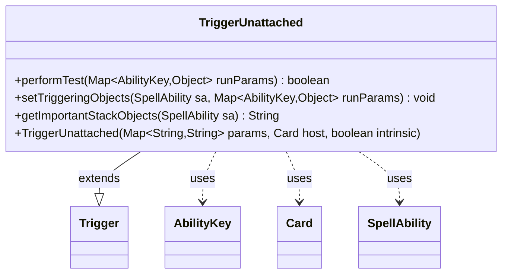

---
aliases:
  - TriggerUnattached
tags:
  - java/class
  - module/forge-game
  - pkg/forge/game/trigger
fqn: forge.game.trigger.TriggerUnattached
package: forge.game.trigger
module: forge-game
kind: Class
---

# TriggerUnattached

**Package:** `forge.game.trigger`   **Module:** `forge-game`   **Kind:** Class



## Relationships
**Extends:**
- [[forge.game.trigger.Trigger|Trigger]]
**Uses:**
- [[forge.game.ability.AbilityKey|AbilityKey]]
- [[forge.game.card.Card|Card]]
- [[forge.game.spellability.SpellAbility|SpellAbility]]

## Design Description

TriggerUnattached is a concrete trigger that fires when one card becomes unattached from another, such as an Equipment or Aura leaving the permanent it was on. Extending the abstract `Trigger` base class, it specializes the template's hooks rather than defining new control flow: `performTest` gates the event by matching the `ValidObject` and `ValidAttachment` restrictions against the run parameters, `setTriggeringObjects` binds the detached object and its attachment source onto the resolving `SpellAbility`, and `getImportantStackObjects` produces a localized stack description.

Its collaborators reflect this narrow role: `AbilityKey` keys the typed run-parameter map (`Object`, `AttachSource`), `Card` is the trigger's host, and `SpellAbility` carries the triggering context. The design intent is data-driven configuration—behavior comes from the `params` map and `Valid*` filters supplied at construction—so the class stays a thin, declarative adapter over the shared trigger machinery.

## Source
`forge-game/src/main/java/forge/game/trigger/TriggerUnattached.java`

```java
/*
 * Forge: Play Magic: the Gathering.
 * Copyright (C) 2011  Forge Team
 *
 * This program is free software: you can redistribute it and/or modify
 * it under the terms of the GNU General Public License as published by
 * the Free Software Foundation, either version 3 of the License, or
 * (at your option) any later version.
 * 
 * This program is distributed in the hope that it will be useful,
 * but WITHOUT ANY WARRANTY; without even the implied warranty of
 * MERCHANTABILITY or FITNESS FOR A PARTICULAR PURPOSE.  See the
 * GNU General Public License for more details.
 * 
 * You should have received a copy of the GNU General Public License
 * along with this program.  If not, see <http://www.gnu.org/licenses/>.
 */
package forge.game.trigger;

import java.util.Map;

import forge.game.ability.AbilityKey;
import forge.game.card.Card;
import forge.game.spellability.SpellAbility;
import forge.util.Localizer;

/**
 * <p>
 * Trigger_Unattach class.
 * </p>
 * 
 * @author Forge
 */
public class TriggerUnattached extends Trigger {

    /**
     * <p>
     * Constructor for Trigger_Unequip.
     * </p>
     * 
     * @param params
     *            a {@link java.util.HashMap} object.
     * @param host
     *            a {@link forge.game.card.Card} object.
     * @param intrinsic
     *            the intrinsic
     */
    public TriggerUnattached(final Map<String, String> params, final Card host, final boolean intrinsic) {
        super(params, host, intrinsic);
    }

    /** {@inheritDoc}
     * @param runParams*/
    @Override
    public final boolean performTest(final Map<AbilityKey, Object> runParams) {
        if (!matchesValidParam("ValidObject", runParams.get(AbilityKey.Object))) {
            return false;
        }
        if (!matchesValidParam("ValidAttachment", runParams.get(AbilityKey.AttachSource))) {
            return false;
        }

        return true;
    }

    /** {@inheritDoc} */
    @Override
    public final void setTriggeringObjects(final SpellAbility sa, Map<AbilityKey, Object> runParams) {
        sa.setTriggeringObjectsFrom(runParams, AbilityKey.Object, AbilityKey.AttachSource);
    }

    @Override
    public String getImportantStackObjects(SpellAbility sa) {
        StringBuilder sb = new StringBuilder();
        sb.append(Localizer.getInstance().getMessage("lblObject")).append(": ").append(sa.getTriggeringObject(AbilityKey.Object)).append(", ");
        sb.append(Localizer.getInstance().getMessage("lblAttachment")).append(": ").append(sa.getTriggeringObject(AbilityKey.AttachSource));
        return sb.toString();
    }

}
```

## Python
`forge/game/trigger/TriggerUnattached.py`

```python
from forge.game.ability.AbilityKey import AbilityKey
from forge.game.card.Card import Card
from forge.game.spellability.SpellAbility import SpellAbility
from forge.util.Localizer import Localizer

from forge.game.trigger.Trigger import Trigger


class TriggerUnattached(Trigger):
    """
    Trigger_Unattach class.

    @author Forge
    """

    def __init__(self, params: dict[str, str], host: Card, intrinsic: bool):
        """
        Constructor for Trigger_Unequip.

        :param params: a dict object.
        :param host: a Card object.
        :param intrinsic: the intrinsic
        """
        super().__init__(params, host, intrinsic)

    def performTest(self, runParams: dict[AbilityKey, object]) -> bool:
        if not self.matchesValidParam("ValidObject", runParams.get(AbilityKey.Object)):
            return False
        if not self.matchesValidParam("ValidAttachment", runParams.get(AbilityKey.AttachSource)):
            return False

        return True

    def setTriggeringObjects(self, sa: SpellAbility, runParams: dict[AbilityKey, object]) -> None:
        sa.setTriggeringObjectsFrom(runParams, AbilityKey.Object, AbilityKey.AttachSource)

    def getImportantStackObjects(self, sa: SpellAbility) -> str:
        sb = []
        sb.append(Localizer.getInstance().getMessage("lblObject"))
        sb.append(": ")
        sb.append(str(sa.getTriggeringObject(AbilityKey.Object)))
        sb.append(", ")
        sb.append(Localizer.getInstance().getMessage("lblAttachment"))
        sb.append(": ")
        sb.append(str(sa.getTriggeringObject(AbilityKey.AttachSource)))
        return "".join(sb)
```
