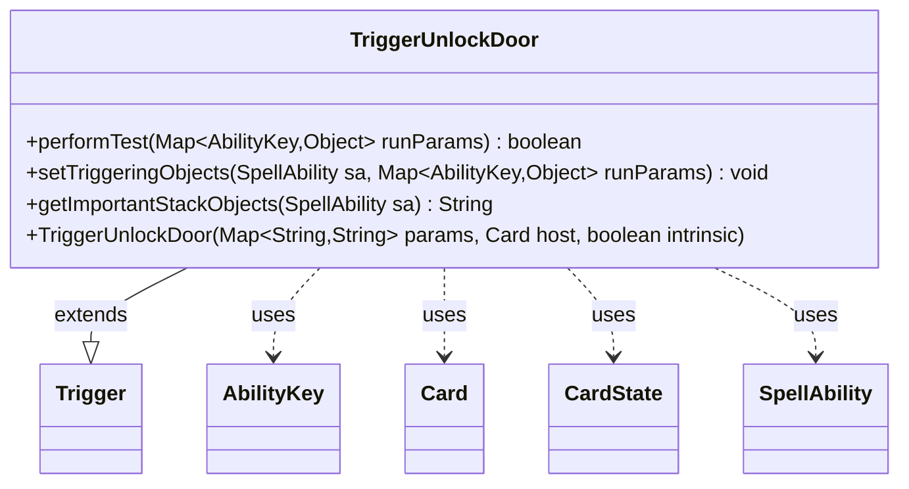

---
aliases:
  - TriggerUnlockDoor
tags:
  - java/class
  - module/forge-game
  - pkg/forge/game/trigger
fqn: forge.game.trigger.TriggerUnlockDoor
package: forge.game.trigger
module: forge-game
kind: Class
---

# TriggerUnlockDoor

**Package:** `forge.game.trigger`   **Module:** `forge-game`   **Kind:** Class



## Relationships
**Extends:**
- [[forge.game.trigger.Trigger|Trigger]]
**Uses:**
- [[forge.game.ability.AbilityKey|AbilityKey]]
- [[forge.game.card.Card|Card]]
- [[forge.game.card.CardState|CardState]]
- [[forge.game.spellability.SpellAbility|SpellAbility]]

## Design Description

TriggerUnlockDoor is a concrete trigger that fires when a door is unlocked, encapsulating the conditions under which such an event should respond. Extending the abstract Trigger base class, it overrides the standard hooks—performTest to gate firing, setTriggeringObjects to expose the relevant game objects, and getImportantStackObjects to render a localized stack summary. Its performTest filters on the ValidCard and ValidPlayer parameters via the inherited matching helpers, and, when the optional ThisDoor parameter is present, narrows firing to the specific host Card and CardState face that was unlocked. It collaborates with AbilityKey to key into the shared runParams map and with SpellAbility to bind the triggering Card and Player. The design follows Forge's data-driven trigger convention, keeping per-trigger logic minimal and parameter-driven while delegating common behavior to its supertype.

## Source
`forge-game/src/main/java/forge/game/trigger/TriggerUnlockDoor.java`

```java
package forge.game.trigger;

import java.util.Map;

import forge.game.ability.AbilityKey;
import forge.game.card.Card;
import forge.game.card.CardState;
import forge.game.spellability.SpellAbility;
import forge.util.Localizer;

public class TriggerUnlockDoor extends Trigger {

    public TriggerUnlockDoor(final Map<String, String> params, final Card host, final boolean intrinsic) {
        super(params, host, intrinsic);
    }

    @Override
    public boolean performTest(Map<AbilityKey, Object> runParams) {
        if (!matchesValidParam("ValidCard", runParams.get(AbilityKey.Card))) {
            return false;
        }

        if (!matchesValidParam("ValidPlayer", runParams.get(AbilityKey.Player))) {
            return false;
        }

        if (hasParam("ThisDoor")) {
            CardState state = (CardState) runParams.get(AbilityKey.CardState);
            // This Card
            if (!getHostCard().equals(state.getCard())) {
                return false;
            }
            // This Face
            if (!getCardStateName().equals(state.getStateName())) {
                return false;
            }
        }

        return true;
    }

    @Override
    public void setTriggeringObjects(SpellAbility sa, Map<AbilityKey, Object> runParams) {
        sa.setTriggeringObjectsFrom(runParams, AbilityKey.Card, AbilityKey.Player);
    }

    @Override
    public String getImportantStackObjects(SpellAbility sa) {
        StringBuilder sb = new StringBuilder();
        sb.append(Localizer.getInstance().getMessage("lblPlayer")).append(": ").append(sa.getTriggeringObject(AbilityKey.Player));
        sb.append(", ").append(Localizer.getInstance().getMessage("lblCard")).append(": ").append(sa.getTriggeringObject(AbilityKey.Card));
        return sb.toString();
    }

}
```

## Python
`forge/game/trigger/TriggerUnlockDoor.py`

```python
from forge.game.trigger.Trigger import Trigger

from typing import Map

from forge.game.ability.AbilityKey import AbilityKey
from forge.game.card.Card import Card
from forge.game.card.CardState import CardState
from forge.game.spellability.SpellAbility import SpellAbility
from forge.util.Localizer import Localizer


class TriggerUnlockDoor(Trigger):

    def __init__(self, params: dict[str, str], host: Card, intrinsic: bool):
        super().__init__(params, host, intrinsic)

    def performTest(self, runParams: dict[AbilityKey, object]) -> bool:
        if not self.matchesValidParam("ValidCard", runParams.get(AbilityKey.Card)):
            return False

        if not self.matchesValidParam("ValidPlayer", runParams.get(AbilityKey.Player)):
            return False

        if self.hasParam("ThisDoor"):
            state = runParams.get(AbilityKey.CardState)
            # This Card
            if not self.getHostCard() == state.getCard():
                return False
            # This Face
            if not self.getCardStateName() == state.getStateName():
                return False

        return True

    def setTriggeringObjects(self, sa: SpellAbility, runParams: dict[AbilityKey, object]) -> None:
        sa.setTriggeringObjectsFrom(runParams, AbilityKey.Card, AbilityKey.Player)

    def getImportantStackObjects(self, sa: SpellAbility) -> str:
        sb = []
        sb.append(Localizer.getInstance().getMessage("lblPlayer"))
        sb.append(": ")
        sb.append(str(sa.getTriggeringObject(AbilityKey.Player)))
        sb.append(", ")
        sb.append(Localizer.getInstance().getMessage("lblCard"))
        sb.append(": ")
        sb.append(str(sa.getTriggeringObject(AbilityKey.Card)))
        return "".join(sb)
```
