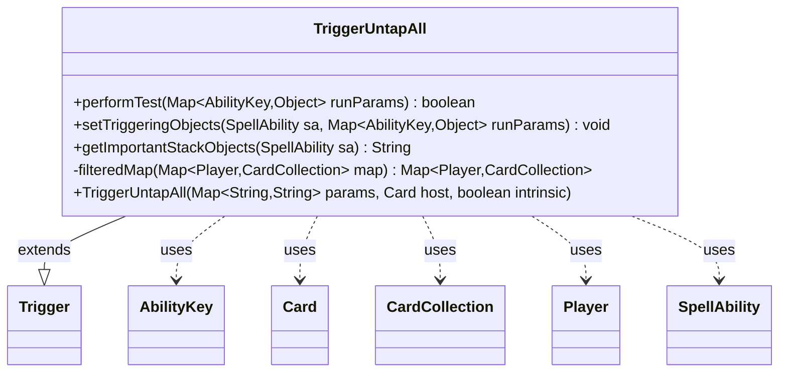

---
aliases:
  - TriggerUntapAll
tags:
  - java/class
  - module/forge-game
  - pkg/forge/game/trigger
fqn: forge.game.trigger.TriggerUntapAll
package: forge.game.trigger
module: forge-game
kind: Class
---

# TriggerUntapAll

**Package:** `forge.game.trigger`   **Module:** `forge-game`   **Kind:** Class



## Relationships
**Extends:**
- [[forge.game.trigger.Trigger|Trigger]]
**Uses:**
- [[forge.game.ability.AbilityKey|AbilityKey]]
- [[forge.game.card.Card|Card]]
- [[forge.game.card.CardCollection|CardCollection]]
- [[forge.game.player.Player|Player]]
- [[forge.game.spellability.SpellAbility|SpellAbility]]

## Design Description

Untap-all triggers in Forge's event system: it fires when a batch untap event occurs and lets a card's ability respond to the set of cards that became untapped.

TriggerUntapAll is a concrete trigger that extends Trigger to fire when groups of cards are untapped en masse. It overrides performTest to filter the incoming Player-to-CardCollection map (from the AbilityKey.Map run parameter) against the trigger's ValidPlayer and ValidCards constraints, firing only when at least one card survives the filter. setTriggeringObjects then republishes the filtered results onto the SpellAbility as triggering objects—the player set, the flattened collection of untapped Cards, and their Amount—so downstream effects can reference them, while getImportantStackObjects surfaces a localized count on the stack. The private filteredMap centralizes the validity logic shared by testing and population, and its reliance on matchesValidParam and hasParam reflects Forge's data-driven, parameter-keyed trigger design.

## Source
`forge-game/src/main/java/forge/game/trigger/TriggerUntapAll.java`

```java
package forge.game.trigger;

import com.google.common.collect.Maps;
import forge.game.ability.AbilityKey;
import forge.game.card.Card;
import forge.game.card.CardCollection;
import forge.game.player.Player;
import forge.game.spellability.SpellAbility;
import forge.util.Localizer;

import java.util.Map;

public class TriggerUntapAll extends Trigger {

    public TriggerUntapAll(final Map<String, String> params, final Card host, final boolean intrinsic) {
        super(params, host, intrinsic);
    }

    @Override
    public boolean performTest(Map<AbilityKey, Object> runParams) {
        final Map<Player, CardCollection> testMap =
                filteredMap((Map<Player, CardCollection>) runParams.get(AbilityKey.Map));
        return !testMap.isEmpty();
    }

    @Override
    public void setTriggeringObjects(SpellAbility sa, Map<AbilityKey, Object> runParams) {
        final Map<Player, CardCollection> map =
                filteredMap((Map<Player, CardCollection>) runParams.get(AbilityKey.Map));

        sa.setTriggeringObject(AbilityKey.Map, map);
        sa.setTriggeringObject(AbilityKey.Player, map.keySet());

        CardCollection untapped = new CardCollection();
        for (final Map.Entry<Player, CardCollection> e : map.entrySet()) {
            untapped.addAll(e.getValue());
        }
        sa.setTriggeringObject(AbilityKey.Cards, untapped);
        sa.setTriggeringObject(AbilityKey.Amount, untapped.size());
    }

    @Override
    public String getImportantStackObjects(SpellAbility sa) {
        StringBuilder sb = new StringBuilder();
        sb.append(Localizer.getInstance().getMessage("lblAmount")).append(": ");
        sb.append(sa.getTriggeringObject(AbilityKey.Amount));
        return sb.toString();
    }

    private Map<Player, CardCollection> filteredMap(Map<Player, CardCollection> map) {
        Map<Player, CardCollection> passMap = Maps.newHashMap();
        for (final Map.Entry<Player, CardCollection> e : map.entrySet()) {
            if (matchesValidParam("ValidPlayer", e.getKey())) {
                CardCollection passCards = new CardCollection();
                if (hasParam("ValidCards")) {
                    for (Card c : e.getValue()) {
                        if (matchesValidParam("ValidCards", c)) passCards.add(c);
                    }
                }
                if (!passCards.isEmpty()) passMap.put(e.getKey(), passCards);
            }
        }
        return passMap;
    }

}
```

## Python
`forge/game/trigger/TriggerUntapAll.py`

```python
from forge.game.trigger.Trigger import Trigger
from forge.game.ability.AbilityKey import AbilityKey
from forge.game.card.Card import Card
from forge.game.card.CardCollection import CardCollection
from forge.game.player.Player import Player
from forge.game.spellability.SpellAbility import SpellAbility
from forge.util.Localizer import Localizer


class TriggerUntapAll(Trigger):

    def __init__(self, params: dict[str, str], host: Card, intrinsic: bool):
        super().__init__(params, host, intrinsic)

    def performTest(self, runParams: dict[AbilityKey, object]) -> bool:
        testMap = self.filteredMap(runParams.get(AbilityKey.Map))
        return len(testMap) != 0

    def setTriggeringObjects(self, sa: SpellAbility, runParams: dict[AbilityKey, object]) -> None:
        map = self.filteredMap(runParams.get(AbilityKey.Map))

        sa.setTriggeringObject(AbilityKey.Map, map)
        sa.setTriggeringObject(AbilityKey.Player, set(map.keys()))

        untapped = CardCollection()
        for player, cards in map.items():
            untapped.addAll(cards)
        sa.setTriggeringObject(AbilityKey.Cards, untapped)
        sa.setTriggeringObject(AbilityKey.Amount, untapped.size())

    def getImportantStackObjects(self, sa: SpellAbility) -> str:
        sb = []
        sb.append(Localizer.getInstance().getMessage("lblAmount"))
        sb.append(": ")
        sb.append(str(sa.getTriggeringObject(AbilityKey.Amount)))
        return "".join(sb)

    def filteredMap(self, map: dict[Player, CardCollection]) -> dict[Player, CardCollection]:
        passMap = {}
        for player, cards in map.items():
            if self.matchesValidParam("ValidPlayer", player):
                passCards = CardCollection()
                if self.hasParam("ValidCards"):
                    for c in cards:
                        if self.matchesValidParam("ValidCards", c):
                            passCards.add(c)
                if not passCards.isEmpty():
                    passMap[player] = passCards
        return passMap
```
