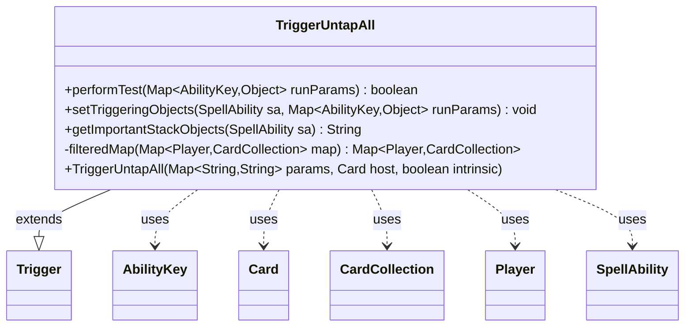

---
aliases:
  - TriggerUntapAll
tags:
  - java/class
  - module/forge-game
  - pkg/forge/game/trigger
fqn: forge.game.trigger.TriggerUntapAll
package: forge.game.trigger
module: forge-game
kind: Class
---

# TriggerUntapAll

**Package:** `forge.game.trigger` &nbsp; **Module:** `forge-game` &nbsp; **Kind:** Class



## Relationships
**Extends:**
- [[forge.game.trigger.Trigger|Trigger]]
**Uses:**
- [[forge.game.ability.AbilityKey|AbilityKey]]
- [[forge.game.card.Card|Card]]
- [[forge.game.card.CardCollection|CardCollection]]
- [[forge.game.player.Player|Player]]
- [[forge.game.spellability.SpellAbility|SpellAbility]]

## Source
`forge-game/src/main/java/forge/game/trigger/TriggerUntapAll.java`

```java
package forge.game.trigger;

import com.google.common.collect.Maps;
import forge.game.ability.AbilityKey;
import forge.game.card.Card;
import forge.game.card.CardCollection;
import forge.game.player.Player;
import forge.game.spellability.SpellAbility;
import forge.util.Localizer;

import java.util.Map;

public class TriggerUntapAll extends Trigger {

    public TriggerUntapAll(final Map<String, String> params, final Card host, final boolean intrinsic) {
        super(params, host, intrinsic);
    }

    @Override
    public boolean performTest(Map<AbilityKey, Object> runParams) {
        final Map<Player, CardCollection> testMap =
                filteredMap((Map<Player, CardCollection>) runParams.get(AbilityKey.Map));
        return !testMap.isEmpty();
    }

    @Override
    public void setTriggeringObjects(SpellAbility sa, Map<AbilityKey, Object> runParams) {
        final Map<Player, CardCollection> map =
                filteredMap((Map<Player, CardCollection>) runParams.get(AbilityKey.Map));

        sa.setTriggeringObject(AbilityKey.Map, map);
        sa.setTriggeringObject(AbilityKey.Player, map.keySet());

        CardCollection untapped = new CardCollection();
        for (final Map.Entry<Player, CardCollection> e : map.entrySet()) {
            untapped.addAll(e.getValue());
        }
        sa.setTriggeringObject(AbilityKey.Cards, untapped);
        sa.setTriggeringObject(AbilityKey.Amount, untapped.size());
    }

    @Override
    public String getImportantStackObjects(SpellAbility sa) {
        StringBuilder sb = new StringBuilder();
        sb.append(Localizer.getInstance().getMessage("lblAmount")).append(": ");
        sb.append(sa.getTriggeringObject(AbilityKey.Amount));
        return sb.toString();
    }

    private Map<Player, CardCollection> filteredMap(Map<Player, CardCollection> map) {
        Map<Player, CardCollection> passMap = Maps.newHashMap();
        for (final Map.Entry<Player, CardCollection> e : map.entrySet()) {
            if (matchesValidParam("ValidPlayer", e.getKey())) {
                CardCollection passCards = new CardCollection();
                if (hasParam("ValidCards")) {
                    for (Card c : e.getValue()) {
                        if (matchesValidParam("ValidCards", c)) passCards.add(c);
                    }
                }
                if (!passCards.isEmpty()) passMap.put(e.getKey(), passCards);
            }
        }
        return passMap;
    }

}
```
