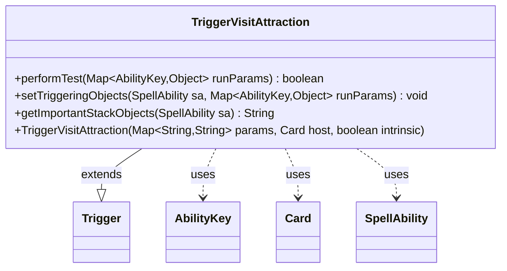

---
aliases:
  - TriggerVisitAttraction
tags:
  - java/class
  - module/forge-game
  - pkg/forge/game/trigger
fqn: forge.game.trigger.TriggerVisitAttraction
package: forge.game.trigger
module: forge-game
kind: Class
---

# TriggerVisitAttraction

**Package:** `forge.game.trigger` &nbsp; **Module:** `forge-game` &nbsp; **Kind:** Class



## Relationships
**Extends:**
- [[forge.game.trigger.Trigger|Trigger]]
**Uses:**
- [[forge.game.ability.AbilityKey|AbilityKey]]
- [[forge.game.card.Card|Card]]
- [[forge.game.spellability.SpellAbility|SpellAbility]]

## Design Description

Trigger­VisitAttraction is a concrete trigger that fires when a player visits an Attraction (a Magic: The Gathering "Unfinity" mechanic), extending the abstract `Trigger` base class within Forge's event-driven triggered-ability system. It implements the standard trigger contract: `performTest` gates firing by validating the triggering player and card against the `ValidPlayer` and `ValidCard` parameters, while `setTriggeringObjects` exposes those objects to the resulting `SpellAbility` via `AbilityKey` constants.

Collaborating with `Card`, `SpellAbility`, and `AbilityKey`, the class follows the data-driven pattern shared by sibling triggers, deriving its behavior from string parameters passed to the superclass constructor rather than hardcoded logic. `getImportantStackObjects` produces a localized stack description through `Localizer`, and a TODO notes deferred intent to expose the attraction roll value and its instigator, signaling the implementation is intentionally minimal pending richer trigger context.

## Source
`forge-game/src/main/java/forge/game/trigger/TriggerVisitAttraction.java`

```java
package forge.game.trigger;

import forge.game.ability.AbilityKey;
import forge.game.card.Card;
import forge.game.spellability.SpellAbility;
import forge.util.Localizer;

import java.util.Map;


public class TriggerVisitAttraction extends Trigger {

    public TriggerVisitAttraction(Map<String, String> params, Card host, boolean intrinsic) {
        super(params, host, intrinsic);
    }

    @Override
    public boolean performTest(Map<AbilityKey, Object> runParams) {
        if (!matchesValidParam("ValidPlayer", runParams.get(AbilityKey.Player))) {
            return false;
        }
        if (!matchesValidParam("ValidCard", runParams.get(AbilityKey.Card))) {
            return false;
        }
        return true;
    }

    @Override
    public void setTriggeringObjects(SpellAbility sa, Map<AbilityKey, Object> runParams) {
        //TODO: Attraction roll value? Person who caused the attraction roll?
        sa.setTriggeringObjectsFrom(runParams, AbilityKey.Player, AbilityKey.Card);
    }

    @Override
    public String getImportantStackObjects(SpellAbility sa) {
        return Localizer.getInstance().getMessage("lblPlayer") + ": " +
                sa.getTriggeringObject(AbilityKey.Player);
    }
}
```

## Python
`forge/game/trigger/TriggerVisitAttraction.py`

```python
from forge.game.ability.AbilityKey import AbilityKey
from forge.game.card.Card import Card
from forge.game.spellability.SpellAbility import SpellAbility
from forge.util.Localizer import Localizer

from forge.game.trigger.Trigger import Trigger


class TriggerVisitAttraction(Trigger):

    def __init__(self, params: dict[str, str], host: Card, intrinsic: bool):
        super().__init__(params, host, intrinsic)

    def performTest(self, runParams: dict[AbilityKey, object]) -> bool:
        if not self.matchesValidParam("ValidPlayer", runParams.get(AbilityKey.Player)):
            return False
        if not self.matchesValidParam("ValidCard", runParams.get(AbilityKey.Card)):
            return False
        return True

    def setTriggeringObjects(self, sa: SpellAbility, runParams: dict[AbilityKey, object]) -> None:
        #TODO: Attraction roll value? Person who caused the attraction roll?
        sa.setTriggeringObjectsFrom(runParams, AbilityKey.Player, AbilityKey.Card)

    def getImportantStackObjects(self, sa: SpellAbility) -> str:
        return Localizer.getInstance().getMessage("lblPlayer") + ": " + \
                str(sa.getTriggeringObject(AbilityKey.Player))
```
