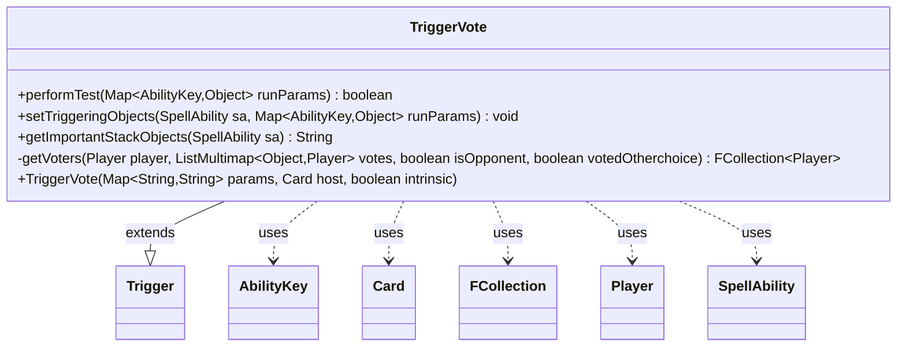

---
aliases:
  - TriggerVote
tags:
  - java/class
  - module/forge-game
  - pkg/forge/game/trigger
fqn: forge.game.trigger.TriggerVote
package: forge.game.trigger
module: forge-game
kind: Class
---

# TriggerVote

**Package:** `forge.game.trigger`   **Module:** `forge-game`   **Kind:** Class



## Relationships
**Extends:**
- [[forge.game.trigger.Trigger|Trigger]]
**Uses:**
- [[forge.game.ability.AbilityKey|AbilityKey]]
- [[forge.game.card.Card|Card]]
- [[forge.game.player.Player|Player]]
- [[forge.game.spellability.SpellAbility|SpellAbility]]
- [[forge.util.collect.FCollection|FCollection]]

## Design Description

TriggerVote is a concrete trigger that fires on the resolution of a voting effect, extending the abstract `Trigger` base class within the `forge.game.trigger` package. Its `performTest` unconditionally returns true, so the trigger always fires once a vote occurs; its real work lies in `setTriggeringObjects`, which inspects the `AllVotes` tally (a `ListMultimap` keyed by vote choice) and exposes two derived `FCollection<Player>` sets — opponents who voted differently from, and the same as, the host's controller — under the `OpponentVotedDiff` and `OpponentVotedSame` ability keys. It collaborates with `SpellAbility`, `AbilityKey`, `Card`, and `Player` to wire these results into the ability stack. A private static `getVoters` helper centralizes the choice-comparison and opponent-filtering logic, while `getImportantStackObjects` formats the voter lists into localized, human-readable stack text.

## Source
`forge-game/src/main/java/forge/game/trigger/TriggerVote.java`

```java
/*
 * Forge: Play Magic: the Gathering.
 * Copyright (C) 2011  Forge Team
 *
 * This program is free software: you can redistribute it and/or modify
 * it under the terms of the GNU General Public License as published by
 * the Free Software Foundation, either version 3 of the License, or
 * (at your option) any later version.
 * 
 * This program is distributed in the hope that it will be useful,
 * but WITHOUT ANY WARRANTY; without even the implied warranty of
 * MERCHANTABILITY or FITNESS FOR A PARTICULAR PURPOSE.  See the
 * GNU General Public License for more details.
 * 
 * You should have received a copy of the GNU General Public License
 * along with this program.  If not, see <http://www.gnu.org/licenses/>.
 */
package forge.game.trigger;

import java.util.List;
import java.util.Map;

import com.google.common.collect.ListMultimap;

import forge.game.ability.AbilityKey;
import forge.game.card.Card;
import forge.game.player.Player;
import forge.game.spellability.SpellAbility;
import forge.util.Localizer;
import forge.util.collect.FCollection;

/**
 * <p>
 * Trigger_Vote class.
 * </p>
 * 
 * @author Forge
 * @version $Id: TriggerVote.java 24769 2014-02-09 13:56:04Z Hellfish $
 */
public class TriggerVote extends Trigger {

    /**
     * <p>
     * Constructor for Trigger_Untaps.
     * </p>
     * 
     * @param params
     *            a {@link java.util.HashMap} object.
     * @param host
     *            a {@link forge.game.card.Card} object.
     * @param intrinsic
     *            the intrinsic
     */
    public TriggerVote(final Map<String, String> params, final Card host, final boolean intrinsic) {
        super(params, host, intrinsic);
    }

    /** {@inheritDoc}
     * @param runParams*/
    @Override
    public final boolean performTest(final Map<AbilityKey, Object> runParams) {
        return true;
    }

    /** {@inheritDoc} */
    @Override
    public final void setTriggeringObjects(final SpellAbility sa, Map<AbilityKey, Object> runParams) {
        @SuppressWarnings("unchecked")
        FCollection<Player> oppVotedDiff = getVoters(
            this.getHostCard().getController(),
            (ListMultimap<Object, Player>) runParams.get(AbilityKey.AllVotes),
            true, true
        );
        sa.setTriggeringObject(AbilityKey.OpponentVotedDiff, oppVotedDiff);

        FCollection<Player> oppVotedSame = getVoters(
                this.getHostCard().getController(),
                (ListMultimap<Object, Player>) runParams.get(AbilityKey.AllVotes),
                true, false
        );
        sa.setTriggeringObject(AbilityKey.OpponentVotedSame, oppVotedSame);
    }

    @Override
    public String getImportantStackObjects(SpellAbility sa) {
        StringBuilder sb = new StringBuilder();
        if (hasParam("List")) {
            final String l = getParam("List");
            if (l.contains("OppVotedSame")) {
                final String ovs = sa.getTriggeringObject(AbilityKey.OpponentVotedSame).toString();
                sb.append(Localizer.getInstance().getMessage("lblOppVotedSame")).append(": ");
                sb.append(!ovs.equals("[]") ? ovs.substring(1, ovs.length() - 1)
                        : Localizer.getInstance().getMessage("lblNone"));
            }
            if (l.contains("OppVotedDiff")) {
                if (sb.length() > 0) {
                    sb.append("] [");
                }
                final String ovd = sa.getTriggeringObject(AbilityKey.OpponentVotedDiff).toString();
                sb.append(Localizer.getInstance().getMessage("lblOppVotedDiff")).append(": ");
                sb.append(!ovd.equals("[]") ? ovd.substring(1, ovd.length() - 1)
                        : Localizer.getInstance().getMessage("lblNone"));
            }
        }
        return sb.toString();
    }

    private static FCollection<Player> getVoters (final Player player, final ListMultimap<Object, Player> votes,
                                                  final boolean isOpponent, final boolean votedOtherchoice) {
        final FCollection<Player> voters = new FCollection<>();
        for (final Object voteType : votes.keySet()) {
            final List<Player> players = votes.get(voteType);
            if (votedOtherchoice ^ players.contains(player)) {
                voters.addAll(players);
            }
        }
        if (isOpponent) {
            voters.retainAll(player.getOpponents());
        }
        return voters;
    }

}
```

## Python
`forge/game/trigger/TriggerVote.py`

```python
from typing import List

from com.google.common.collect.ListMultimap import ListMultimap

from forge.game.ability.AbilityKey import AbilityKey
from forge.game.card.Card import Card
from forge.game.player.Player import Player
from forge.game.spellability.SpellAbility import SpellAbility
from forge.util.Localizer import Localizer
from forge.util.collect.FCollection import FCollection
from forge.game.trigger.Trigger import Trigger


class TriggerVote(Trigger):

    def __init__(self, params: dict[str, str], host: Card, intrinsic: bool):
        super().__init__(params, host, intrinsic)

    def performTest(self, runParams: dict[AbilityKey, object]) -> bool:
        return True

    def setTriggeringObjects(self, sa: SpellAbility, runParams: dict[AbilityKey, object]) -> None:
        oppVotedDiff = TriggerVote.getVoters(
            self.getHostCard().getController(),
            runParams.get(AbilityKey.AllVotes),
            True, True
        )
        sa.setTriggeringObject(AbilityKey.OpponentVotedDiff, oppVotedDiff)

        oppVotedSame = TriggerVote.getVoters(
            self.getHostCard().getController(),
            runParams.get(AbilityKey.AllVotes),
            True, False
        )
        sa.setTriggeringObject(AbilityKey.OpponentVotedSame, oppVotedSame)

    def getImportantStackObjects(self, sa: SpellAbility) -> str:
        sb = []
        if self.hasParam("List"):
            l = self.getParam("List")
            if "OppVotedSame" in l:
                ovs = str(sa.getTriggeringObject(AbilityKey.OpponentVotedSame))
                sb.append(Localizer.getInstance().getMessage("lblOppVotedSame"))
                sb.append(": ")
                sb.append(ovs[1:len(ovs) - 1] if ovs != "[]"
                          else Localizer.getInstance().getMessage("lblNone"))
            if "OppVotedDiff" in l:
                if len("".join(sb)) > 0:
                    sb.append("] [")
                ovd = str(sa.getTriggeringObject(AbilityKey.OpponentVotedDiff))
                sb.append(Localizer.getInstance().getMessage("lblOppVotedDiff"))
                sb.append(": ")
                sb.append(ovd[1:len(ovd) - 1] if ovd != "[]"
                          else Localizer.getInstance().getMessage("lblNone"))
        return "".join(sb)

    @staticmethod
    def getVoters(player: Player, votes: ListMultimap[object, Player],
                  isOpponent: bool, votedOtherchoice: bool) -> FCollection[Player]:
        voters = FCollection()
        for voteType in votes.keySet():
            players = votes.get(voteType)
            if votedOtherchoice ^ (player in players):
                voters.addAll(players)
        if isOpponent:
            voters.retainAll(player.getOpponents())
        return voters
```
