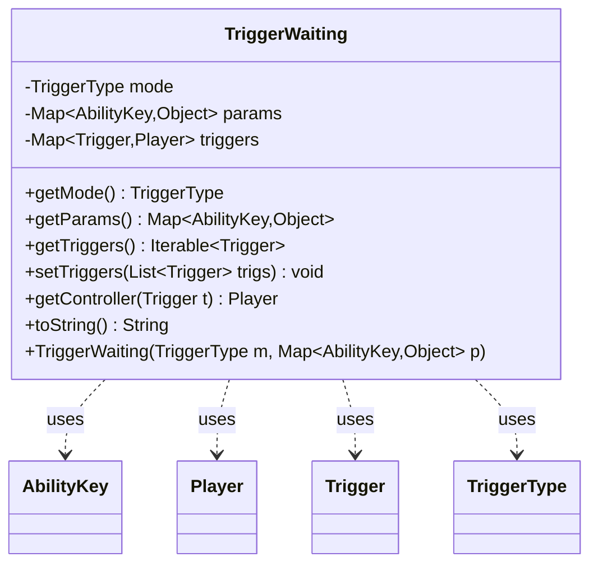

---
aliases:
  - TriggerWaiting
tags:
  - java/class
  - module/forge-game
  - pkg/forge/game/trigger
fqn: forge.game.trigger.TriggerWaiting
package: forge.game.trigger
module: forge-game
kind: Class
---

# TriggerWaiting

**Package:** `forge.game.trigger` &nbsp; **Module:** `forge-game` &nbsp; **Kind:** Class



## Relationships
**Uses:**
- [[forge.game.ability.AbilityKey|AbilityKey]]
- [[forge.game.player.Player|Player]]
- [[forge.game.trigger.Trigger|Trigger]]
- [[forge.game.trigger.TriggerType|TriggerType]]

## Design Description

TriggerWaiting is a lightweight data-holder in the `forge.game.trigger` package that records a triggered event awaiting resolution, bundling together its TriggerType mode and the AbilityKey-keyed parameter map captured when the event occurred. It is a plain object with no supertype, serving purely as a transient queue entry within Forge's trigger-handling pipeline rather than participating in any inheritance hierarchy.

Its chief responsibility is associating each pending Trigger with the Player who controls it: setTriggers eagerly resolves and caches each trigger's controller (via its host card) into a Trigger-to-Player map at registration time, so the controller is snapshotted when triggers are queued rather than re-derived later, guarding against intervening board changes. Accessors expose the mode, params, the trigger keyset, and per-trigger controller lookups, with null-guards reflecting that triggers may never be set. The toString implementation aids debugging by summarizing the waiting trigger's mode and parameters.

## Source
`forge-game/src/main/java/forge/game/trigger/TriggerWaiting.java`

```java
package forge.game.trigger;

import java.util.List;
import java.util.Map;

import com.google.common.collect.Maps;

import forge.game.ability.AbilityKey;
import forge.game.player.Player;
import forge.util.TextUtil;

/** 
 * TriggerWaiting is just a small object to keep track of things that occurred that need to be run.
 */
public class TriggerWaiting {
    private TriggerType mode;
    private Map<AbilityKey, Object> params;
    private Map<Trigger, Player> triggers;

    public TriggerWaiting(TriggerType m, Map<AbilityKey, Object> p) {
        mode = m;
        params = p;
    }

    public TriggerType getMode() {
        return mode;
    }

    public Map<AbilityKey, Object> getParams() {
        return params;
    }

    public Iterable<Trigger> getTriggers() {
        if (triggers == null) {
            return null;
        }
        return triggers.keySet();
    }

    public void setTriggers(final List<Trigger> trigs) {
        this.triggers = Maps.newHashMap();
        for (Trigger t : trigs) {
            triggers.put(t, t.getHostCard().getController());
        }
    }

    public Player getController(Trigger t) {
        if (triggers == null) {
            return null;
        }
        return triggers.get(t);
    }

    @Override
    public String toString() {
        return TextUtil.concatWithSpace("Waiting trigger:", mode.toString(),"with", params.toString());
    }
}
```

## Python
`forge/game/trigger/TriggerWaiting.py`

```python
from typing import Iterable

from forge.game.ability.AbilityKey import AbilityKey
from forge.game.player.Player import Player
from forge.game.trigger.Trigger import Trigger
from forge.game.trigger.TriggerType import TriggerType
from forge.util.TextUtil import TextUtil


class TriggerWaiting:
    """TriggerWaiting is just a small object to keep track of things that occurred that need to be run."""

    def __init__(self, m: TriggerType, p: dict[AbilityKey, object]):
        self.mode: TriggerType = m
        self.params: dict[AbilityKey, object] = p
        self.triggers: dict[Trigger, Player] = None

    def getMode(self) -> TriggerType:
        return self.mode

    def getParams(self) -> dict[AbilityKey, object]:
        return self.params

    def getTriggers(self) -> Iterable[Trigger]:
        if self.triggers is None:
            return None
        return self.triggers.keys()

    def setTriggers(self, trigs: list[Trigger]) -> None:
        self.triggers = {}
        for t in trigs:
            self.triggers[t] = t.getHostCard().getController()

    def getController(self, t: Trigger) -> Player:
        if self.triggers is None:
            return None
        return self.triggers.get(t)

    def toString(self) -> str:
        return TextUtil.concatWithSpace("Waiting trigger:", self.mode.toString(), "with", self.params.toString())

    def __str__(self) -> str:
        return self.toString()
```
