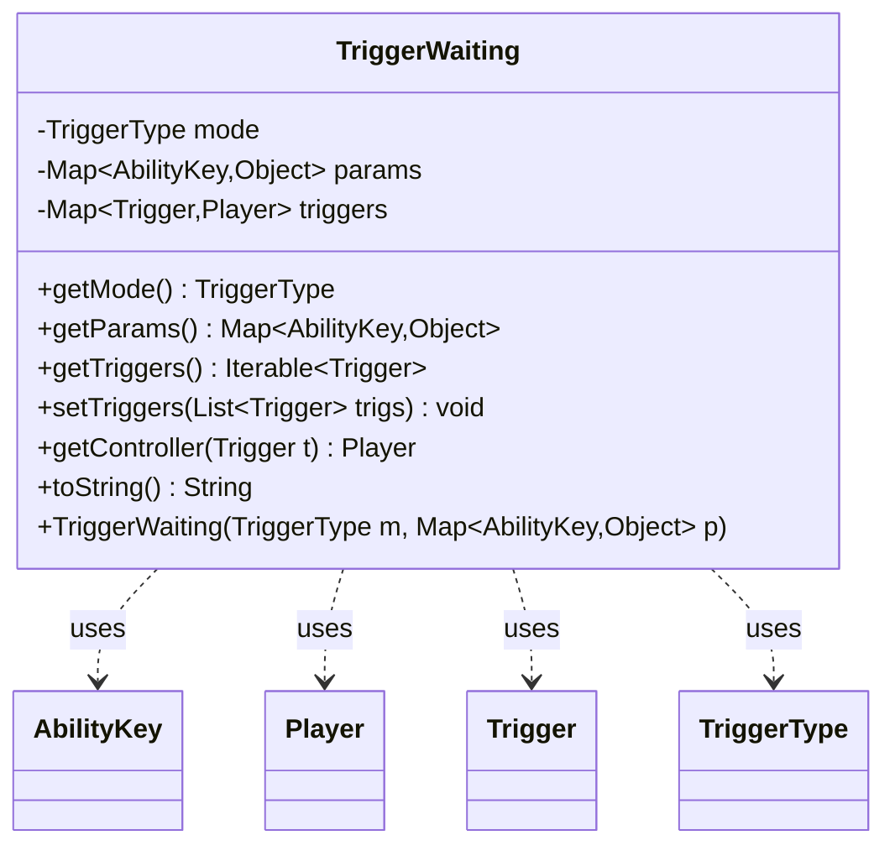

---
aliases:
  - TriggerWaiting
tags:
  - java/class
  - module/forge-game
  - pkg/forge/game/trigger
fqn: forge.game.trigger.TriggerWaiting
package: forge.game.trigger
module: forge-game
kind: Class
---

# TriggerWaiting

**Package:** `forge.game.trigger` &nbsp; **Module:** `forge-game` &nbsp; **Kind:** Class



## Relationships
**Uses:**
- [[forge.game.ability.AbilityKey|AbilityKey]]
- [[forge.game.player.Player|Player]]
- [[forge.game.trigger.Trigger|Trigger]]
- [[forge.game.trigger.TriggerType|TriggerType]]

## Source
`forge-game/src/main/java/forge/game/trigger/TriggerWaiting.java`

```java
package forge.game.trigger;

import java.util.List;
import java.util.Map;

import com.google.common.collect.Maps;

import forge.game.ability.AbilityKey;
import forge.game.player.Player;
import forge.util.TextUtil;

/** 
 * TriggerWaiting is just a small object to keep track of things that occurred that need to be run.
 */
public class TriggerWaiting {
    private TriggerType mode;
    private Map<AbilityKey, Object> params;
    private Map<Trigger, Player> triggers;

    public TriggerWaiting(TriggerType m, Map<AbilityKey, Object> p) {
        mode = m;
        params = p;
    }

    public TriggerType getMode() {
        return mode;
    }

    public Map<AbilityKey, Object> getParams() {
        return params;
    }

    public Iterable<Trigger> getTriggers() {
        if (triggers == null) {
            return null;
        }
        return triggers.keySet();
    }

    public void setTriggers(final List<Trigger> trigs) {
        this.triggers = Maps.newHashMap();
        for (Trigger t : trigs) {
            triggers.put(t, t.getHostCard().getController());
        }
    }

    public Player getController(Trigger t) {
        if (triggers == null) {
            return null;
        }
        return triggers.get(t);
    }

    @Override
    public String toString() {
        return TextUtil.concatWithSpace("Waiting trigger:", mode.toString(),"with", params.toString());
    }
}
```
